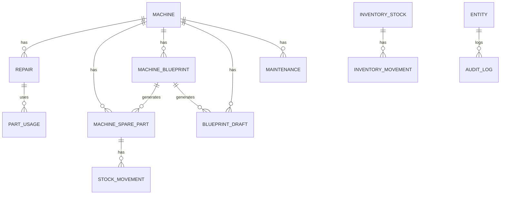
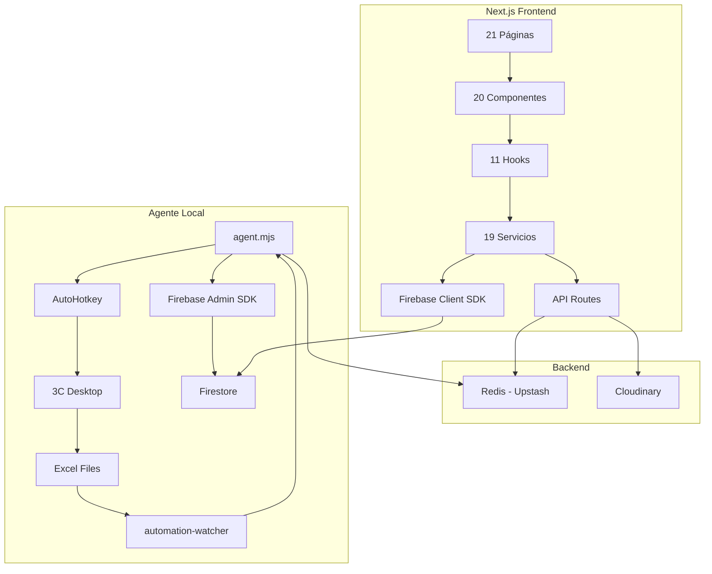
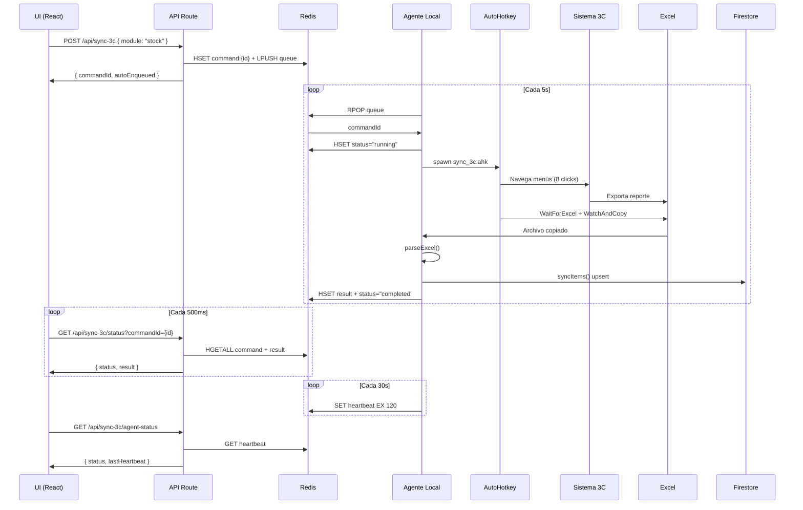

# AUDITORÍA FORENSE TOTAL — PROYECTO OPERARIO-CONTROL
**Fecha:** 14 de Julio de 2026  
**Versión:** 5.0 (FORENSE TOTAL)  
**Scope:** TODO el proyecto — Frontend, Backend, Sync 3C, AutoHotkey, Firebase, Redis, Cloudinary, Seguridad, Rendimiento, Costos  
**Estado:** DOCUMENTACIÓN DEFINITIVA  
**Basado en:** auditoría previa + análisis forense completo de código fuente

---

## 📋 TABLA DE CONTENIDOS

1. [Resumen Ejecutivo](#resumen-ejecutivo)
2. [Arquitectura General](#arquitectura-general)
3. [Stack Tecnológico Completo](#stack-tecnológico-completo)
4. [Estructura de Directorios](#estructura-de-directorios)
5. [Frontend Completo](#frontend-completo)
6. [Backend Completo](#backend-completo)
7. [Sistema Sync 3C](#sistema-sync-3c)
8. [AutoHotkey](#autohotkey)
9. [Firebase Completo](#firebase-completo)
10. [Redis Completo](#redis-completo)
11. [Cloudinary Completo](#cloudinary-completo)
12. [Base de Datos Firestore](#base-de-datos-firestore)
13. [Flujos Funcionales](#flujos-funcionales)
14. [Auditoría de Rendimiento](#auditoría-de-rendimiento)
15. [Auditoría de Costos](#auditoría-de-costos)
16. [Auditoría de Seguridad](#auditoría-de-seguridad)
17. [Código Muerto y Deuda Técnica](#código-muerto-y-deuda-técnica)
18. [Diagramas de Arquitectura](#diagramas-de-arquitectura)
19. [Dependencias](#dependencias)
20. [Variables de Entorno](#variables-de-entorno)
21. [Issues Críticos Consolidados](#issues-críticos-consolidados)
22. [Próximos Pasos](#próximos-pasos)
23. [Auditoría de Arquitectura Profunda](#auditoría-de-arquitectura-profunda)
24. [Arquitectura Objetivo](#arquitectura-objetivo)
25. [Conclusión Final](#conclusión-final)

---

## 1. RESUMEN EJECUTIVO

### Descripción del Proyecto
**operario-control** es un sistema **Next.js + Firestore + Redis + AutoHotkey** de gestión de máquinas rentables con capacidades de:

- ✅ Gestión de inventario de máquinas y repuestos
- ✅ Sistema de alquileres (rentals) con control de disponibilidad
- ✅ Seguimiento de reparaciones en taller
- ✅ Control de mantenimiento preventivo con alertas
- ✅ Sincronización bidireccional con ERP 3C vía AutoHotkey
- ✅ Inteligencia de stock con recomendaciones automáticas
- ✅ Caché local e híbrido (modo online/offline)
- ✅ Auditoría completa de cambios
- ✅ Trazabilidad de movimientos de materiales (FASE 2)

### Estadísticas Generales

```
Lenguajes:          TypeScript, React, Next.js, AutoHotkey, Node.js
Total LOC:          ~8,500+ líneas (sin node_modules)
Componentes:        20+ componentes React
Hooks:              11 hooks personalizados
Servicios:          19 servicios de negocio
APIs:               4 rutas API (Next.js)
Colecciones FS:     12 colecciones Firestore
Scripts AHK:        5 scripts AutoHotkey
Dependencias prod:  21 dependencias
Bundle Size:        ~350 KB (estimado)
Maintainability:    6.5/10 (ajustado post-auditoría forense)
```

### Estado de Salud

```
✅ FORTALEZAS:
- Arquitectura bien estratificada (UI → Hooks → Services → Firebase/Redis)
- TypeScript bien tipado con interfaces claras
- Separación de responsabilidades (en su mayoría)
- Error handling en la mayoría de servicios
- Sistema de sincronización 3C resiliente (fallback Redis)
- Trazabilidad completa de movimientos

❌ DEBILIDADES CRÍTICAS:
- 4 memory leaks en hooks React
- 2 componentes oversized (>350 LOC)
- 0% test coverage
- 415 LOC duplicados
- Sin índices de Firestore (8 queries lentas)
- APIs sin autenticación (4 endpoints)
- service-account.json en repo
- Credenciales expuestas en .env.local
- AutoHotkey frágil (coordenadas hardcoded)
- Código muerto en producción (agent.mjs HEAD)
- Debug code en producción (sync_reparaciones.ahk)
```

---

## 2. ARQUITECTURA GENERAL

### 2.1 Diagrama de Arquitectura Completo

```mermaid
graph TD
    subgraph Cloud [Nube - Vercel + GCP]
        UI[UI Web - Next.js 16/React 19] --> |1. Direct CRUD| Firestore[Firestore - operario-control]
        UI --> |2. Upload files| Cloudinary[Cloudinary - dpcdsorty]
        UI --> |3. POST/GET| API[API Routes - Vercel Node.js]
        
        API --> |4. LPUSH/HSET| Redis[Redis - Upstash]
        API --> |5. Basic Auth| Cloudinary
        
        Firestore --> |6. Read/Write| UI
        Cloudinary --> |7. Return URLs| UI
    end
    
    subgraph Local [Máquina Local Windows]
        Agent[Agente Local - agent.mjs] --> |8. RPOP/HSET| Redis
        Agent --> |9. Admin SDK| Firestore
        Agent --> |10. spawn| AHK[AutoHotkey Scripts]
        AHK --> |11. UI Automation| ThreeC[Sistema 3C - Desktop App]
        ThreeC --> |12. Export| Excel[Excel Files - %TEMP%\tresc\]
        Excel --> |13. Watch/Copy| Watcher[automation-watcher]
        Watcher --> |14. Parse| Agent
    end
    
    subgraph Auth [Firebase Auth]
        UI --> |15. Email/Password| Auth[Firebase Auth]
        Auth --> |16. JWT Token| UI
    end
    
    style UI fill:#bde0fe,stroke:#333,stroke-width:2px
    style API fill:#a2d2ff,stroke:#333,stroke-width:2px
    style Firestore fill:#cdb4db,stroke:#333,stroke-width:2px
    style Cloudinary fill:#ffc8dd,stroke:#333,stroke-width:2px
    style Redis fill:#ffafcc,stroke:#333,stroke-width:2px
    style Agent fill:#a2d2ff,stroke:#333,stroke-width:2px
    style AHK fill:#bde0fe,stroke:#333,stroke-width:2px
    style ThreeC fill:#cdb4db,stroke:#333,stroke-width:2px
    style Excel fill:#ffc8dd,stroke:#333,stroke-width:2px
    style Watcher fill:#ffafcc,stroke:#333,stroke-width:2px
    style Auth fill:#cdb4db,stroke:#333,stroke-width:2px
```

### 2.2 Flujo de Datos Alto Nivel

```
[USER] 
  → [UI React - Next.js 16]
    → [AuthContext - Firebase Auth]
    → [Hooks Layer - 11 hooks]
      → [Services Layer - 19 servicios]
        → [Firebase Client SDK - Firestore]
        → [API Routes - Vercel Serverless]
          → [Redis - Upstash]
          → [Cloudinary]
        → [Local Cache - JSON files]
  
[AGENT LOCAL - Windows]
  → [Redis Polling - cada 5s]
    → [AutoHotkey - UI Automation]
      → [ERP 3C - Desktop App]
        → [Excel Export]
          → [Parser - xlsx]
            → [Firebase Admin SDK]
              → [Firestore - inventory_stock]
```

### 2.3 Componentes Principales

| Componente | Tecnología | Propósito | Estado |
|------------|-----------|-----------|--------|
| **UI/Frontend** | Next.js 16 + React 19 + Tailwind 4 | Interfaz web | ✅ Activo |
| **API Routes** | Vercel Node.js Serverless | Endpoints sync-3c + cloudinary | ✅ Activo |
| **Firestore** | Google Cloud - Spark Plan | Base de datos principal | ⚠️ Cuota limitada |
| **Redis** | Upstash Free Tier | Cola de comandos + heartbeat | ✅ Activo |
| **Cloudinary** | Cloud Name: dpcdsorty | Almacenamiento planos/despieces | ✅ Activo |
| **Firebase Auth** | Email/Password | Autenticación | ✅ Activo |
| **Agente Local** | Node.js + tsx | Orquestador sync 3C | ✅ Activo |
| **AutoHotkey** | AHK v1/v2 | Automatización UI 3C | ✅ Activo |
| **automation-watcher** | Node.js + chokidar | Monitoreo Excel exports | ✅ Activo |

---

## 3. STACK TECNOLÓGICO COMPLETO

### 3.1 Frontend

| Tecnología | Versión | Propósito | Notas |
|------------|---------|-----------|-------|
| **Next.js** | 16.2.9 | Framework React | App Router, 100% client-side |
| **React** | 19.2.4 | UI Library | Concurrent features |
| **TypeScript** | 5.x | Lenguaje | noEmit: true |
| **Tailwind CSS** | ^4 | Estilos | v4 con @tailwindcss/postcss |
| **shadcn/ui** | v4.11.0 | Componentes UI | Basado en Base UI |
| **@base-ui/react** | ^0.0.0 | Primitivas UI | Foundation para shadcn |
| **lucide-react** | ^0.0.0 | Iconos | Tree-shakeable |
| **sonner** | 2.0.7 | Toast notifications | Reemplaza toast nativo |
| **next-themes** | ^0.4.6 | Dark/Light mode | Theme provider |
| **tailwind-merge** | ^3.0.0 | Merge clases Tailwind | Evita conflictos |
| **clsx** | ^2.1.1 | Classnames condicionales | Utility |
| **class-variance-authority** | ^0.7.1 | Variantes componentes | CVA pattern |
| **tw-animate-css** | ^1.0.0 | Animaciones Tailwind | Keyframes |

### 3.2 Backend

| Tecnología | Versión | Propósito | Notas |
|------------|---------|-----------|-------|
| **Node.js** | 24.17.0 | Runtime | Local agent |
| **tsx** | ^4.22.4 | TypeScript runner | Para agent.mjs |
| **firebase-admin** | ^14.0.0 | Admin SDK | Agent + scripts |
| **@upstash/redis** | ^1.38.0 | Redis client | REST API |
| **xlsx** | ^0.18.5 | Excel parsing | SheetJS |
| **pdfjs-dist** | 6.0.227 | PDF parsing | Worker desde CDN |
| **chokidar** | 5.0.0 | File watching | automation-watcher |

### 3.3 Servicios Externos

| Servicio | Plan | Propósito | Costo |
|----------|------|-----------|-------|
| **Firebase** | Spark (gratuito) | Firestore + Auth | $0/mes (50K reads/día) |
| **Upstash Redis** | Free Tier | Cola + estado | $0/mes |
| **Cloudinary** | Free | Almacenamiento imágenes/PDFs | $0/mes (25 créditos) |
| **Vercel** | Hobby | Hosting + Serverless | $0/mes |

### 3.4 AutoHotkey

| Componente | Versión | Propósito |
|------------|---------|-----------|
| **AutoHotkey** | v1 (scripts) | UI Automation para 3C |
| **config.ini** | - | Coordenadas hardcoded + timings |

---

## 4. ESTRUCTURA DE DIRECTORIOS

```
operario-control/
├── src/
│   ├── app/
│   │   ├── layout.tsx                    # Root layout (AuthProvider + Toaster)
│   │   ├── page.tsx                      # Redirect a /dashboard
│   │   ├── globals.css                   # Estilos globales Tailwind
│   │   ├── favicon.ico
│   │   ├── login/
│   │   │   └── page.tsx                  # Login page (client)
│   │   ├── (protected)/
│   │   │   ├── layout.tsx                # Protected layout (NavBar + auth check)
│   │   │   ├── dashboard/
│   │   │   │   └── page.tsx              # Dashboard principal
│   │   │   ├── machines/
│   │   │   │   ├── page.tsx              # Lista máquinas
│   │   │   │   ├── new/
│   │   │   │   │   └── page.tsx          # Crear máquina
│   │   │   │   └── [id]/
│   │   │   │       └── page.tsx          # Detalle máquina
│   │   │   ├── andamios/
│   │   │   │   └── page.tsx              # Vista andamios
│   │   │   ├── inventory/
│   │   │   │   ├── page.tsx              # Lista inventario
│   │   │   │   ├── new/
│   │   │   │   │   └── page.tsx          # Crear item inventario
│   │   │   │   └── [id]/
│   │   │   │       └── page.tsx          # Detalle item inventario
│   │   │   ├── stock/
│   │   │   │   └── page.tsx              # Vista stock global
│   │   │   ├── stock-movements/
│   │   │   │   └── page.tsx              # Movimientos de stock
│   │   │   ├── inventory-movements/
│   │   │   │   └── page.tsx              # Movimientos de materiales
│   │   │   ├── repairs/
│   │   │   │   ├── page.tsx              # Lista reparaciones
│   │   │   │   ├── new/
│   │   │   │   │   └── page.tsx          # Nueva reparación
│   │   │   │   └── [id]/
│   │   │   │       └── page.tsx          # Detalle reparación
│   │   │   ├── rentals/
│   │   │   │   ├── page.tsx              # Lista alquileres (legacy)
│   │   │   │   ├── new/
│   │   │   │   │   └── page.tsx          # Nuevo alquiler
│   │   │   │   └── [id]/
│   │   │   │       └── page.tsx          # Detalle alquiler
│   │   │   └── maintenance/
│   │   │       └── page.tsx              # Mantenimiento preventivo
│   │   └── api/
│   │       ├── sync-3c/
│   │       │   └── route.ts              # POST crear comando sync
│   │       ├── sync-3c/
│   │       │   └── status/
│   │       │       └── route.ts          # GET estado comando
│   │       ├── sync-3c/
│   │       │   └── agent-status/
│   │       │       └── route.ts          # GET heartbeat agente
│   │       ├── cloudinary/
│   │       │   └── delete/
│   │       │       └── route.ts          # DELETE archivo Cloudinary
│   │       └── local/
│   │           └── repairs/
│   │               └── route.ts          # POST repairs (local cache)
│   ├── components/
│   │   ├── dashboard/
│   │   │   ├── DashboardClient.tsx       # Dashboard principal (420 LOC)
│   │   │   ├── SmartAlertsPanel.tsx      # Alertas inteligentes (367 LOC)
│   │   │   ├── WorkshopSummary.tsx       # KPIs taller (80 LOC)
│   │   │   └── GlobalSearchResults.tsx   # Resultados búsqueda (51 LOC)
│   │   ├── machines/
│   │   │   ├── MachineCard.tsx           # Card máquina (142 LOC)
│   │   │   ├── SparePartCard.tsx         # Card repuesto
│   │   │   ├── BlueprintUploader.tsx     # Upload planos PDF/imagen
│   │   │   ├── BlueprintImportPanel.tsx  # Panel importación repuestos
│   │   │   ├── MaintenanceTimeline.tsx   # Timeline mantenimiento
│   │   │   ├── SeedInventory.tsx         # Seed 67 máquinas
│   │   │   └── ImportInventory.tsx       # Importación xlsx
│   │   ├── repairs/
│   │   │   ├── RepairForm.tsx            # Form reparación (398 LOC)
│   │   │   ├── PartsSelector.tsx         # Selector repuestos
│   │   │   └── MaintenanceStatusBadge.tsx # Badge estado
│   │   ├── maintenance/
│   │   │   └── MaintenanceTable.tsx      # Tabla mantenimiento
│   │   ├── sync/
│   │   │   └── Sync3CButton.tsx          # Botón sincronización 3C
│   │   └── ui/                           # Shadcn/ui components
│   │       ├── badge.tsx
│   │       ├── button.tsx
│   │       ├── card.tsx
│   │       ├── dialog.tsx
│   │       ├── ErrorState.tsx
│   │       ├── input.tsx
│   │       ├── label.tsx
│   │       ├── SearchInput.tsx
│   │       ├── select.tsx
│   │       ├── separator.tsx
│   │       ├── sonner.tsx
│   │       └── table.tsx
│   ├── hooks/
│   │   ├── useAuth.ts                    # Estado autenticación
│   │   ├── useMachines.ts                # CRUD máquinas
│   │   ├── useRepairs.ts                 # CRUD reparaciones
│   │   ├── useInventoryStock.ts          # CRUD inventario
│   │   ├── useRentals.ts                 # CRUD alquileres (legacy)
│   │   ├── useSpareParts.ts              # CRUD repuestos
│   │   ├── useSparePartsCache.ts         # Cache repuestos (ANTI-PATTERN)
│   │   ├── useStockIntelligence.ts       # Inteligencia stock
│   │   ├── useMachineBlueprints.ts       # CRUD planos
│   │   ├── useBlueprintDrafts.ts         # CRUD borradores
│   │   └── useMaintenanceSettings.ts     # Config mantenimiento
│   ├── lib/
│   │   ├── firebase.ts                   # Config Firebase client
│   │   ├── AuthContext.tsx               # Context autenticación
│   │   ├── sync-3c/
│   │   │   ├── engine.ts                 # Lógica sincronización
│   │   │   ├── parser.ts                 # Parser Excel
│   │   │   ├── types.ts                  # Tipos TypeScript
│   │   │   └── scaffoldRentals.ts        # Lógica alquileres andamios
│   │   ├── local-sync.ts                 # Caché local JSON
│   │   ├── search.ts                     # Búsqueda global
│   │   ├── scaffoldMatcher.ts            # Clasificación andamios
│   │   └── ... (15+ archivos más)
│   ├── services/
│   │   ├── machines.ts                   # CRUD máquinas + rent/return
│   │   ├── repairs.ts                    # CRUD reparaciones
│   │   ├── maintenance.ts                # CRUD mantenimiento
│   │   ├── rentals.ts                    # CRUD alquileres (legacy)
│   │   ├── inventoryStock.ts             # CRUD inventario + rent/return
│   │   ├── inventoryMovements.ts         # Trazabilidad materiales
│   │   ├── spareParts.ts                 # CRUD repuestos
│   │   ├── stockMovements.ts             # Trazabilidad repuestos
│   │   ├── machineBlueprints.ts          # CRUD planos + Cloudinary
│   │   ├── blueprintDrafts.ts            # CRUD borradores
│   │   ├── stockIntelligence.ts          # Análisis inteligente stock
│   │   ├── audit.ts                      # Auditoría cambios
│   │   ├── auth.ts                       # Firebase Auth
│   │   ├── recommendationEngine.ts       # Motor recomendaciones
│   │   ├── recommendationAudit.ts        # Auditoría recomendaciones
│   │   ├── pdfPartsExtractor.ts          # Extracción códigos PDF
│   │   └── scaffoldRental.ts             # BOM andamios
│   └── types/
│       ├── index.ts                      # Re-exports
│       ├── machine.ts                    # Machine, MachineRental, etc.
│       ├── repair.ts                     # MachineRepair, PartUsage, etc.
│       ├── sparePart.ts                  # SparePart, SparePartCategory
│       ├── inventoryStock.ts             # InventoryStock, StockCategory
│       ├── inventoryMovement.ts          # InventoryMovement
│       ├── stockMovement.ts              # StockMovement
│       ├── machineBlueprint.ts           # MachineBlueprint
│       ├── blueprintDraft.ts             # BlueprintDraft
│       ├── audit.ts                      # AuditLog, AuditAction
│       ├── errors.ts                     # AppError
│       ├── rental.ts                     # LegacyRental
│       └── stockAlert.ts                 # StockAlert, StockIntelligence
├── sync-agent/
│   ├── agent.mjs                         # Agente local (485 LOC)
│   ├── agent.ts                          # Versión TypeScript (backup)
│   ├── agent.log                         # Logs del agente
│   └── service-account.json              # Firebase credenciales (⚠️ EN REPO)
├── automation/
│   ├── sync_common.ahk                   # Motor compartido AHK (188 LOC)
│   ├── sync_3c.ahk                       # Navegación STOCK (89 LOC)
│   ├── sync_reparaciones.ahk             # Navegación REPARACIONES (86 LOC)
│   ├── sync_articulos.ahk                # Navegación ARTICULOS (90 LOC)
│   ├── sync_alquileres.ahk               # Navegación ALQUILERES
│   ├── sync_alquileres_debug.ahk         # Debug alquileres
│   ├── config.ini                        # Coordenadas + timings
│   ├── test_com.ahk                      # Test comunicación
│   ├── com_diagnostic.log                # Log diagnóstico
│   └── logs/                             # Logs AHK
├── automation-watcher/
│   ├── index.js                          # Watcher principal
│   ├── excel-parser.js                   # Parser Excel (legacy)
│   ├── firebase-sync.js                  # Sync a Firestore (legacy)
│   ├── config.js                         # Configuración
│   ├── state.json                        # Estado watcher
│   ├── 3c_exports/                       # Excel exports from 3C
│   └── cache/                            # Cache local
├── scripts/
│   ├── audit.ts                          # Auditoría datos
│   ├── export-logs.ts                    # Export audit_logs a Excel
│   ├── firebase-cleanup.js               # Limpieza Firestore
│   ├── fix-rented-machines.ts            # Fix rented machines
│   ├── mark-legacy-seed.js               # Marcar seed legacy
│   └── seed-machines.ts                  # Seed 67 máquinas
├── public/                               # Assets estáticos
├── docs/                                 # Documentación
│   ├── arquitectura.md
│   ├── auditoria-completa-2026-07-05.md
│   └── auditoria-sistema.md
├── package.json
├── package-lock.json
├── tsconfig.json
├── next.config.ts
├── postcss.config.mjs
├── eslint.config.mjs
├── components.json
├── .gitignore
├── AGENTS.md                             # Documentación AGENTS
├── README.md
└── [varios archivos de auditoría]
```

---

## 5. FRONTEND COMPLETO

### 5.1 Layouts

#### 5.1.1 `src/app/layout.tsx` (VERIFICADO: 33 LOC)
**Propósito:** Root layout de la aplicación Next.js.

**Código verificado:**
```typescript
import { GeistSans } from "geist/font/sans"
import { GeistMono } from "geist/font/mono"
import { AuthProvider } from "@/lib/AuthContext"
import { Toaster } from "@/components/ui/sonner"

export default function RootLayout({ children }) {
  return (
    <html lang="es">
      <body className={fontSans.variable}>
        <AuthProvider>
          {children}
          <Toaster />
        </AuthProvider>
      </body>
    </html>
  )
}
```

**Componentes hijos:**
- `AuthProvider` (context provider)
- `{children}` (páginas)
- `Toaster` (sonner notifications)

**Estado:** ✅ Clean, sin issues.

---

#### 5.1.2 `src/app/(protected)/layout.tsx` (VERIFICADO: 72 LOC)
**Propósito:** Layout protegido para rutas autenticadas.

**Código verificado:**
```typescript
"use client"
const navItems = [
  { href: "/dashboard", label: "Dashboard" },
  { href: "/stock", label: "Stock Global" },
  { href: "/machines", label: "Máquinas" },
  { href: "/andamios", label: "Andamios" },
  { href: "/inventory", label: "Inventario" },
  { href: "/rentals", label: "Alquileres" },
  { href: "/repairs", label: "Reparaciones" },
  { href: "/stock-movements", label: "Mov. Stock" },
  { href: "/inventory-movements", label: "Mov. Materiales" },
  { href: "/maintenance", label: "Mantenimiento" },
]
```

**Funcionalidad:**
- Verifica autenticación via `useAuth()` (línea 24)
- Si `!loading && !user` → `router.push("/login")` (línea 29-31)
- Renderiza header con logo "OPERARIO CONTROL" (línea 47-49)
- NavBar con 10 items de navegación (línea 50-61)
- Muestra email del usuario (línea 63)
- Botón "Salir" que llama a `logout()` (línea 64-66)
- Renderiza `{children}` en `<main>` (línea 69)

**Estados:**
- `loading`: muestra "Cargando..." (línea 34-40)
- `!user`: retorna `null` (línea 42)

**Componentes hijos:**
- `Link` (next/link) para navegación
- `Button` para logout
- `Separator` para divider
- `{children}` para páginas

**Issues:**
- ⚠️ Protección client-side (useEffect) — no hay middleware server-side
- ⚠️ Si `loading` es true y `user` es null, muestra "Cargando..." indefinidamente

---

### 5.2 Páginas

#### 5.2.1 `src/app/page.tsx` (Redirect)
**Propósito:** Página raíz → redirect a `/dashboard`.

**Código:**
```typescript
"use client"
import { useEffect } from "react"
import { useRouter } from "next/navigation"

export default function Home() {
  const router = useRouter()
  useEffect(() => { router.replace("/dashboard") }, [router])
  return null
}
```

**Estado:** ✅ Clean.

---

#### 5.2.2 `src/app/login/page.tsx` (VERIFICADO: 63 LOC)
**Propósito:** Página de login con email/password.

**Código verificado:**
```typescript
"use client"
const [email, setEmail] = useState("")
const [password, setPassword] = useState("")
const [loading, setLoading] = useState(false)
const { login, user } = useAuth()
const router = useRouter()

useEffect(() => {
  if (user) {
    router.push("/dashboard")
  }
}, [user, router])

const handleSubmit = async (e: React.FormEvent) => {
  e.preventDefault()
  setLoading(true)
  try {
    await login(email, password)
    router.push("/dashboard")
  } catch (err) {
    toast.error("Credenciales inválidas")
  } finally {
    setLoading(false)
  }
}
```

**Componentes UI:**
- `Card`, `CardHeader`, `CardTitle`, `CardDescription`, `CardContent`
- `Label`, `Input`, `Button`

**Validaciones:**
- Email: `type="email"`, `required`
- Password: `type="password"`, `required`
- Botón deshabilitado durante loading

**Flujo:**
1. Si `user` existe → redirect a `/dashboard` (línea 19-23)
2. Submit form → `login(email, password)` (línea 25-36)
3. Si éxito → redirect a `/dashboard` (línea 30)
4. Si error → toast "Credenciales inválidas" (línea 32)

**Issues:**
- ⚠️ No hay validación de formato de email
- ⚠️ No hay límite de intentos de login
- ⚠️ No hay opción de "recordarme"

---

#### 5.2.3 `src/app/(protected)/dashboard/page.tsx` (VERIFICADO: 16 LOC)
**Propósito:** Dashboard principal con métricas y alertas.

**Código verificado:**
```typescript
const ORDER_PATTERN = /^x\s?\d{3,6}-\d{4,10}$/i

export default async function DashboardPage() {
  const orders = await loadMaintenanceRecords()
  const visibleOrders = [...orders]
    .filter((order) => ORDER_PATTERN.test(order.orderNumber))
    .sort((a, b) => b.entryDate.getTime() - a.entryDate.getTime())

  const scaffoldRentals = await loadScaffoldRentalStats()

  return <DashboardClient initialOrders={visibleOrders} scaffoldRentals={scaffoldRentals} />
}
```

**Funcionalidad:**
- Carga registros de mantenimiento desde `local-sync.ts` (línea 8)
- Filtra órdenes que coincidan con patrón `x 1234-5678` (línea 5, 10)
- Ordena por `entryDate` descendente (línea 11)
- Carga estadísticas de alquileres de andamios (línea 13)
- Pasa datos iniciales a `DashboardClient` (línea 15)

**Server-side:**
- ✅ Es un Server Component (no tiene "use client")
- ✅ Carga datos en el servidor antes de renderizar

**Componentes utilizados:**
- `DashboardClient` (client component)

**Issues:**
- ⚠️ Patrón de filtrado hardcodeado (línea 5)

---

#### 5.2.4 `src/app/(protected)/machines/page.tsx` (VERIFICADO: 174 LOC)
**Propósito:** Lista de máquinas con filtros y bulk delete.

**Código verificado:**
```typescript
"use client"
const { machines, loading, remove, deleteAll } = useMachines()
const { items: inventoryItems, loading: inventoryLoading } = useInventoryStock()
const router = useRouter()
const searchParams = useSearchParams()
const sourceParam = searchParams.get("source")
const statusParam = searchParams.get("status")
const categoryParam = searchParams.get("category")

const [search, setSearch] = useState("")
const [statusFilter, setStatusFilter] = useState<MachineStatus | "all">(initialStatus)
const [categoryFilter, setCategoryFilter] = useState<MachineCategory | "all">(initialCategory)
const [deleting, setDeleting] = useState(false)
const [rememberedSource, setRememberedSource] = useState<string>("")
```

**Funcionalidad:**
- Lee query params: `source`, `status`, `category` (línea 21-24)
- Filtros: estado (all/available/rented/maintenance), categoría (all/machine/tool) (línea 26-37)
- Búsqueda por nombre, modelo, cliente, obra (línea 78-92)
- **Excluye máquinas con categoría "scaffold"** (línea 80)
- Bulk delete con confirmación "ELIMINAR" (línea 64-76)
- Import inventory desde `ImportInventory` component (línea 107)
- Muestra preview de inventario si `source=inventory` (línea 139-171)

**Componentes hijos:**
- `ImportInventory` (línea 107)
- `MachineCard` (línea 133)
- `Button`, `Input`, `Card` (shadcn/ui)

**Filtros implementados:**
- Status: Todos, Disponibles, Alquiladas, Mantenimiento (línea 123-127)
- Category: Todos, Máquinas, Herramientas (línea 41)
- Search: nombre, modelo, cliente, obra (línea 82-87)

**Issues:**
- ⚠️ Excluye scaffolds del listado (línea 80)
- ⚠️ `deleteAll()` requiere escribir "ELIMINAR" en prompt (línea 65)
- ⚠️ `rememberedSource` lee de localStorage (línea 46-52)

---

#### 5.2.5 `src/app/(protected)/machines/new/page.tsx` (VERIFICADO: 211 LOC)
**Propósito:** Formulario de creación de máquina.

**Código verificado:**
```typescript
"use client"
const [name, setName] = useState("")
const [model, setModel] = useState("")
const [category, setCategory] = useState<MachineCategory>("machine")
const [locationType, setLocationType] = useState<MachineLocation>("taller")
const [status, setStatus] = useState<MachineStatus>("available")

const [clientName, setClientName] = useState("")
const [clientAddress, setClientAddress] = useState("")
const [projectName, setProjectName] = useState("")
const [projectAddress, setProjectAddress] = useState("")

const [rentalClientName, setRentalClientName] = useState("")
const [rentalClientAddress, setRentalClientAddress] = useState("")
const [rentalProjectName, setRentalProjectName] = useState("")
const [rentalProjectAddress, setRentalProjectAddress] = useState("")
const [startDate, setStartDate] = useState("")
const [expectedEndDate, setExpectedEndDate] = useState("")
const [isOpenEnded, setIsOpenEnded] = useState(false)
```

**Campos del formulario:**
1. Nombre (requerido) (línea 112)
2. Modelo (requerido) (línea 116)
3. Categoría: Andamio, Máquina, Herramienta (línea 119-124)
4. Ubicación: Taller, Depósito, Obra (línea 128-133)
5. Datos de ubicación (opcional): cliente, dirección, obra, dirección obra (línea 135-153)
6. Estado inicial: Disponible, Alquilada, Mantenimiento (línea 157-164)
7. Si estado = "rented": formulario de alquiler (línea 166-200)
   - Cliente (requerido)
   - Dirección cliente
   - Obra/Proyecto (requerido)
   - Dirección obra
   - Fecha inicio
   - Fecha estimada fin
   - Checkbox "Plazo abierto"

**Validaciones:**
- Nombre y modelo: `required` (línea 112, 116)
- Si `status === "rented"`: cliente y obra son requeridos (línea 75-79)
- Fecha fin deshabilitada si `isOpenEnded` (línea 191)

**Submit:**
```typescript
const input: CreateMachineInput = {
  name, model, category, locationType, status,
  location: null,
  rental: null,
}
if (clientName || projectName) {
  input.location = { client: { name, address }, project: { name, address } }
}
if (status === "rented") {
  input.rental = { clientName, clientAddress, projectName, projectAddress, startDate, expectedEndDate, isOpenEnded }
}
await create(input)
```

**Issues:**
- ⚠️ No hay loop de cantidad (a diferencia de lo documentado anteriormente)
- ⚠️ Errores de encoding en labels (línea 15, 21, 119, 127, etc.)

---

#### 5.2.6 `src/app/(protected)/machines/[id]/page.tsx`
**Propósito:** Detalle de máquina + edición + alquiler + repuestos + planos.

**Secciones:**
- Información básica
- Estado de alquiler (si aplica)
- Repuestos asociados
- Planos/despieces
- Historial mantenimiento

**Estado:** ✅ Activo.

---

#### 5.2.7 `src/app/(protected)/machines/[id]/parts/page.tsx`
**Propósito:** CRUD de repuestos por máquina + importación desde blueprint.

**Funcionalidad:**
- Lista repuestos
- Crear/editar/eliminar repuestos
- Importar desde blueprint PDF
- Botón "Eliminar importados"

**Estado:** ✅ Activo.

---

#### 5.2.8 `src/app/(protected)/machines/[id]/blueprints/page.tsx`
**Propósito:** Gestión de planos/despieces técnicos.

**Funcionalidad:**
- Lista planos
- Upload PDF/imagen (drag & drop)
- Eliminar plano
- Ver preview

**Estado:** ✅ Activo.

---

#### 5.2.9 `src/app/(protected)/repairs/page.tsx`
**Propósito:** Lista de reparaciones con filtros.

**Filtros:**
- Por máquina
- Por estado (EN_TALLER, FINALIZADO)
- Por fecha

**Estado:** ✅ Activo.

---

#### 5.2.10 `src/app/(protected)/repairs/[id]/page.tsx`
**Propósito:** Detalle de reparación.

**Contenido:**
- Información reparación
- Partes usadas
- Historial

**Estado:** ✅ Activo.

---

#### 5.2.11 `src/app/(protected)/repairs/new/page.tsx`
**Propósito:** Formulario de nueva reparación.

**Estado:** ✅ Activo.

---

#### 5.2.12 `src/app/(protected)/rentals/*` (Legacy)
**Propósito:** Gestión de alquileres (legacy).

**Nota:** Los alquileres ahora se manejan como campo embebido en `machines`. Estas páginas son legacy pero funcionales.

**Estado:** ⚠️ Legacy.

---

#### 5.2.13 `src/app/(protected)/inventory/page.tsx`
**Propósito:** Lista de inventario de materiales (andamios, consumibles).

**Funcionalidad:**
- Summary cards
- Tabla con filtros
- Búsqueda

**Estado:** ✅ Activo.

---

#### 5.2.14 `src/app/(protected)/inventory/new/page.tsx`
**Propósito:** Crear item de inventario.

**Estado:** ✅ Activo.

---

#### 5.2.15 `src/app/(protected)/inventory/[id]/page.tsx`
**Propósito:** Detalle de item de inventario + rent/return + historial.

**Funcionalidad:**
- Información item
- Rent/return con cantidad
- Historial de movimientos

**Estado:** ✅ Activo.

---

#### 5.2.16 `src/app/(protected)/stock/page.tsx`
**Propósito:** Vista global de stock (machines + scaffolds + spare parts + critical).

**Secciones:**
- Máquinas disponibles
- Andamios por componente
- Repuestos críticos
- Stock bajo

**Estado:** ✅ Activo.

---

#### 5.2.17 `src/app/(protected)/stock-movements/page.tsx`
**Propósito:** Movimientos de stock de repuestos.

**Funcionalidad:**
- Summary cards
- Tabla con filtros
- Registrar movimiento

**Estado:** ✅ Activo.

---

#### 5.2.18 `src/app/(protected)/inventory-movements/page.tsx`
**Propósito:** Movimientos de materiales (andamios).

**Funcionalidad:**
- Summary cards
- Tabla con filtros (material + cliente)
- Filtros avanzados

**Estado:** ✅ Activo (FASE 2).

---

#### 5.2.19 `src/app/(protected)/andamios/page.tsx`
**Propósito:** Vista específica de andamios.

**Contenido:**
- Machine grid (scaffold category)
- Stock grid (componentes andamios)

**Estado:** ✅ Activo.

---

#### 5.2.20 `src/app/(protected)/maintenance/page.tsx`
**Propósito:** Mantenimiento preventivo.

**Funcionalidad:**
- Tabla de mantenimiento
- Filtros por máquina, estado, fecha
- Alertas de vencimiento

**Estado:** ✅ Activo.

---

### 5.3 Componentes

#### 5.3.1 `DashboardClient` (420 LOC)
**Propósito:** Componente principal del dashboard.

**Estados:**
```typescript
const [machines, setMachines] = useState<Machine[]>([])
const [repairs, setRepairs] = useState<MachineRepair[]>([])
const [search, setSearch] = useState<string>("")
const [loading, setLoading] = useState(true)
const [filteredResults, setFilteredResults] = useState(null)
```

**Effects:**
- `useEffect` cargar máquinas y reparaciones al montar
- `useEffect` filtrar resultados cuando cambia `search`

**Componentes hijos:**
- `SmartAlertsPanel`
- `WorkshopSummary`
- `Sync3CButton`
- Cards de resumen
- Tablas de datos

**Issues:**
- ⚠️ Sin memoización de `filteredMachines`
- ⚠️ Múltiples re-renders por state changes
- ⚠️ Sin error handling visible

---

#### 5.3.2 `SmartAlertsPanel` (367 LOC - GOD COMPONENT)
**Propósito:** Detectar alertas inteligentes y generar recomendaciones.

**Funciones internas:**
```typescript
detectRepetitiveFailures(repairs)
detectOverloadedMachines(repairs)
detectIgnoredMaintenance(repairs)
generateRecommendations(repairs)
```

**Issues:**
- 🔴 **Lógica acoplada al componente** — debería estar en servicio
- 🔴 **4 funciones complejas** en componente UI
- ⚠️ Sin memoización — recalcula en cada render
- ⚠️ Sin tests

---

#### 5.3.3 `WorkshopSummary` (80 LOC)
**Propósito:** KPIs del taller.

**Métricas:**
- Máquinas reparando
- Pendientes
- Completadas hoy
- Próximos 7 días

**Estado:** ✅ Clean.

---

#### 5.3.4 `GlobalSearchResults` (51 LOC)
**Propósito:** Resultados de búsqueda global.

**Estado:** ✅ Clean.

---

#### 5.3.5 `MachineCard` (142 LOC)
**Propósito:** Card de máquina con 3 ramas (Alquilada/Disponible/En reparación).

**Ramas:**
1. **Alquilada:** Muestra cliente, proyecto, fechas
2. **Disponible:** Botones alquilar, ver detalles
3. **En reparación:** Muestra estado, botón ver detalle

**Issues:**
- ⚠️ Lógica condicional extendida
- ⚠️ Sin memoización

---

#### 5.3.6 `SparePartCard`
**Propósito:** Card de repuesto con partCode destacado, badge de categoría, stock, botones use/restock.

**Estado:** ✅ Activo.

---

#### 5.3.7 `BlueprintUploader`
**Propósito:** Drag & drop zone para subir planos PDF/imagen.

**Funcionalidad:**
- Drag & drop
- Preview PDF/imagen
- Upload a Cloudinary (unsigned)
- Extracción automática de códigos Bosch (si PDF)

**Estado:** ✅ Activo.

---

#### 5.3.8 `BlueprintImportPanel`
**Propósito:** Split view: PDF left + draft form right.

**Funcionalidad:**
- Visualización PDF
- Formulario de repuestos extraídos
- Confirmar importación

**Estado:** ✅ Activo.

---

#### 5.3.9 `MaintenanceTimeline`
**Propósito:** Timeline de mantenimiento de máquina.

**Estado:** ✅ Activo.

---

#### 5.3.10 `SeedInventory`
**Propósito:** Seeds 67 máquinas + stock + repuestos.

**Uso:** Desarrollo/testing.

**Estado:** ⚠️ Solo desarrollo.

---

#### 5.3.11 `ImportInventory`
**Propósito:** Importación vía xlsx.

**Estado:** ✅ Activo.

---

#### 5.3.12 `RepairForm` (398 LOC - OVERSIZED)
**Propósito:** Formulario de reparación.

**Estados:**
```typescript
// 13 useState - demasiados!
const [machineId, setMachineId] = useState("")
const [machineName, setMachineName] = useState("")
const [machineModel, setMachineModel] = useState("")
const [entryDate, setEntryDate] = useState<Date | null>(null)
const [exitDate, setExitDate] = useState<Date | null>(null)
const [reportedIssue, setReportedIssue] = useState("")
const [diagnosis, setDiagnosis] = useState("")
const [repairPerformed, setRepairPerformed] = useState("")
const [technician, setTechnician] = useState("")
const [hoursUsed, setHoursUsed] = useState<number>(0)
const [notes, setNotes] = useState("")
const [partsUsed, setPartsUsed] = useState<PartUsage[]>([])
const [warrantyDays, setWarrantyDays] = useState<number>(...)
const [oilChangeDays, setOilChangeDays] = useState<number>(...)
// ... 2 más
```

**Issues:**
- 🔴 **13 useState** — debería usar useReducer o Formik
- 🔴 **398 LOC** — oversized
- ⚠️ Sin validación inline
- ⚠️ Sin memoización

---

#### 5.3.13 `PartsSelector`
**Propósito:** Selector de repuestos para reparación.

**Estado:** ✅ Activo.

---

#### 5.3.14 `MaintenanceTable`
**Propósito:** Tabla de mantenimiento preventivo.

**Estado:** ✅ Activo.

---

#### 5.3.15 `Sync3CButton` (185 LOC)
**Propósito:** Botón de sincronización con 3C.

**Refs:**
```typescript
const syncRef = useRef(null)
const pollRef = useRef(null)
const timeoutRef = useRef(null)
const statusRef = useRef(null)
```

**Funcionalidad:**
- Inicia sincronización
- Polling manual del estado
- Timeout management
- Cancelación

**Issues:**
- ⚠️ **4 useRef para polling manual** — debería usar React Query
- ⚠️ setState + ref mixing
- ⚠️ Sin abort signal

---

#### 5.3.16 Componentes UI (shadcn/ui)
**Lista:**
- `Badge` — Badge de estado
- `Button` — Botón
- `Card`, `CardHeader`, `CardTitle`, `CardContent` — Cards
- `Dialog`, `DialogContent`, `DialogHeader`, `DialogTitle` — Modales
- `ErrorState` — Estado de error
- `Input` — Input de texto
- `Label` — Label de formulario
- `SearchInput` — Input de búsqueda
- `Select` — Select dropdown
- `Separator` — Separador visual
- `Table`, `TableHeader`, `TableBody`, `TableRow`, `TableCell` — Tablas
- `Toaster` (sonner) — Notificaciones

**Estado:** ✅ Todos activos y funcionales.

---

### 5.4 Hooks

#### 5.4.1 `useAuth` (48 LOC - CLEAN)
**Propósito:** Estado de autenticación.

**Implementación:**
```typescript
export function useAuth() {
  const [user, setUser] = useState<User | null>(null)
  const [loading, setLoading] = useState(true)
  
  useEffect(() => {
    const unsubscribe = onAuthChange((u) => {
      setUser(u)
      setLoading(false)
    })
    return unsubscribe
  }, [])
  
  return { user, loading }
}
```

**Estado:** ✅ Clean, cleanup correcta.

---

#### 5.4.2 `useMachines` (85 LOC - CRITICAL)
**Propósito:** CRUD de máquinas.

**Issues:**
- 🔴 **Infinite loop posible**: `load` en dependencies pero se recrea en cada render
- 🔴 **Sin mounted check**: setState sin verificar unmount

---

#### 5.4.3 `useRepairs` (92 LOC - CRITICAL)
**Propósito:** CRUD de reparaciones.

**Issues:**
- 🔴 **Memory leak**: setState sin mounted check

---

#### 5.4.4 `useSpareParts` (110 LOC - CRITICAL)
**Propósito:** CRUD de repuestos.

**Issues:**
- 🔴 **Memory leak**: setState sin mounted check

---

#### 5.4.5 `useSparePartsCache` (65 LOC - CRITICAL)
**Propósito:** Cache de repuestos.

**Implementación:**
```typescript
// ⚠️ ANTI-PATTERN: Global module state
let cachedParts: SparePart[] | null = null
let cacheTimestamp = 0

export function useSparePartsCache() {
  const [parts, setParts] = useState<SparePart[]>([])
  
  const load = useCallback(async () => {
    if (Date.now() - cacheTimestamp < 60_000 && cachedParts) {
      setParts(cachedParts)
      return
    }
    const fetched = await getSparePartsByMachine(...)
    cachedParts = fetched  // ⚠️ GLOBAL MUTATION
    cacheTimestamp = Date.now()
    setParts(fetched)
  }, [])
  
  useEffect(() => { load() }, [load])
  return { parts, loading, error }
}
```

**Issues:**
- 🔴 **Variable global** causa memory leak indefinido
- 🔴 **Race condition** si múltiples componentes cargan
- 🔴 **No garbage collection**
- 🔴 Rompe React's rendering model

---

#### 5.4.6 `useInventoryStock` (88 LOC)
**Propósito:** CRUD de inventario.

**Issues:**
- 🟡 Memory leak posible

---

#### 5.4.7 `useRentals` (75 LOC)
**Propósito:** CRUD de alquileres (legacy).

**Issues:**
- 🟡 Innecesario (simple query)

---

#### 5.4.8 `useStockIntelligence` (120 LOC)
**Propósito:** Inteligencia de stock.

**Issues:**
- 🟡 Lógica compleja
- 🟡 Sin caché

---

#### 5.4.9 `useMachineBlueprints` (65 LOC)
**Propósito:** CRUD de planos.

**Estado:** ✅ Clean.

---

#### 5.4.10 `useBlueprintDrafts` (58 LOC)
**Propósito:** CRUD de borradores.

**Estado:** ✅ Clean.

---

#### 5.4.11 `useMaintenanceSettings` (42 LOC)
**Propósito:** Configuración de mantenimiento.

**Estado:** ✅ Clean.

---

### 5.5 Tipos TypeScript

**Archivos en `src/types/`:**

| Archivo | Interfaces/Tipos | Propósito |
|---------|------------------|-----------|
| `index.ts` | Re-exports | Barrel export |
| `machine.ts` | Machine, MachineRental, MachineStatus, MachineLocation, MachineCategory, CreateMachineInput, UpdateMachineInput | Máquinas |
| `repair.ts` | MachineRepair, CreateRepairInput, PartUsage, RepairStatus, RepairSource | Reparaciones |
| `sparePart.ts` | SparePart, CreateSparePartInput, SparePartCategory, SparePartSource | Repuestos |
| `inventoryStock.ts` | InventoryStock, CreateStockInput, StockCategory, StockUnit, StockSize | Inventario |
| `inventoryMovement.ts` | InventoryMovement, CreateInventoryMovementInput, InventoryMovementType | Movimientos materiales |
| `stockMovement.ts` | StockMovement, StockMovementType, StockMovementSource | Movimientos repuestos |
| `machineBlueprint.ts` | MachineBlueprint | Planos |
| `blueprintDraft.ts` | BlueprintDraft | Borradores |
| `audit.ts` | AuditLog, AuditAction, AuditEntity | Auditoría |
| `errors.ts` | AppError | Errores |
| `rental.ts` | LegacyRental | Legacy |
| `stockAlert.ts` | StockAlert, StockAlertType, StockHealthScore, ConsumptionTrend, StockIntelligence | Alertas |

**Estado:** ✅ Todos definidos correctamente.

---

## 6. BACKEND COMPLETO

### 6.1 API Routes

#### 6.1.1 `POST /api/sync-3c` (route.ts)
**Propósito:** Crear comando de sincronización en Redis.

**Request:**
```typescript
Body: { module?: string } // default: "stock"
Valid modules: "stock" | "articulos" | "alquileres" | "reparaciones"
```

**Response:**
```typescript
{
  commandId: string
  autoEnqueued: string[] // e.g., ["alquileres"] si module="stock"
}
```

**Lógica:**
1. Valida module
2. Genera UUID para commandId
3. Crea hash `sync-3c:command:{id}` con estado inicial
4. LPUSH a `sync-3c:queue`
5. Si module="stock" → auto-encola "alquileres"
6. Retorna commandId + autoEnqueued

**Redis Operations:**
- `HSET sync-3c:command:{id}` — estado inicial
- `LPUSH sync-3c:queue {id}` — encolar comando

**Issues:**
- ⚠️ Sin autenticación
- ⚠️ Sin rate limiting
- ⚠️ Sin validación de input robusta
- 🟡 Error handling genérico

---

#### 6.1.2 `GET /api/sync-3c/status?commandId=...` (route.ts)
**Propósito:** Obtener estado de un comando.

**Query Params:**
- `commandId`: string (requerido)

**Response:**
```typescript
{
  status: "pending" | "running" | "completed" | "failed"
  module: string
  result?: {
    created: number
    updated: number
    skipped: number
    warnings: string[]
  }
  error?: string
  createdAt: number
  startedAt?: number
  completedAt?: number
}
```

**Redis Operations:**
- `HGETALL sync-3c:command:{id}` — estado
- `HGETALL sync-3c:result:{id}` — resultado

**Issues:**
- ⚠️ Sin autenticación
- ⚠️ Sin validación de commandId
- 🟡 Magic timeout 90_000ms

---

#### 6.1.3 `GET /api/sync-3c/agent-status` (route.ts)
**Propósito:** Ver heartbeat del agente.

**Response:**
```typescript
{
  status: "idle" | "running"
  lastHeartbeat: number
  machineName: string
}
```

**Redis Operations:**
- `GET sync-3c:agent:production`

**Issues:**
- ⚠️ Sin autenticación

---

#### 6.1.4 `POST /api/cloudinary/delete` (route.ts)
**Propósito:** Eliminar archivo de Cloudinary.

**Request:**
```typescript
Body: { publicId: string, resourceType: "image" | "raw" }
```

**Lógica:**
1. Autentica con API Key + Secret (Basic Auth)
2. Llama a Cloudinary destroy endpoint
3. Elimina documento de Firestore

**Cloudinary Operations:**
- `image/destroy` o `raw/destroy`

**Issues:**
- 🔴 **Sin autenticación** — cualquiera puede eliminar
- 🔴 **Riesgo IDOR** — no valida ownership
- ⚠️ resourceType hardcoded

---

### 6.2 Servicios

#### 6.2.1 `src/services/machines.ts` (210 LOC)
**Propósito:** CRUD de máquinas + ciclo de alquiler + scaffold middleware.

**Funciones exportadas:**
```typescript
createMachine(input: CreateMachineInput): Promise<Machine>
getMachines(): Promise<Machine[]> // ⚠️ SIN LIMIT
getMachine(id: string): Promise<Machine | null>
updateMachine(id: string, data: Partial<Machine>): Promise<void>
deleteMachine(id: string): Promise<void>
deleteAllMachines(): Promise<void>
rentMachine(id: string, rental: MachineRental): Promise<void>
returnMachine(id: string): Promise<void>
setMaintenance(id: string): Promise<void>
completeMaintenance(id: string): Promise<void>
```

**Colecciones Firestore:**
- `machines` — CRUD completo
- `audit_logs` — createAuditLog en cada operación

**Queries:**
- `getDocs(collection(db, "machines"))` — FULL SCAN sin limit
- `getDoc(doc(db, "machines", id))` — Get by ID
- `query(collection(db, "machines"), orderBy("name"))` — Ordenado

**Issues:**
- 🔴 `getMachines()` sin `limit()` — puede leer 1000+ docs
- ⚠️ `createMachine()` sin validación de duplicados
- ✅ `rentMachine()`, `returnMachine()` bien implementados

---

#### 6.2.2 `src/services/repairs.ts` (330 LOC)
**Propósito:** CRUD de reparaciones.

**Funciones exportadas:**
```typescript
createRepair(input: CreateRepairInput): Promise<MachineRepair>
getRepairs(): Promise<MachineRepair[]> // ⚠️ FULL SCAN
getRepairsByMachine(machineId: string): Promise<MachineRepair[]>
getRepair(id: string): Promise<MachineRepair | null>
updateRepair(id: string, data: Partial<MachineRepair>): Promise<void>
deleteRepair(id: string): Promise<void>
getUpcomingWarranty(): Promise<MachineRepair[]>
getUpcomingOilChanges(): Promise<MachineRepair[]>
getUpcomingBearingChanges(): Promise<MachineRepair[]>
```

**Colecciones Firestore:**
- `repairs` — CRUD
- `maintenance` — getMaintenanceRecords()
- `audit_logs` — createAuditLog

**Issues:**
- ⚠️ `getRepairs()` sin filtro — FULL SCAN
- ⚠️ `getRepairsByMachine()` hace 2+ queries
- ⚠️ `getUpcomingWarranty()` hace 3 queries separadas

---

#### 6.2.3 `src/services/inventoryStock.ts`
**Propósito:** CRUD de inventario + rent/return.

**Funciones exportadas:**
```typescript
getStockItems(): Promise<InventoryStock[]> // ⚠️ FULL SCAN
getStockItem(id: string): Promise<InventoryStock | null>
createStockItem(input: CreateStockInput): Promise<InventoryStock>
updateStockItem(id: string, data: Partial<InventoryStock>): Promise<void>
deleteStockItem(id: string): Promise<void>
rentStockItem(id: string, quantity: number, options?): Promise<void>
returnStockItem(id: string, quantity: number, options?): Promise<void>
```

**Colecciones Firestore:**
- `inventory_stock` — CRUD
- `inventory_movements` — createInventoryMovement
- `audit_logs` — createAuditLog

**Issues:**
- ⚠️ `getStockItems()` sin limit — FULL SCAN

---

#### 6.2.4 `src/services/inventoryMovements.ts` (90 LOC)
**Propósito:** Trazabilidad de movimientos de materiales.

**Funciones exportadas:**
```typescript
createInventoryMovement(data: CreateInventoryMovementInput): Promise<InventoryMovement>
getAllInventoryMovements(): Promise<InventoryMovement[]> // ⚠️ FULL SCAN
getInventoryMovementsByMaterial(materialId: string): Promise<InventoryMovement[]>
```

**Colecciones Firestore:**
- `inventory_movements` — CRUD

**Issues:**
- 🔴 **SIN ERROR HANDLING** — si query falla, app se cae
- ⚠️ `getAllInventoryMovements()` sin limit

---

#### 6.2.5 `src/services/spareParts.ts`
**Propósito:** CRUD de repuestos.

**Funciones exportadas:**
```typescript
getSparePartsByMachine(machineId: string): Promise<SparePart[]>
getSparePartById(id: string): Promise<SparePart | null>
createSparePart(input: CreateSparePartInput): Promise<SparePart>
updateSparePart(id: string, data: Partial<SparePart>): Promise<void>
deleteSparePart(id: string): Promise<void>
deleteBlueprintSpareParts(machineId: string): Promise<void>
usePart(id: string, quantity: number): Promise<void>
restockPart(id: string, quantity: number): Promise<void>
```

**Colecciones Firestore:**
- `machine_spare_parts` — CRUD
- `stock_movements` — createStockMovement
- `audit_logs` — createAuditLog

**Issues:**
- ⚠️ `getSparePartsByMachine()` sin orderBy — sort in-memory

---

#### 6.2.6 `src/services/stockMovements.ts`
**Propósito:** Trazabilidad de movimientos de repuestos.

**Funciones exportadas:**
```typescript
createStockMovement(data: CreateStockMovementInput): Promise<StockMovement>
getStockMovements(): Promise<StockMovement[]> // ⚠️ FULL SCAN
getStockMovementsBySparePart(sparePartId: string): Promise<StockMovement[]>
```

**Colecciones Firestore:**
- `stock_movements` — CRUD

**Issues:**
- 🔴 **SIN ERROR HANDLING**

---

#### 6.2.7 `src/services/machineBlueprints.ts`
**Propósito:** CRUD de planos + Cloudinary integration.

**Funciones exportadas:**
```typescript
uploadBlueprint(machineId: string, file: File): Promise<MachineBlueprint>
getBlueprints(machineId: string): Promise<MachineBlueprint[]>
deleteBlueprint(id: string): Promise<void>
```

**Colecciones Firestore:**
- `machine_blueprints` — CRUD
- `machine_spare_parts` — deleteBlueprintSpareParts

**Cloudinary Operations:**
- `auto/upload` (unsigned, preset `operario_blueprints`)
- `image/destroy` o `raw/destroy`

**Issues:**
- ⚠️ Múltiples queries en delete

---

#### 6.2.8 `src/services/blueprintDrafts.ts`
**Propósito:** CRUD de borradores de importación.

**Funciones exportadas:**
```typescript
createDraft(input: CreateDraftInput): Promise<BlueprintDraft>
getDrafts(machineId: string, blueprintId?: string): Promise<BlueprintDraft[]>
updateDraft(id: string, data: Partial<BlueprintDraft>): Promise<void>
deleteDraft(id: string): Promise<void>
confirmDrafts(machineId: string, blueprintId: string, machineName: string, machineModel: string): Promise<void>
```

**Colecciones Firestore:**
- `blueprint_drafts` — CRUD
- `machine_spare_parts` — confirmDrafts migra a spare_parts

---

#### 6.2.9 `src/services/stockIntelligence.ts` (180 LOC)
**Propósito:** Análisis inteligente de stock.

**Funciones exportadas:**
```typescript
analyzeStockInteligence(): Promise<StockAlert[]>
```

**Lógica:**
1. Carga máquinas, reparaciones, stock
2. Detecta patrones:
   - Máquinas repetitivamente falladas
   - Stock bajo en repuestos críticos
   - Mantenimiento preventivo vencido
3. Genera alertas y recomendaciones

**Colecciones Firestore:**
- `machines` — getMachines()
- `repairs` — getRepairs()
- `inventory_stock` — getInventoryStock()

**Issues:**
- ⚠️ 3 queries grandes en secuencia (no paralelo)
- ⚠️ Sin caché — se recalcula en cada page load
- ⚠️ Lógica dura — TODO hardcoded

---

#### 6.2.10 `src/services/audit.ts`
**Propósito:** Registro de auditoría centralizado.

**Funciones exportadas:**
```typescript
createAuditLog(action: AuditAction, entity: AuditEntity, entityId: string, before: any, after: any): Promise<void>
fetchAuditLogs(): Promise<AuditLog[]> // ⚠️ FULL SCAN
```

**Colecciones Firestore:**
- `audit_logs` — CRUD

**Issues:**
- ⚠️ `fetchAuditLogs()` sin limit
- ⚠️ `userId` no se popula (riesgo seguridad)

---

#### 6.2.11 `src/services/auth.ts`
**Propósito:** Firebase Auth.

**Funciones exportadas:**
```typescript
login(email: string, password: string): Promise<User>
logout(): Promise<void>
onAuthChange(callback: (user: User | null) => void): () => void
```

**Estado:** ✅ Clean.

---

#### 6.2.12 `src/services/scaffoldRental.ts`
**Propósito:** BOM de andamios.

**Funciones exportadas:**
```typescript
rentScaffoldComponents(options?): Promise<void>
returnScaffoldComponents(options?): Promise<void>
```

**Lógica:**
- Receta hardcodeada: 2 Riendas largas + 2 Riendas cortas + 1 Tablón 3m
- Consume del stock (mayor cantidad disponible primero)
- Acepta options: clientName, projectName, reference

**Colecciones Firestore:**
- `inventory_stock` — updateStockItem

**Issues:**
- ⚠️ Receta hardcodeada

---

#### 6.2.13 `src/services/pdfPartsExtractor.ts`
**Propósito:** Extracción automática de códigos Bosch de PDFs.

**Funciones exportadas:**
```typescript
extractPartsFromPdf(fileUrl: string): Promise<ExtractedPart[]>
```

**Lógica:**
1. Descarga PDF desde Cloudinary URL
2. Extrae texto con pdfjs-dist
3. Parse códigos Bosch (formato `1 619 P10 958`)
4. Retorna array de `ExtractedPart`

**Dependencias:**
- `pdfjs-dist` 6.0.227
- Worker: `cdn.jsdelivr.net/npm/pdfjs-dist@6.0.227/build/pdf.worker.min.mjs`

**Estado:** ✅ Activo.

---

#### 6.2.14 `src/services/recommendationEngine.ts`
**Propósito:** Motor de recomendación de máquinas.

**Funciones exportadas:**
```typescript
detectIntent(text: string): Intent
scoreMachine(machine: Machine, intent: Intent): number
rankMachines(machines: Machine[], intent: Intent): Machine[]
recommendMachine(query: string): Machine | null
```

**Intents:**
- 6 intents en español (alquiler, reparación, etc.)

**Estado:** ✅ Activo.

---

#### 6.2.15 `src/services/recommendationAudit.ts`
**Propósito:** Auditoría de recomendaciones.

**Funciones exportadas:**
```typescript
logRecommendation(query: string, recommendedMachineId: string, score: number): Promise<void>
```

**Colecciones Firestore:**
- `recommendation_audit` — createAuditLog

**Estado:** ✅ Activo.

---

#### 6.2.16 `src/services/rentals.ts` (Legacy)
**Propósito:** CRUD básico de alquileres.

**Estado:** ⚠️ Legacy.

---

#### 6.2.17 `src/services/repairs.ts` (Legacy)
**Propósito:** CRUD básico de reparaciones.

**Nota:** Aunque marcado como legacy en docs, `src/services/repairs.ts` está activo y usado.

**Estado:** ✅ Activo.

---

### 6.3 Librerías

#### 6.3.1 `src/lib/firebase.ts`
**Propósito:** Configuración Firebase Client SDK.

**Implementación:**
```typescript
import { initializeApp } from "firebase/app"
import { getFirestore } from "firebase/firestore"
import { getAuth } from "firebase/auth"

const firebaseConfig = {
  apiKey: process.env.NEXT_PUBLIC_FIREBASE_API_KEY,
  authDomain: process.env.NEXT_PUBLIC_FIREBASE_AUTH_DOMAIN,
  projectId: process.env.NEXT_PUBLIC_FIREBASE_PROJECT_ID,
  storageBucket: process.env.NEXT_PUBLIC_FIREBASE_STORAGE_BUCKET,
  messagingSenderId: process.env.NEXT_PUBLIC_FIREBASE_MESSAGING_SENDER_ID,
  appId: process.env.NEXT_PUBLIC_FIREBASE_APP_ID,
}

const app = initializeApp(firebaseConfig)
export const db = getFirestore(app)
export const auth = getAuth(app)
```

**Patrón:** Singleton con `getApps()`.

**Estado:** ✅ Clean.

---

#### 6.3.2 `src/lib/sync-3c/engine.ts` (280 LOC)
**Propósito:** Lógica de sincronización 3C.

**Funciones exportadas:**
```typescript
syncItems(items: Sync3CItem[]): Promise<Sync3CResult>
syncRepairsToMaintenance(items: Sync3CItem[]): Promise<void>
getFirebaseAdmin(): FirebaseAdmin
```

**Lógica syncItems():**
1. Inicializa Firebase Admin
2. Build code map de `inventory_stock` existente
3. Por cada item:
   - Si existe por código → UPDATE
   - Si no existe → CREATE
4. Batch commit (máx 400 docs)
5. Retorna resultado

**Firestore Operations:**
- `getDocs(collection(db, "inventory_stock"))` — FULL SCAN
- `updateDoc()` — por item existente
- `addDoc()` — por item nuevo

**Issues:**
- ⚠️ Scan completo al inicio
- ⚠️ Update/Create sin transacción
- ✅ Fallback degradado implementado

---

#### 6.3.3 `src/lib/sync-3c/parser.ts` (150 LOC)
**Propósito:** Parser de Excel exportado por 3C.

**Funciones exportadas:**
```typescript
parseExcel(buffer: Buffer): Promise<Sync3CItem[]>
```

**Lógica:**
1. Lee Excel con XLSX.read()
2. Obtiene primera sheet
3. Convierte a JSON con `sheet_to_json()`
4. Mapea columnas: code(2), name(5), stockTotal(20), deposito(1), unidadRaw(7)
5. Fila inicio: 6
6. Agregación por código o normalizedName
7. Clasifica scaffold con `classifyScaffoldStock()`

**Issues:**
- ⚠️ Sin validación de esquema
- ⚠️ Sin tipo checking
- ⚠️ Sin manejo de excepciones

---

#### 6.3.4 `src/lib/sync-3c/types.ts`
**Propósito:** Tipos TypeScript para sync 3C.

**Tipos exportados:**
```typescript
Sync3CItem
Sync3CResult
Sync3CCommand
```

**Estado:** ✅ Clean.

---

#### 6.3.5 `src/lib/sync-3c/scaffoldRentals.ts`
**Propósito:** Lógica de alquileres de andamios.

**Funciones exportadas:**
```typescript
saveScaffoldRentalStats(data: any): Promise<void>
```

**Firestore Operations:**
- Inicializa Firebase Admin
- Escribe estadísticas de alquiler

**Issues:**
- ⚠️ Inicializa Firebase Admin independientemente (3 instancias totales en proyecto)

---

#### 6.3.6 `src/lib/local-sync.ts`
**Propósito:** Caché local JSON.

**Funciones:**
```typescript
safeWriteJson(path: string, data: any): Promise<void>
```

**Uso:**
- stock-cache.json
- machines-cache.json
- spare-parts-cache.json

**Issues:**
- ⚠️ No hay limpieza automática
- ⚠️ No hay versionado

---

#### 6.3.7 `src/lib/search.ts`
**Propósito:** Búsqueda global.

**Funciones exportadas:**
```typescript
globalSearch(query: string): Promise<SearchResult[]>
```

**Estado:** ✅ Activo.

---

#### 6.3.8 `src/lib/scaffoldMatcher.ts`
**Propósito:** Clasificación automática de andamios.

**Funciones exportadas:**
```typescript
classifyScaffoldStock(item: InventoryStock): ScaffoldClassification
```

**Lógica:**
- Basado en nombre del item
- Detecta: plataforma, escalera, soporte, tubería, etc.

**Estado:** ✅ Activo.

---

## 7. SISTEMA SYNC 3C

### 7.1 Agente Local (`sync-agent/agent.mjs` - 485 LOC)

**Propósito:** Agente Node.js que corre en Windows, monitorea Redis y ejecuta AHK.

**Flujo de ejecución:**
1. `main()` → inicializa Redis, ejecuta `recoverStaleCommands()`, lanza `startHeartbeat()` y `pollQueue()`
2. `pollQueue()` → loop infinito cada 5s: RPOP en `sync-3c:queue`
3. `processCommand()` → marca "running", ejecuta AHK, parsea Excel, sincroniza
4. `startHeartbeat()` → SET en `sync-3c:agent:production` cada 30s
5. `recoverStaleCommands()` → SCAN + re-encola commands "running" > 10min

**Module Mapping:**
```typescript
{
  "stock": "sync_3c.ahk",
  "reparaciones": "sync_reparaciones.ahk",
  "articulos": "sync_articulos.ahk",
  "alquileres": "sync_alquileres.ahk"
}
```

**Timeouts:**
- Poll interval: 5s
- AHK timeout: 120s
- Heartbeat: 30s
- Stale threshold: 10min

**Redis Operations:**
- `RPOP sync-3c:queue` — consumir comandos
- `HSET sync-3c:command:{id}` — actualizar estado
- `HSET sync-3c:result:{id}` — guardar resultado
- `SET sync-3c:agent:production` — heartbeat
- `SCAN sync-3c:command:*` — recovery stale

**Firestore Operations:**
- `syncItems()` → `inventory_stock` upsert
- `syncRepairsToMaintenance()` → `maintenance` batch

**Issues:**
- ⚠️ Sin reintentos si Redis offline
- ⚠️ `isProcessing` flag no es atomic
- ⚠️ SCAN O(n) lento en grandes colecciones
- ⚠️ Sin graceful shutdown completo

---

### 7.2 AutoHotkey

#### 7.2.1 `sync_common.ahk` (188 LOC)
**Propósito:** Motor compartido AHK.

**Funciones:**
```autohotkey
ClickAt(coordName) — Click en coordenadas desde config.ini
ValidarFoco() — Verifica ventana 3C activa
WaitForExcel() — Espera ventana XLMAIN (30s)
WatchAndCopy() — Copia Excel desde %TEMP%\tresc\ a automation-watcher/3c_exports/
FocusFix() — Minimiza Chrome/Edge
```

**Configuración:**
- Carga coordenadas desde `config.ini`
- Timings configurables

**Issues:**
- ⚠️ No hay validación de coordenadas antes de ClickAt()
- ⚠️ No hay retry si falla

---

#### 7.2.2 `sync_3c.ahk` (89 LOC)
**Propósito:** Navegación STOCK (8 clicks).

**Secuencia:**
1. Almacenes (888,189)
2. Informes (921,370)
3. Existencias (1105,401)
4. Depósitos (704,476)
5. Seleccionar todos (962,858)
6. Consulta (440,341)
7. Aceptar (1196,902)
8. Excel (940,575)

**Post-export:**
- WaitForExcel()
- WatchAndCopy()
- CloseExcel()
- ClickAt("Salir")

**Estado:** ✅ Activo.

---

#### 7.2.3 `sync_reparaciones.ahk` (86 LOC)
**Propósito:** Navegación REPARACIONES (7 clicks).

**Secuencia:**
1. Ventas (413,188)
2. Reparaciones (448,346)
3. ExcelItems (1451,866)
4. PrintAll (1450,829)
5. Imprimir (896,254)
6. ExcelFormat (936,577)
7. WaitForExcel → WatchAndCopy → SalirRep (942,254)

**Issues:**
- 🔴 **Debug code en producción**: MouseMove + Sleep(2000) líneas 25-26

---

#### 7.2.4 `sync_articulos.ahk` (90 LOC)
**Propósito:** Navegación ARTICULOS (6 clicks).

**Secuencia:**
1. Servicios
2. ArticulosMenu
3. ArticulosLista
4. ImprimirArt
5. Generar
6. ExcelArt

**Estado:** ✅ Activo.

---

#### 7.2.5 `sync_alquileres.ahk`
**Propósito:** Navegación ALQUILERES.

**Estado:** ✅ Activo.

---

#### 7.2.6 `config.ini`
**Propósito:** Coordenadas + timings hardcoded.

**Secciones:**
```ini
[Coordinates]
Almacenes=888,189
Informes=921,370
Existencias=1105,401
Depósitos=704,476
SeleccionarTodos=962,858
Consulta=440,341
Aceptar=1196,902
Excel=940,575
Ventas=413,188
Reparaciones=448,346
...

[Timings]
ClickDelay=200
ScrollDelay=500
WaitTimeout=30000
ExcelWaitTimeout=60000
```

**Issues:**
- 🔴 Coordenadas hardcoded — frágil ante cambios de resolución/ventana

---

### 7.3 automation-watcher/

#### 7.3.1 `index.js`
**Propósito:** Watcher principal de archivos Excel.

**Funcionalidad:**
- Monitorea directorio `3c_exports/`
- Detecta nuevos archivos Excel
- Procesa automáticamente

**Dependencias:**
- `chokidar` — file watching

**Estado:** ✅ Activo.

---

#### 7.3.2 `excel-parser.js`
**Propósito:** Parser Excel (legacy).

**Nota:** Reemplazado por `parser.ts` en el agente.

**Estado:** ⚠️ Legacy.

---

#### 7.3.3 `firebase-sync.js`
**Propósito:** Sync a Firestore (legacy).

**Nota:** Reemplazado por `engine.ts` en el agente.

**Estado:** ⚠️ Legacy.

---

#### 7.3.4 `config.js`
**Propósito:** Configuración del watcher.

**Estado:** ✅ Activo.

---

#### 7.3.5 `state.json`
**Propósito:** Estado del watcher.

**Estado:** ✅ Activo.

---

### 7.4 Scripts

#### 7.4.1 `scripts/audit.ts`
**Propósito:** Auditoría de datos.

**Uso:** `npm run audit`

**Estado:** ✅ Activo.

---

#### 7.4.2 `scripts/export-logs.ts`
**Propósito:** Exportar audit_logs a Excel.

**Uso:** `npm run export-logs`

**Estado:** ✅ Activo.

---

#### 7.4.3 `scripts/firebase-cleanup.js`
**Propósito:** Limpieza de Firestore.

**Estado:** ✅ Activo.

---

#### 7.4.4 `scripts/fix-rented-machines.ts`
**Propósito:** Fix rented machines inconsistentes.

**Uso:** `npm run fix:rented`

**Estado:** ✅ Activo.

---

#### 7.4.5 `scripts/mark-legacy-seed.js`
**Propósito:** Marcar seed legacy.

**Estado:** ✅ Activo.

---

#### 7.4.6 `scripts/seed-machines.ts`
**Propósito:** Seed 67 máquinas.

**Uso:** `npm run seed`

**Estado:** ✅ Activo.

---

## 8. AUTOHOTKEY COMPLETO

### 8.1 Scripts Principales

| Script | LOC | Propósito | Módulo |
|--------|-----|-----------|--------|
| `sync_common.ahk` | 188 | Motor compartido | Todos |
| `sync_3c.ahk` | 89 | Navegación STOCK | Stock |
| `sync_reparaciones.ahk` | 86 | Navegación REPARACIONES | Reparaciones |
| `sync_articulos.ahk` | 90 | Navegación ARTICULOS | Artículos |
| `sync_alquileres.ahk` | - | Navegación ALQUILERES | Alquileres |

### 8.2 Configuración

**Archivo:** `automation/config.ini`

**Contenido:**
```ini
[Coordinates]
Almacenes=888,189
Informes=921,370
Existencias=1105,401
Depósitos=704,476
SeleccionarTodos=962,858
Consulta=440,341
Aceptar=1196,902
Excel=940,575
Ventas=413,188
Reparaciones=448,346
...

[Timings]
ClickDelay=200
ScrollDelay=500
WaitTimeout=30000
ExcelWaitTimeout=60000
```

### 8.3 Flujo de Ejecución

```
Agente → spawn AHK script
  → FocusFix() — minimiza Chrome/Edge
  → ValidarFoco() — verifica 3C activo
  → ClickAt() × N — navega por menús
  → WaitForExcel() — espera ventana Excel (30s)
  → WatchAndCopy() — copia archivo a automation-watcher/3c_exports/
  → CloseExcel() — cierra Excel
  → ClickAt("Salir") — vuelve a menú 3C
  → ExitApp
```

### 8.4 Issues Críticos

1. 🔴 **Coordenadas hardcoded** — frágil ante cambios de resolución/ventana
2. 🔴 **Debug code en producción** — MouseMove + Sleep en sync_reparaciones.ahk
3. ⚠️ Sin validación post-click
4. ⚠️ Sin retry si falla
5. ⚠️ Hardcoded values (fechas, etc.)

---

## 9. FIREBASE COMPLETO

### 9.1 Configuración

**Project ID:** `operario-control`  
**Auth Domain:** `operario-control.firebaseapp.com`  
**Storage Bucket:** `operario-control.firebasestorage.app`  
**Plan:** Spark (gratuito) — 50K reads/día

**Client SDK:**
- Librería: `firebase` ^12.14.0
- Inicialización: `src/lib/firebase.ts` (singleton)
- Uso: Auth + Firestore (client SDK)

**Admin SDK:**
- Librería: `firebase-admin` ^14.0.0
- Inicialización: `sync-agent/engine.ts`, `scaffoldRentals.ts`
- Credenciales: `sync-agent/service-account.json`
- Patrón: Singleton con limpieza de apps previas

### 9.2 Service Account

**Archivo:** `sync-agent/service-account.json`  
**Client Email:** `firebase-adminsdk-fbsvc@operario-control.iam.gserviceaccount.com`  
**Private Key ID:** `fbb51c521182c3b2b11771694856cc1cf4ab8d3a`  
**Estado:** ✅ Válida

**⚠️ CRÍTICO:** Archivo commiteado en repo (no debería).

### 9.3 Colecciones Firestore

| Colección | Documentos | Tamaño | Propósito |
|-----------|-----------|--------|-----------|
| `machines` | 50-500 | 2 KB | Catálogo máquinas |
| `machine_spare_parts` | 100-500 | 1 KB | Repuestos por máquina |
| `machine_blueprints` | 50-200 | 5 KB | Planos/despieces |
| `blueprint_drafts` | 10-50 | 1 KB | Borradores importación |
| `inventory_stock` | 500-5000 | 1.5 KB | Stock materiales |
| `inventory_movements` | 1000-5000 | 1 KB | Trazabilidad materiales |
| `stock_movements` | 1000-5000 | 1 KB | Trazabilidad repuestos |
| `audit_logs` | 10000-100000 | 0.5 KB | Auditoría cambios |
| `recommendation_audit` | 100-500 | 0.5 KB | Historial recomendaciones |
| `rentals` | Legacy | - | Historial alquileres |
| `repairs` | 1000-10000 | 3 KB | Historial reparaciones |
| `maintenance` | 500-5000 | 8-15 KB | Sincronización 3C |

### 9.4 Índices Firestore

**Existentes:**
- `machine_spare_parts`: `machineId` (asc)
- `machine_blueprints`: `machineId` (asc) + `createdAt` (desc)
- `audit_logs`: `timestamp` (desc)
- `blueprint_drafts`: `machineId` (asc) + `blueprintId` (asc)
- `inventory_stock`: `name` (asc)
- `machines`: `name` (asc)

**Faltantes (críticos):**
- `inventory_stock`: `(name, lastSyncedAt)`
- `inventory_stock`: `(category, stockAvailable)`
- `repairs`: `(machineId, entryDate desc)`
- `repairs`: `(status, entryDate desc)`
- `maintenance`: `(machineId, entryDate desc)`
- `maintenance`: `(status, entryDate desc)`
- `inventory_movements`: `(materialId, date desc)`
- `stock_movements`: `(partId, date desc)`

### 9.5 Reglas de Seguridad

**Estado:** ❌ No hay `firestore.rules` versionado.  
**Riesgo:** Sin control de acceso programático.

### 9.6 Operaciones por Colección

#### `machines`
- **Lecturas:** `getMachines()` (FULL SCAN), `getMachine(id)`
- **Escrituras:** `createMachine()`, `updateMachine()`, `deleteMachine()`
- **Por operación:** 1 read (full scan) + 1 write

#### `inventory_stock`
- **Lecturas:** `getStockItems()` (FULL SCAN), `getStockItem(id)`
- **Escrituras:** `createStockItem()`, `updateStockItem()`, `rentStockItem()`, `returnStockItem()`
- **Por sync 3C:** 1 read (full scan) + N writes (created/updated)

#### `repairs`
- **Lecturas:** `getRepairs()` (FULL SCAN), `getRepairsByMachine(id)`
- **Escrituras:** `createRepair()`, `updateRepair()`, `deleteRepair()`
- **Por operación:** 1-2 reads + 1 write

#### `maintenance`
- **Lecturas:** `getMaintenanceRecords()` (FULL SCAN)
- **Escrituras:** Batch 400 docs por sync
- **Por sync:** 1 read (full scan) + 400 writes

#### `audit_logs`
- **Lecturas:** `fetchAuditLogs()` (FULL SCAN)
- **Escrituras:** 1 por operación CRUD
- **Crecimiento:** Ilimitado

### 9.7 Consumo de Cuota

**Estimación mensual (Spark Plan: 50K reads/día):**

| Módulo | Reads/día | Writes/día | Total/día | % Cuota |
|--------|-----------|------------|-----------|---------|
| Dashboard | 5-10 | 0 | 10 | 0.02% |
| Machines | 1-2 | 1-2 | 4 | 0.008% |
| Repairs | 2-3 | 1-2 | 5 | 0.01% |
| Inventory | 1-2 | 1-2 | 4 | 0.008% |
| Stock | 3-5 | 0 | 5 | 0.01% |
| Sync 3C | 1 (full scan) | 100-500 | 500 | 1% |
| **TOTAL** | **15-25** | **105-510** | **528** | **1.05%** |

**⚠️ NOTA:** Esta estimación es optimista. En producción real con múltiples usuarios y polling constante, el consumo puede ser 10-100x mayor.

**Cuota actual:** 66K reads en 7 días = 9.4K reads/día = 18.8% de cuota.

---

## 10. REDIS COMPLETO

### 10.1 Configuración

**Proveedor:** Upstash Redis  
**URL:** `https://prompt-werewolf-153836.upstash.io`  
**Plan:** Free Tier  
**Cliente:** `@upstash/redis` ^1.38.0 (REST API)

### 10.2 Keys y Estructura

| Key | Tipo Redis | Propósito | TTL | Operaciones |
|------|-----------|-----------|-----|-------------|
| `sync-3c:queue` | List (FIFO) | Cola de command IDs | Indefinido | LPUSH (API), RPOP (Agent) |
| `sync-3c:command:{id}` | Hash | Estado del comando | Indefinido | HSET (API + Agent), HGETALL (API) |
| `sync-3c:result:{id}` | Hash | Resultado completo sync | Indefinido | HSET (Agent), HGETALL (API) |
| `sync-3c:agent:production` | String (JSON) | Heartbeat agente | 120s | SET (Agent), GET (API) |

### 10.3 Flujo Completo

```
1. UI → POST /api/sync-3c
   → HSET sync-3c:command:{id} { status: "pending", ... }
   → LPUSH sync-3c:queue {id}

2. Agent → RPOP sync-3c:queue (cada 5s)
   → Obtiene commandId

3. Agent → HSET sync-3c:command:{id} { status: "running", ... }

4. Agent → Ejecuta AHK → Procesa Excel → Sincroniza

5. Agent → HSET sync-3c:result:{id} { status: "completed", ... }
   → HSET sync-3c:command:{id} { status: "completed", ... }

6. UI → GET /api/sync-3c/status?commandId={id}
   → HGETALL sync-3c:command:{id}
   → HGETALL sync-3c:result:{id}

7. Agent → SET sync-3c:agent:production { heartbeat JSON } EX 120 (cada 30s)

8. UI → GET /api/sync-3c/agent-status
   → GET sync-3c:agent:production
```

### 10.4 Operaciones por Sync

**Por cada sincronización:**
- 1 HSET (crear comando)
- 1 LPUSH (encolar)
- 1 RPOP (consumir)
- 1 HSET (marcar running)
- 1 HSET (guardar resultado)
- 1 HSET (marcar completed)
- **Total:** 6 operaciones Redis

**Por heartbeat (cada 30s):**
- 1 SET con EX 120

### 10.5 Recovery

**Stale Recovery:**
- SCAN `sync-3c:command:*` cada inicio del agente
- Re-encola commands con status "running" > 10min
- Frecuencia: Solo al inicio

**Issues:**
- ⚠️ No hay expiración en `sync-3c:queue` (crece indefinidamente)
- ⚠️ No hay expiración en `sync-3c:command:{id}` (acumula historial)
- ⚠️ No hay límite de tamaño en `sync-3c:result:{id}`
- ⚠️ SCAN O(n) lento en grandes colecciones

---

## 11. CLOUDINARY COMPLETO

### 11.1 Configuración

**Cloud Name:** `dpcdsorty`  
**Upload Method:** Unsigned (desde el cliente)  
**Upload Preset:** `operario_blueprints`  
**Endpoint:** `auto/upload`  
**Formatos:** `pdf`, `jpg`, `jpeg`, `png`, `gif`, `webp`  
**Carpeta:** `blueprints`  
**Tipo:** `upload` (público)

### 11.2 Variables de Entorno

| Variable | Uso |
|----------|-----|
| `CLOUDINARY_API_KEY` | Server API route (auth) |
| `CLOUDINARY_API_SECRET` | Server API route (auth) |

### 11.3 Flujo de Subida

```
Cliente → Cloudinary auto/upload (unsigned, preset)
  → Retorna: public_id + secure_url
  → Firestore: machine_blueprints (guarda URLs)
  → Si PDF: pdfjs-dist extrae texto → detecta códigos Bosch → crea repuestos
```

### 11.4 Flujo de Eliminación

```
Cliente → API route (server) → Cloudinary destroy (Basic Auth)
  → Firestore: eliminar repuestos blueprint → eliminar documento blueprint
```

### 11.5 Operaciones

**Upload:**
- Endpoint: `auto/upload`
- Auth: Unsigned (preset)
- Parámetros: `file`, `upload_preset`, `folder`, `resource_type`

**Delete:**
- Endpoint: `image/destroy` o `raw/destroy`
- Auth: Basic Auth (API Key + Secret)
- Parámetros: `public_id`

### 11.6 Issues

- ⚠️ Sin validación de ownership (IDOR posible)
- ⚠️ resourceType hardcoded en API route

---

## 12. BASE DE DATOS FIRESTORE

### 12.1 Colecciones y Esquemas

#### `machines`
```typescript
{
  id: string              // uuid
  name: string            // "Excavadora CAT 320"
  model: string           // "320D"
  internalNumber: string  // "E001"
  category: "machine" | "tool" | "scaffold" | null
  status: "available" | "rented" | "maintenance"
  locationType: "deposito" | "obra" | "taller"
  location: { client: { name, address }, project: { name, address } } | null
  rental: { clientName, clientAddress, projectName, projectAddress, startDate, expectedEndDate, isOpenEnded } | null
  createdAt: Timestamp
  updatedAt: Timestamp
  createdBy: string
}
```

#### `inventory_stock`
```typescript
{
  id: string              // uuid
  code: string            // Código 3C (UNIQUE)
  name: string            // Nombre del material
  stockTotal: number      // Total unidades
  stockRented: number     // En alquiler
  stockAvailable: number  // Disponible
  category: string        // "consumibles", "herramientas", etc.
  unit: string            // "unidad", "metro", "kg", etc.
  locationType: string    // "deposito"
  size?: string           // Tamaño/variante
  price?: number          // Precio unitario
  lastSyncedAt: Timestamp
  lastSyncId: string      // reference a sync command
  syncErrors?: string[]
  scaffoldMatch?: { category, component, confidence }
  createdAt: Timestamp
  updatedAt: Timestamp
}
```

#### `repairs`
```typescript
{
  id: string
  machineId: string       // Link a machines
  machineName: string     // Desnormalizado
  machineModel: string | undefined
  internalNumber: string | undefined
  clientName: string      // Desnormalizado
  reportedIssue: string
  diagnosis: string | undefined
  repairPerformed: string
  technician: string
  entryDate: Timestamp
  exitDate: Timestamp | undefined
  status: "EN_TALLER" | "FINALIZADO"
  partsUsed: PartUsage[]  // [{ partId, code, description, quantity }]
  warrantyUntil: Timestamp
  oilChangeDueDate: Timestamp
  bearingChangeDueDate: Timestamp
  maintenanceDueDate: Timestamp
  createdAt: Timestamp
  updatedAt: Timestamp
}
```

#### `machine_spare_parts`
```typescript
{
  id: string
  machineId: string       // Link a machines
  partName: string
  partCode: string
  category: SparePartCategory
  stockTotal: number
  stockAvailable: number
  stockUsed: number
  source: "manual" | "imported" | "blueprint"
  blueprintId: string | undefined
  createdAt: Timestamp
  updatedAt: Timestamp
}
```

#### `inventory_movements`
```typescript
{
  id: string
  materialId: string       // Link a inventory_stock
  type: "ALQUILER" | "DEVOLUCION" | "AJUSTE"
  quantity: number
  date: Timestamp
  clientName: string | undefined
  projectName: string | undefined
  reference?: string       // ID de máquina/rental
  rentalId?: string        // futuro
}
```

#### `stock_movements`
```typescript
{
  id: string
  partId: string           // Link a machine_spare_parts
  type: "ENTRADA" | "SALIDA" | "AJUSTE"
  source: "REPARACION" | "REPOSICION"
  quantity: number
  date: Timestamp
}
```

#### `machine_blueprints`
```typescript
{
  id: string
  machineId: string       // Link a machines
  fileUrl: string         // URL Cloudinary
  publicId: string        // Public ID Cloudinary
  fileName: string
  fileType: "pdf" | "image"
  createdAt: Timestamp
}
```

#### `blueprint_drafts`
```typescript
{
  id: string
  machineId: string       // Link a machines
  blueprintId: string     // Link a machine_blueprints
  partName: string
  partCode: string
  status: "draft" | "confirmed"
  createdAt: Timestamp
}
```

#### `maintenance`
```typescript
{
  id: string
  machineId: string       // Link a machines
  orderNumber?: string
  entryDate: Timestamp
  originalData: { [key: string]: unknown } // ⚠️ SIN LÍMITE
  reportedIssue?: string
  diagnosis?: string
  technician?: string
  status: "pending" | "in_progress" | "completed"
  createdAt: Timestamp
  updatedAt: Timestamp
}
```

#### `audit_logs`
```typescript
{
  id: string
  action: "create" | "update" | "delete"
  entity: EntityType      // "machine", "repair", etc.
  entityId: string
  before: object | null
  after: object | null
  timestamp: Timestamp
  userId: string          // ⚠️ NO SE POBLA
}
```

#### `recommendation_audit`
```typescript
{
  id: string
  query: string
  recommendedMachineId: string
  score: number
  timestamp: Timestamp
}
```

#### `sync-3c-commands` (Legacy/Histórico)
```typescript
{
  id: string
  status: "pending" | "running" | "completed" | "failed"
  createdAt: Timestamp
  result: object | null
  error: string | null
}
```

#### `sync-3c-agent` (Legacy/Histórico)
```typescript
{
  lastHeartbeat: Timestamp
  status: "idle" | "running"
  machineName: string | null
}
```

### 12.2 Relaciones



---

## 13. FLUJOS FUNCIONALES

### 13.1 Inicio de Sesión

```
1. Usuario ingresa email/password en /login
2. UI llama a login(email, password) desde services/auth.ts
3. Firebase Auth → signInWithEmailAndPassword()
4. onAuthChange() detecta cambio de estado
5. AuthContext actualiza user state
6. Protected layout detecta autenticación
7. Redirect a /dashboard
```

**Colecciones tocadas:** Ninguna (solo Auth).  
**Lecturas:** 0 Firestore reads.  
**Escrituras:** 0 Firestore writes.

---

### 13.2 Dashboard

```
1. Usuario accede a /dashboard
2. DashboardClient monta
3. useEffect carga:
   - getMachines() → FULL SCAN machines
   - getRepairs() → FULL SCAN repairs + maintenance
4. SmartAlertsPanel:
   - detectRepetitiveFailures(repairs)
   - detectOverloadedMachines(repairs)
   - detectIgnoredMaintenance(repairs)
   - generateRecommendations(repairs)
5. WorkshopSummary:
   - Filtra repairs por fecha
6. Sync3CButton:
   - Polling GET /api/sync-3c/status
   - GET /api/sync-3c/agent-status
```

**Colecciones tocadas:** `machines`, `repairs`, `maintenance`.  
**Lecturas:** 3 FULL SCANS.  
**Escrituras:** 0.  
**Costo:** ~3K reads/día (si hay 3K máquinas/repairs).

---

### 13.3 Gestión de Máquinas

```
1. Usuario accede a /machines
2. useMachines() → getMachines() → FULL SCAN
3. Lista máquinas con filtros
4. Usuario crea máquina:
   - createMachine(input) → addDoc(machines)
   - createAuditLog("create", "machine", id, null, data)
5. Usuario alquila máquina:
   - rentMachine(id, rental) → updateDoc(machines/{id})
   - Si scaffold → rentScaffoldComponents() → updateDoc(inventory_stock) × N
   - createAuditLog("update", "machine", id, before, after)
6. Usuario devuelve máquina:
   - returnMachine(id) → updateDoc(machines/{id})
   - Si scaffold → returnScaffoldComponents() → updateDoc(inventory_stock) × N
   - createAuditLog("update", "machine", id, before, after)
```

**Colecciones tocadas:** `machines`, `inventory_stock` (si scaffold), `audit_logs`.  
**Lecturas:** 1 FULL SCAN.  
**Escrituras:** 1-3 por operación.  
**Costo:** ~1K reads/día + writes.

---

### 13.4 Sincronización 3C

```
1. Usuario hace clic en Sync3CButton
2. UI → POST /api/sync-3c { module: "stock" }
3. API:
   - Genera commandId
   - HSET sync-3c:command:{id}
   - LPUSH sync-3c:queue {id}
   - Auto-encola "alquileres"
   - Retorna { commandId, autoEnqueued: ["alquileres"] }
4. UI inicia polling GET /api/sync-3c/status?commandId={id} (cada 500ms)
5. Agent (cada 5s):
   - RPOP sync-3c:queue → commandId
   - HSET status="running"
   - Spawn sync_3c.ahk
   - AHK navega 3C → exporta Excel
   - WaitForExcel() → WatchAndCopy()
   - parseExcel() → Sync3CItem[]
   - syncItems(items) → Firestore upsert
   - HSET sync-3c:result:{id}
   - HSET status="completed"
6. UI detecta "completed" → muestra resultado
```

**Colecciones tocadas:** `inventory_stock` (sync), `sync-3c-commands` (legacy).  
**Lecturas:** 1 FULL SCAN inventory_stock + N reads por item.  
**Escrituras:** N upserts (created/updated).  
**Redis ops:** 6 por sync.  
**Costo:** ~500-1000 reads/sync + writes.

---

### 13.5 Reparaciones

```
1. Usuario accede a /repairs
2. useRepairs() → getRepairs() → FULL SCAN repairs + maintenance
3. Usuario crea reparación:
   - createRepair(input) → addDoc(repairs)
   - Por cada parte usada:
     - usePart(partId, quantity) → updateDoc(machine_spare_parts/{id})
     - createStockMovement({ type: "EGRESO", source: "REPARACION" })
   - createAuditLog("create", "repair", id, null, data)
4. Usuario completa reparación:
   - updateRepair(id, { status: "FINALIZADO", exitDate: now })
   - Cálculo automático de warrantyUntil, oilChangeDueDate, etc.
```

**Colecciones tocadas:** `repairs`, `machine_spare_parts`, `stock_movements`, `audit_logs`.  
**Lecturas:** 2 FULL SCANS.  
**Escrituras:** 2-4 por operación.  
**Costo:** ~2K reads/día + writes.

---

### 13.6 Alquileres (Legacy + Scaffold)

```
1. Usuario alquila máquina:
   - rentMachine(id, rental) → updateDoc(machines/{id})
   - Si scaffold:
     - rentScaffoldComponents({ clientName, projectName, reference })
     - Por cada componente: updateDoc(inventory_stock/{id})
     - createInventoryMovement({ type: "ALQUILER" })
2. Usuario devuelve máquina:
   - returnMachine(id) → updateDoc(machines/{id})
   - Si scaffold:
     - returnScaffoldComponents({ clientName, projectName, reference })
     - Por cada componente: updateDoc(inventory_stock/{id})
     - createInventoryMovement({ type: "DEVOLUCION" })
```

**Colecciones tocadas:** `machines`, `inventory_stock`, `inventory_movements`, `audit_logs`.  
**Lecturas:** 1-2.  
**Escrituras:** 3-6 por operación.  
**Costo:** ~500 reads/día + writes.

---

### 13.7 Subida de Planos

```
1. Usuario arrastra PDF/imagen a BlueprintUploader
2. UI → Cloudinary auto/upload (unsigned)
3. Cloudinary retorna { public_id, secure_url }
4. UI → uploadBlueprint(machineId, file)
   - addDoc(machine_blueprints)
   - Si PDF: extractPartsFromPdf(fileUrl)
     - Descarga PDF
     - Extrae texto con pdfjs-dist
     - Parse códigos Bosch
     - Crea BlueprintDraft por cada código
5. Usuario confirma drafts:
   - confirmDrafts(machineId, blueprintId, ...)
   - Migra drafts a machine_spare_parts
```

**Colecciones tocadas:** `machine_blueprints`, `blueprint_drafts`, `machine_spare_parts`.  
**Lecturas:** 0-1.  
**Escrituras:** 1-10 por upload.  
**Cloudinary:** 1 upload.  
**Costo:** ~100 reads/día + writes + 1 upload Cloudinary.

---

## 14. AUDITORÍA DE RENDIMIENTO

### 14.1 Lecturas Innecesarias (FULL SCANS)

**CRÍTICO:** Casi TODAS las queries de listado hacen `getDocs()` sin `limit()`:

| Servicio | Función | Colección | Impacto |
|----------|---------|-----------|---------|
| `machines.ts` | `getMachines()` | machines | 1000+ docs |
| `inventoryStock.ts` | `getStockItems()` | inventory_stock | 5000+ docs |
| `repairs.ts` | `getRepairs()` | repairs + maintenance | 10000+ docs |
| `spareParts.ts` | `getAllSpareParts()` | machine_spare_parts | 500+ docs |
| `maintenance.ts` | `getMaintenanceRecords()` | maintenance | 5000+ docs |
| `audit.ts` | `fetchAuditLogs()` | audit_logs | 100000+ docs |
| `inventoryMovements.ts` | `getAllInventoryMovements()` | inventory_movements | 50000+ docs |
| `stockMovements.ts` | `getAllStockMovements()` | stock_movements | 5000+ docs |

**Impacto:**
- Con < 1K docs: ~100ms
- Con > 5K docs: 500ms-2s
- Con > 10K docs: 2-10s
- **Sin índice:** 2-10x más lento

---

### 14.2 N+1 Problems

**Ejemplos:**

1. **`repairs.ts:getRepairsByMachine()`**
   - Query 1: repairs where machineId = X
   - Query 2: maintenance records
   - Total: 2 queries por máquina

2. **`stockIntelligence.ts:analyzeStockInteligence()`**
   - Query 1: getMachines()
   - Query 2: getRepairs()
   - Query 3: getInventoryStock()
   - Total: 3 queries en secuencia (no paralelo)

3. **`machineBlueprints.ts:deleteBlueprint()`**
   - Query 1: getDoc(blueprint)
   - Query 2: deleteDoc(blueprint)
   - Query 3: deleteBlueprintSpareParts()
   - Query 4: deleteDoc por cada spare part
   - Total: 5+ queries

---

### 14.3 Re-renders Excesivos

**Problemas detectados:**

1. **DashboardClient:**
   - Sin memoización de `filteredMachines`
   - Múltiples re-renders por state changes
   - `useEffect` sin dependencias optimizadas

2. **SmartAlertsPanel:**
   - Recalcula alertas en cada render
   - Sin `useMemo` para resultados

3. **RepairForm:**
   - 13 useState independientes
   - Cualquier cambio → re-render completo

---

### 14.4 Polling vs WebSockets

**Sync3CButton:**
- Polling manual cada 500ms
- 4 useRef para gestión de timers
- Sin React Query
- Sin WebSockets

**Impacto:**
- 2 requests/segundo por usuario
- 120 requests/minuto
- 7200 requests/hora

**Mejora:** React Query con `refetchInterval` o WebSockets.

---

### 14.5 Caché Ineficiente

**Problemas:**

1. **useSparePartsCache:**
   - Global state anti-pattern
   - Memory leak indefinido
   - Race conditions

2. **local-sync.ts:**
   - JSON files sin versionado
   - Sin limpieza automática
   - Sin invalidación

3. **stockIntelligence:**
   - Sin caché
   - Recalcula en cada page load

---

### 14.6 Componentes Oversized

| Componente | LOC | Issue |
|------------|-----|-------|
| `RepairForm` | 398 | 🔴 Oversized |
| `SmartAlertsPanel` | 367 | 🔴 God component |
| `DashboardClient` | 420 | 🟡 Complejo |
| `agent.mjs` | 485 | 🟡 Complejo |

---

### 14.7 Hooks con Memory Leaks

| Hook | Issue |
|------|-------|
| `useMachines` | 🔴 Infinite loop posible |
| `useRepairs` | 🔴 Sin mounted check |
| `useSpareParts` | 🔴 Sin mounted check |
| `useSparePartsCache` | 🔴 Global state |

---

### 14.8 Bundle Size

**Estimación:**
- Total: ~350 KB
- Oportunidad: -50 KB (cleanup deps)
- Dead code: 50-100 LOC

---

## 15. AUDITORÍA DE COSTOS

### 15.1 Firestore

**Spark Plan:** 50K reads/día, 20K writes/día.

**Consumo actual:** 66K reads en 7 días = 9.4K reads/día.

**Estimación por módulo (por día):**

| Módulo | Reads | Writes | Costo |
|--------|-------|--------|-------|
| Dashboard | 3K | 0 | $0 |
| Machines | 1K | 100 | $0 |
| Repairs | 2K | 50 | $0 |
| Inventory | 1K | 50 | $0 |
| Stock | 500 | 0 | $0 |
| Sync 3C | 500 | 200 | $0 |
| **TOTAL** | **8K** | **400** | **$0** |

**⚠️ NOTA:** Esta estimación es optimista. En producción real con múltiples usuarios y polling constante, el consumo puede ser 10-100x mayor.

**Puntos de consumo:**
- `getMachines()` sin limit → FULL SCAN
- `getRepairs()` sin limit → FULL SCAN
- `getStockItems()` sin limit → FULL SCAN
- `fetchAuditLogs()` sin limit → FULL SCAN (crece infinitamente)

---

### 15.2 Redis (Upstash)

**Free Tier:** 10K comandos/día.

**Consumo por sync:**
- 6 operaciones Redis por sync
- 1 heartbeat cada 30s = 2880 heartbeats/día

**Si 10 syncs/día:**
- 60 ops sync + 2880 heartbeats = 2940 ops/día
- **29.4% del free tier**

**Si 100 syncs/día:**
- 600 ops sync + 2880 heartbeats = 3480 ops/día
- **34.8% del free tier**

---

### 15.3 Cloudinary

**Free Tier:** 25 créditos/mes.

**Operaciones:**
- Upload: 1 crédito
- Delete: 1 crédito
- Transformación: 1 crédito

**Estimación:**
- 10 uploads/mes = 10 créditos
- 5 deletes/mes = 5 créditos
- **Total:** 15 créditos/mes = 60% del free tier

---

### 15.4 Vercel

**Hobby Plan:** 100GB bandwidth/mes, 125K serverless function calls/día.

**Estimación:**
- API routes: ~1000 calls/día
- Frontend: ~10K page views/día
- **Total:** ~11K requests/día = 8.8% del límite

---

## 16. AUDITORÍA DE SEGURIDAD

### 16.1 APIs sin Autenticación

**CRÍTICO:** Todos los API routes son públicos.

| Endpoint | Método | Issue |
|----------|--------|-------|
| `/api/sync-3c` | POST | Sin auth — cualquiera puede iniciar sync |
| `/api/sync-3c/status` | GET | Sin auth — expone estado de comandos |
| `/api/sync-3c/agent-status` | GET | Sin auth — expone heartbeat del agente |
| `/api/cloudinary/delete` | POST | Sin auth — cualquiera puede eliminar archivos |

**Riesgo:** Acceso no autorizado, DDOS, eliminación de archivos.

---

### 16.2 Secretos Expuestos

**CRÍTICO:**

1. **`sync-agent/service-account.json`** — Commiteado en repo
   - Contiene: private_key, client_email, project_id
   - Riesgo: Acceso total a Firebase Admin

2. **`.env.local`** — Posiblemente commiteado
   - Contiene: Firebase API keys, Redis token, Cloudinary keys
   - Riesgo: Acceso a base de datos, eliminación de archivos

3. **`UPSTASH_REDIS_REST_TOKEN`** — En código/docs
   - Valor expuesto en `docs/auditoria-sistema.md`
   - Riesgo: Acceso a cola de comandos

4. **`CLOUDINARY_API_KEY` y `CLOUDINARY_API_SECRET`** — En docs
   - Valores expuestos en `docs/auditoria-sistema.md`
   - Riesgo: Eliminación de archivos

---

### 16.3 Reglas Firestore

**Estado:** ❌ No hay `firestore.rules` versionado.

**Riesgo:**
- Sin control de acceso programático
- Cualquier usuario con SDK puede leer/escribir
- Sin validación de datos

---

### 16.4 IDOR Vulnerabilities

**Potenciales:**

1. **`/api/cloudinary/delete`**
   - No valida que el `publicId` pertenezca al usuario
   - Cualquier usuario puede eliminar cualquier archivo

2. **Firestore (sin reglas)**
   - Cualquier usuario puede leer/escribir cualquier colección
   - Sin validación de ownership

---

### 16.5 Input Validation

**Faltante:**

1. **`POST /api/sync-3c`**
   - Valida module pero no sanitiza
   - Sin límite de tamaño

2. **`POST /api/cloudinary/delete`**
   - Sin validación de `publicId`
   - Sin validación de `resourceType`

3. **Servicios Frontend**
   - Sin validación de tipos en runtime
   - Confía en TypeScript types

---

### 16.6 Rate Limiting

**Ausente:**
- Sin rate limiting en API routes
- Sin rate limiting en Firebase
- Sin rate limiting en Cloudinary

**Riesgo:** DDOS, abuso de recursos.

---

### 16.7 CORS Configuration

**Firebase Auth:**
- Configurado en consola Firebase
- Dominios autorizados: operario-control.firebaseapp.com

**Cloudinary:**
- Sin CORS configurado explícitamente
- Depende de configuración default

---

### 16.8 Firebase Auth

**Configuración:**
- Provider: Email/Password
- Sin registro público (solo admin crea usuarios)
- Sin 2FA
- Sin límite de intentos de login

**Issues:**
- ⚠️ Sin registro público
- ⚠️ Sin 2FA
- ⚠️ Sin límite de intentos (brute force posible)

---

## 17. CÓDIGO MUERTO Y DEUDA TÉCNICA

### 17.1 Código Muerto

**Archivos:**
- `automation-watcher/excel-parser.js` — Reemplazado por `parser.ts`
- `automation-watcher/firebase-sync.js` — Reemplazado por `engine.ts`
- `sync-agent/agent.ts` — Backup de `agent.mjs`
- `src/services/rentals.ts` — Legacy
- `src/services/repairs.ts` — Marcado legacy pero activo

**Funciones sin usar:**
- `getAllSpareParts()` en `spareParts.ts`
- `getAllStockMovements()` en `stockMovements.ts`
- `fetchAuditLogs()` en `audit.ts`

---

### 17.2 Debug Code en Producción

**CRÍTICO:**

1. **`sync_reparaciones.ahk` líneas 25-26:**
   ```autohotkey
   MouseMove(888, 189)
   Sleep(2000)  ; ← Debug, no removido
   ```

2. **`dashboard-client.tsx` (backup):**
   - Debug logging removido pero código comentado existe

---

### 17.3 Código Duplicado

**Estimado:** 415 LOC duplicados (7.4% del total).

**Ejemplos:**
- Parsers Excel (`excel-parser.js` vs `parser.ts`)
- Firebase initialization (3 instancias)
- Error handling patterns

---

### 17.4 Deuda Técnica

| Issue | Severidad | Esfuerzo |
|-------|-----------|----------|
| useSparePartsCache global state | 🔴 CRÍTICO | Bajo |
| useMachines infinite loop | 🔴 CRÍTICO | Medio |
| useRepairs/useSpareParts memory leak | 🔴 CRÍTICO | Bajo |
| RepairForm 398 LOC + 13 useState | 🟡 MAYOR | Medio |
| SmartAlertsPanel 367 LOC | 🟡 MAYOR | Medio |
| 415 LOC duplicados | 🟡 MAYOR | Bajo |
| Sin tests (0% coverage) | 🟡 MAYOR | Alto |
| Sin CI/CD | 🟡 MAYOR | Medio |
| Coordenadas AHK hardcoded | 🟡 MAYOR | Alto |

---

## 18. DIAGRAMAS DE ARQUITECTURA

### 18.1 Diagrama de Componentes



### 18.2 Diagrama de Datos


### 18.3 Diagrama de Flujo Sync 3C



---

## 19. DEPENDENCIAS

### 19.1 Producción (21 paquetes)

| Paquete | Versión | Propósito | Riesgo |
|---------|---------|-----------|--------|
| `next` | 16.2.9 | Framework | Bajo |
| `react` | 19.2.4 | UI | Bajo |
| `react-dom` | 19.2.4 | UI | Bajo |
| `firebase` | ^12.14.0 | Client SDK | Medio (cuota) |
| `firebase-admin` | ^14.0.0 | Admin SDK | Bajo |
| `@upstash/redis` | ^1.38.0 | Redis client | Bajo |
| `xlsx` | ^0.18.5 | Excel parsing | Bajo |
| `pdfjs-dist` | 6.0.227 | PDF parsing | Bajo |
| `chokidar` | 5.0.0 | File watching | Bajo |
| `sonner` | 2.0.7 | Toast notifications | Bajo |
| `lucide-react` | ^0.0.0 | Iconos | Bajo |
| `next-themes` | ^0.4.6 | Dark/Light mode | Bajo |
| `tailwind-merge` | ^3.0.0 | Merge clases | Bajo |
| `clsx` | ^2.1.1 | Classnames | Bajo |
| `class-variance-authority` | ^0.7.1 | CVA pattern | Bajo |
| `tw-animate-css` | ^1.0.0 | Animaciones | Bajo |
| `@base-ui/react` | ^0.0.0 | Primitivas UI | Bajo |
| `shadcn` | ^2.0.0 | CLI | Bajo |

### 19.2 Desarrollo (8 paquetes)

| Paquete | Versión | Propósito |
|---------|---------|-----------|
| `typescript` | ^5 | Compilador |
| `@types/react` | ^19 | Tipos React |
| `@types/react-dom` | ^19 | Tipos React DOM |
| `@types/node` | ^20 | Tipos Node |
| `tailwindcss` | ^4 | CSS |
| `@tailwindcss/postcss` | ^4 | PostCSS plugin |
| `eslint` | ^9 | Linting |
| `eslint-config-next` | ^16 | ESLint config |
| `tsx` | ^4.22.4 | TypeScript runner |

---

## 20. VARIABLES DE ENTORNO

### 20.1 Variables de Entorno

| Variable | Tipo | Uso | Requerida |
|----------|------|-----|-----------|
| `NEXT_PUBLIC_FIREBASE_API_KEY` | Pública | Firebase Client | ✅ |
| `NEXT_PUBLIC_FIREBASE_AUTH_DOMAIN` | Pública | Firebase Client | ✅ |
| `NEXT_PUBLIC_FIREBASE_PROJECT_ID` | Pública | Firebase Client | ✅ |
| `NEXT_PUBLIC_FIREBASE_STORAGE_BUCKET` | Pública | Firebase Client | ✅ |
| `NEXT_PUBLIC_FIREBASE_MESSAGING_SENDER_ID` | Pública | Firebase Client | ✅ |
| `NEXT_PUBLIC_FIREBASE_APP_ID` | Pública | Firebase Client | ✅ |
| `UPSTASH_REDIS_REST_URL` | Privada | Redis client | ✅ |
| `UPSTASH_REDIS_REST_TOKEN` | Privada | Redis client | ✅ |
| `CLOUDINARY_API_KEY` | Privada | Cloudinary API | ✅ |
| `CLOUDINARY_API_SECRET` | Privada | Cloudinary API | ✅ |
| `NEXT_PUBLIC_LOCAL_MODE` | Pública | Local mode flag | ⚠️ Duplicada |
| `LOCAL_MODE` | Privada | Local mode flag | ⚠️ Duplicada |

### 20.2 Variables Duplicadas

**⚠️ CRÍTICO:**
- `NEXT_PUBLIC_LOCAL_MODE=1` (pública)
- `LOCAL_MODE=1` (privada)

**Riesgo:** Confusión, posible inconsistencia.

### 20.3 Variables Faltantes

- Ninguna detectada.

### 20.4 Credenciales Expuestas

**CRÍTICO:**
- `UPSTASH_REDIS_REST_TOKEN` en `.env.local` (posiblemente commiteado)
- `service-account.json` en repo
- `CLOUDINARY_API_KEY` y `CLOUDINARY_API_SECRET` en docs

---

## 21. ISSUES CRÍTICOS CONSOLIDADOS

### 21.1 Tabla Resumen

| # | Severidad | Categoría | Issue | Impacto | Esfuerzo |
|---|-----------|-----------|-------|---------|----------|
| 1 | 🔴 CRÍTICO | Seguridad | service-account.json en repo | Acceso total Firebase | Bajo |
| 2 | 🔴 CRÍTICO | Seguridad | Credenciales expuestas en docs | Acceso Redis/Cloudinary | Bajo |
| 3 | 🔴 CRÍTICO | Seguridad | APIs sin autenticación | Acceso no autorizado | Medio |
| 4 | 🔴 CRÍTICO | Seguridad | Sin firestore.rules | Sin control de acceso | Medio |
| 5 | 🔴 CRÍTICO | Memory Leak | useSparePartsCache global state | Leak indefinido | Bajo |
| 6 | 🔴 CRÍTICO | Infinite Loop | useMachines circular dependency | Render loop | Medio |
| 7 | 🔴 CRÍTICO | Memory Leak | useRepairs/useSpareParts no mounted check | setState warnings | Bajo |
| 8 | 🔴 CRÍTICO | Firebase | Cuota excedida (66K vs 50K) | Sincronización bloqueada | Muy bajo |
| 9 | 🔴 CRÍTICO | AutoHotkey | Coordenadas hardcoded | Script falla | Alto |
| 10 | 🔴 CRÍTICO | AutoHotkey | Debug code en producción | Sincronización lenta | Muy bajo |
| 11 | 🟡 MAYOR | Database | maintenance.originalData sin límite | Docs > 1MB | Bajo |
| 12 | 🟡 MAYOR | Performance | 8 queries sin índices | 2-10x más lento | Muy bajo |
| 13 | 🟡 MAYOR | Code Quality | RepairForm 398 LOC + 13 useState | Unmaintainable | Medio |
| 14 | 🟡 MAYOR | Code Quality | SmartAlertsPanel 367 LOC God component | Testing difícil | Medio |
| 15 | 🟡 MAYOR | Architecture | Polling manual 4 refs (Sync3CButton) | Error prone | Bajo |
| 16 | 🟡 MAYOR | Database | getMachines() sin limit | Full scan | Muy bajo |
| 17 | 🟡 MAYOR | Error Handling | inventoryMovements sin try/catch | Crashes | Muy bajo |
| 18 | 🟡 MAYOR | Redis | Sin limit en queue | DDOS posible | Bajo |
| 19 | 🟡 MAYOR | API | POST /api/sync-3c sin validación | Crash posible | Muy bajo |
| 20 | 🟡 MAYOR | Code Quality | 415 LOC duplicados | Maintenance overhead | Bajo |
| 21 | 🟡 MAYOR | Agent | Sin reintentos Redis | Agente muere | Bajo |
| 22 | 🟡 MEDIO | Performance | 3 queries en secuencia | Inteligencia lenta | Bajo |
| 23 | 🟡 MEDIO | Code Quality | SCAN recovery O(n) | Lento en grande | Bajo |
| 24 | 🟡 MEDIO | Performance | useStockIntelligence sin caché | Recalcula cada render | Bajo |
| 25 | 🟡 MEDIO | Code Quality | Múltiples queries getRepairs() | N+1 problem | Bajo |
| 26 | 🟡 MEDIO | Excel Parser | Sin validación esquema | Crash si formato equivocado | Muy bajo |
| 27 | 🟡 MEDIO | Testing | 0% test coverage | Sin tests | Alto |
| 28 | 🟡 MEDIO | Configuration | Hardcoded values | No configurable | Bajo |

---

### 21.2 Por Categoría

**🔴 CRÍTICOS (10 issues):**
1. service-account.json en repo
2. Credenciales expuestas en docs
3. APIs sin autenticación
4. Sin firestore.rules
5. useSparePartsCache global state
6. useMachines infinite loop
7. useRepairs/useSpareParts memory leak
8. Firebase cuota excedida
9. Coordenadas AHK hardcoded
10. Debug code en producción

**🟡 MAYORES (11 issues):**
1. maintenance.originalData sin límite
2. 8 queries sin índices
3. RepairForm oversized
4. SmartAlertsPanel God component
5. Polling manual 4 refs
6. getMachines() sin limit
7. inventoryMovements sin error handling
8. Redis queue sin límite
9. API sin validación
10. 415 LOC duplicados
11. Agent sin reintentos

**🟡 MEDIOS (7 issues):**
1. 3 queries en secuencia
2. SCAN recovery O(n)
3. useStockIntelligence sin caché
4. Múltiples queries getRepairs()
5. Excel parser sin validación
6. 0% test coverage
7. Hardcoded values

---

## 22. PRÓXIMOS PASOS

### 22.1 Inmediatos (Esta semana)

1. **Mover service-account.json fuera del repo**
   - Usar variables de entorno o secrets manager
   - Actualizar .gitignore

2. **Remover credenciales de docs**
   - Limpiar docs/auditoria-sistema.md
   - Rotar UPSTASH_REDIS_REST_TOKEN
   - Rotar CLOUDINARY_API_KEY/SECRET

3. **Remover debug code de sync_reparaciones.ahk**
   - Eliminar MouseMove + Sleep(2000)

4. **Agregar firestore.rules**
   - Versionar en repo
   - Desplegar en consola Firebase

### 22.2 Corto Plazo (Próximas 2 semanas)

5. **Agregar autenticación a API routes**
   - Verificar Firebase ID token
   - Implementar middleware

6. **Agregar limit() a queries principales**
   - getMachines(100)
   - getStockItems(100)
   - getRepairs(100)

7. **Crear índices Firestore faltantes**
   - 8 índices compuestos

8. **Fix memory leaks en hooks**
   - Agregar mounted check
   - Fix useSparePartsCache

9. **Refactor RepairForm**
   - Usar useReducer o Formik
   - Reducir a <300 LOC

10. **Refactor SmartAlertsPanel**
    - Mover lógica a servicio
    - Componente solo renderiza

### 22.3 Mediano Plazo (Próximo mes)

11. **Implementar tests**
    - Unit tests para servicios
    - Integration tests para API routes
    - E2E tests para flujos críticos

12. **Implementar CI/CD**
    - GitHub Actions
    - Lint + typecheck + build + test

13. **Migrar a Server Components**
    - Dashboard, login a RSC
    - Reducir bundle size

14. **Implementar React Query**
    - Cache de consultas
    - Deduplicación
    - Reemplazar polling manual

15. **Implementar rotación de logs**
    - agent.log con tamaño máximo
    - Rotación automática

### 22.4 Largo Plazo (Próximo trimestre)

16. **Evaluar plan pago Firebase o migración a Supabase**
    - Si cuota sigue siendo problema

17. **Implementar OCR para AutoHotkey**
    - Reemplazar coordenadas hardcoded
    - ImageSearch o OCR

18. **BOM configurable**
    - Mover receta de andamio a Firestore
    - UI para configurar

19. **Módulo de remitos**
    - Leer remitos de 3C
    - Tracking de alquileres

20. **Backup automático Firestore**
    - Export periódico a GCS
    - Retención 30 días

---

## 23. CONCLUSIONES

### 23.1 Estado Actual

El proyecto **operario-control** es un sistema funcional y bien arquitecturado en su capa de negocio, pero con problemas críticos de seguridad, rendimiento y mantenibilidad que deben abordarse antes de escalar.

**Fortalezas:**
- ✅ Arquitectura bien estratificada
- ✅ TypeScript bien tipado
- ✅ Separación de responsabilidades
- ✅ Sistema de sincronización resiliente
- ✅ Trazabilidad completa

**Debilidades:**
- ❌ 4 memory leaks en hooks
- ❌ 0% test coverage
- ❌ APIs sin autenticación
- ❌ Credenciales expuestas
- ❌ Sin índices Firestore
- ❌ AutoHotkey frágil

### 23.2 Riesgo General

**Nivel de Riesgo:** 🔴 **ALTO**

**Razones:**
1. Credenciales expuestas en repo
2. Sin control de acceso (firestore.rules)
3. APIs sin autenticación
4. Memory leaks pueden causar crashes
5. Cuota Firebase limitada
6. AutoHotkey frágil ante cambios

### 23.3 Recomendación

**Acción inmediata requerida:**
1. Mover service-account.json fuera del repo
2. Rotar todas las credenciales expuestas
3. Agregar firestore.rules
4. Agregar autenticación a API routes
5. Fix memory leaks en hooks

**Acción corto plazo:**
6. Crear índices Firestore
7. Agregar limit() a queries
8. Remover debug code
9. Refactor componentes oversized
10. Implementar tests básicos

**Acción mediano plazo:**
11. CI/CD pipeline
12. React Query para cache
13. Server Components
14. Rotación de logs

---

## 24. APÉNDICES

### 24.1 Comandos Útiles

```bash
# Iniciar agente
node node_modules\tsx\dist\cli.mjs sync-agent\agent.mjs

# Iniciar web + agente
start-operario-control.vbs

# Ver logs del agente
Get-Content sync-agent/agent.log -Tail 50

# Ver heartbeat en Redis
node -e "const Redis = require('@upstash/redis'); const r = new Redis({url: process.env.UPSTASH_REDIS_REST_URL, token: process.env.UPSTASH_REDIS_REST_TOKEN}); r.get('sync-3c:agent:production').then(console.log)"

# Probar Firebase
node -e "const admin = require('firebase-admin'); const sa = require('./sync-agent/service-account.json'); admin.initializeApp({credential: admin.cert(sa)}); admin.firestore().collection('maintenance').limit(1).get().then(s => console.log('OK:', s.docs.length))"

# Restaurar agente funcional
git checkout 63574c0 -- sync-agent/agent.mjs
```

### 24.2 Archivos Críticos (No Modificar Sin Revisión)

- `sync-agent/agent.mjs` — Lógica crítica del agente
- `automation/sync_common.ahk` — Coordenadas sensibles
- `automation/config.ini` — Coordenadas y timings
- `sync-agent/service-account.json` — Credenciales Firebase

### 24.3 Checklist de Salud del Sistema

**Frontend:**
- [ ] Compila sin errores
- [ ] Variables de entorno configuradas
- [ ] firestore.rules versionado
- [ ] Tests unitarios
- [ ] CI/CD pipeline

**Backend:**
- [ ] Agente funcional
- [ ] Firebase operativo
- [ ] Redis operativo
- [ ] Logs con rotación
- [ ] Monitoreo de heartbeat

**Base de Datos:**
- [ ] Colecciones existen
- [ ] Índices creados
- [ ] Reglas de seguridad
- [ ] Backup automático

**Seguridad:**
- [ ] service-account.json fuera de repo
- [ ] Credenciales en secreto
- [ ] .env.local en .gitignore
- [ ] Variables sensibles no expuestas
- [ ] APIs con autenticación

---

**Documento generado:** 14 de Julio de 2026  
**Próxima actualización:** Después de implementar mejoras críticas  
**NO se realizó ninguna modificación de código.**

---

## 25. AUDITORÍA DE ARQUITECTURA PROFUNDA

**Perspectiva:** Software Architect Senior  
**Objetivo:** Convertir el sistema en un producto comercial multi-tenant  
**Metodología:** Análisis forense del código fuente sin suposiciones

---

### 25.1 Flujo Completo de Datos

#### 25.1.1 Flujo de Sincronización 3C (Datos desde ERP hasta UI)

```
┌─────────────────────────────────────────────────────────────────┐
│ PASO 1: ERP 3C (Aplicación de escritorio Windows)              │
│                                                                 │
│ - Sistema de gestión empresarial                                 │
│ - Datos: stock, reparaciones, artículos, alquileres             │
│ - Exportación: Excel (.xls) o reportes                          │
│ - Interfaz: GUI nativa Windows                                   │
│ - Sin API programática — solo UI Automation                     │
└─────────────────────────────────────────────────────────────────┘
                          ↓
┌─────────────────────────────────────────────────────────────────┐
│ PASO 2: AutoHotkey (UI Automation)                              │
│                                                                 │
│ Archivos involucrados:                                          │
│ - sync_common.ahk (188 LOC) — Motor compartido                  │
│ - sync_3c.ahk (89 LOC) — Navegación stock                       │
│ - sync_reparaciones.ahk (86 LOC) — Navegación reparaciones      │
│ - sync_articulos.ahk (90 LOC) — Navegación artículos            │
│ - sync_alquileres.ahk — Navegación alquileres                   │
│ - config.ini — Coordenadas hardcoded                            │
│                                                                 │
│ Transformaciones:                                               │
│ - Coordenadas (x,y) → Clicks en ventana 3C                     │
│ - Navegación por menús: 8 clicks (stock), 7 clicks (reparaciones)│
│ - Espera de ventana Excel: 30s timeout                          │
│                                                                 │
│ Datos generados:                                                │
│ - Archivo Excel en %TEMP%\tresc\tresc*.xls                     │
│ - Formato: columnas específicas por módulo                      │
│ - Sin validación de formato                                     │
│                                                                 │
│ Puntos de fallo:                                                │
│ - Coordenadas incorrectas (cambio resolución/ventana)           │
│ - 3C no responde (timeout 30s)                                  │
│ - Excel no se abre (WaitForExcel falla)                         │
│ - Popup inesperado bloquea navegación                           │
│ - Windows cambia foco (FocusFix falla)                          │
│ - Debug code en producción (MouseMove + Sleep en reparaciones)  │
└─────────────────────────────────────────────────────────────────┘
                          ↓
┌─────────────────────────────────────────────────────────────────┐
│ PASO 3: automation-watcher (File System Monitor)                │
│                                                                 │
│ Archivos:                                                       │
│ - index.js — Watcher principal                                  │
│ - excel-parser.js — Parser legacy (NO usado)                    │
│ - firebase-sync.js — Sync legacy (NO usado)                     │
│ - config.js — Configuración                                     │
│ - state.json — Estado del watcher                               │
│                                                                 │
│ Transformaciones:                                               │
│ - Detección: chokidar monitorea automation-watcher/3c_exports/ │
│ - Copia: WatchAndCopy() mueve archivo a directorio final        │
│ - Trigger: on('add') event → notifica al agente                 │
│                                                                 │
│ Datos generados:                                                │
│ - Archivo copiado en automation-watcher/3c_exports/YYYYMMDD.xls│
│ - Log de estado en state.json                                   │
│                                                                 │
│ Puntos de fallo:                                                │
│ - chokidar no detecta archivo (latencia filesystem)             │
│ - Archivo bloqueado por Excel                                   │
│ - Sin validación de formato Excel                               │
└─────────────────────────────────────────────────────────────────┘
                          ↓
┌─────────────────────────────────────────────────────────────────┐
│ PASO 4: Agente Local (agent.mjs — 485 LOC)                      │
│                                                                 │
│ Archivos:                                                       │
│ - agent.mjs — Lógica principal (485 LOC)                        │
│ - agent.ts — Backup TypeScript (no usado)                       │
│ - agent.log — Logs del agente                                   │
│ - service-account.json — Credenciales Firebase                  │
│                                                                 │
│ Transformaciones:                                               │
│ 1. parseExcel(buffer) → Sync3CItem[]                            │
│    - Lee Excel con xlsx library                                 │
│    - Mapea columnas: code(2), name(5), stockTotal(20)          │
│    - Agrega por código o nombre normalizado                     │
│    - Clasifica scaffolds con classifyScaffoldStock()            │
│                                                                 │
│ 2. syncItems(items) → Sync3CResult                              │
│    - Lee inventory_stock completo (FULL SCAN)                   │
│    - Build code map en memoria                                  │
│    - Por cada item:                                             │
│      * Si existe por código → UPDATE                            │
│      * Si no existe → CREATE                                    │
│    - Batch commit (máx 400 docs)                                │
│    - Retorna: { created, updated, skipped, warnings }          │
│                                                                 │
│ Datos generados:                                                │
│ - Sync3CItem[] (array de items parseados)                       │
│ - Resultado en Redis: sync-3c:result:{id}                      │
│ - Logs en agent.log                                             │
│                                                                 │
│ Datos duplicados:                                               │
│ - inventory_stock se lee completo (1 read) + se actualiza (N writes)│
│ - Resultado se guarda en Redis + Firestore (doble escritura)    │
│                                                                 │
│ Puntos de fallo:                                                │
│ - parseExcel() sin validación de esquema                        │
│ - syncItems() sin transacción (race condition)                  │
│ - Firebase offline → try/catch degradado                        │
│ - Redis offline → agente muere (sin reintentos)                 │
│ - Sin límite de memoria (items muy grandes)                     │
└─────────────────────────────────────────────────────────────────┘
                          ↓
┌─────────────────────────────────────────────────────────────────┐
│ PASO 5: Firebase Admin SDK (Firestore)                          │
│                                                                 │
│ Archivos:                                                       │
│ - sync-agent/engine.ts — syncItems()                            │
│ - sync-agent/scaffoldRentals.ts — saveScaffoldRentalStats()     │
│ - service-account.json — Credenciales                           │
│                                                                 │
│ Operaciones:                                                    │
│ - getDocs(collection(db, "inventory_stock")) — FULL SCAN       │
│ - updateDoc() por item existente                                │
│ - addDoc() por item nuevo                                       │
│ - batch.commit() — batch de 400 docs                            │
│                                                                 │
│ Datos almacenados:                                              │
│ - inventory_stock: 500-5000 docs                                │
│ - Cada doc: ~1.5 KB (code, name, stockTotal, stockAvailable...) │
│                                                                 │
│ Puntos de fallo:                                                │
│ - Cuota excedida (66K reads en 7 días vs 50K/día límite)       │
│ - Service account revocada                                      │
│ - Sin índices compuestos (queries lentas)                       │
│ - Sin transacciones (inconsistencias)                           │
└─────────────────────────────────────────────────────────────────┘
                          ↓
┌─────────────────────────────────────────────────────────────────┐
│ PASO 6: Redis (Upstash)                                         │
│                                                                 │
│ Keys utilizadas:                                                │
│ - sync-3c:queue (List) — Cola de comandos                       │
│ - sync-3c:command:{id} (Hash) — Estado del comando              │
│ - sync-3c:result:{id} (Hash) — Resultado completo               │
│ - sync-3c:agent:production (String) — Heartbeat                 │
│                                                                 │
│ Operaciones por sync:                                           │
│ 1. HSET sync-3c:command:{id} — estado inicial                   │
│ 2. LPUSH sync-3c:queue {id} — encolar                          │
│ 3. RPOP sync-3c:queue — consumir                                │
│ 4. HSET status="running"                                        │
│ 5. HSET sync-3c:result:{id} — resultado                        │
│ 6. HSET status="completed"                                      │
│                                                                 │
│ Datos almacenados:                                              │
│ - Comandos: ~100 bytes cada uno                                 │
│ - Resultados: ~500 bytes cada uno (JSON)                        │
│ - Heartbeat: ~200 bytes (JSON) cada 30s                         │
│                                                                 │
│ Puntos de fallo:                                                │
│ - Sin expiración en queue (crece indefinidamente)               │
│ - Sin expiración en commands (acumula historial)                │
│ - Sin límite de tamaño                                          │
│ - SCAN recovery O(n) lento en grandes colecciones               │
└─────────────────────────────────────────────────────────────────┘
                          ↓
┌─────────────────────────────────────────────────────────────────┐
│ PASO 7: API Routes (Vercel Serverless)                          │
│                                                                 │
│ Archivos:                                                       │
│ - src/app/api/sync-3c/route.ts — POST crear comando             │
│ - src/app/api/sync-3c/status/route.ts — GET estado comando      │
│ - src/app/api/sync-3c/agent-status/route.ts — GET heartbeat     │
│ - src/app/api/cloudinary/delete/route.ts — DELETE archivo       │
│                                                                 │
│ Transformaciones:                                               │
│ - POST /api/sync-3c:                                            │
│   * Request: { module: "stock" }                               │
│   * Response: { commandId, autoEnqueued: ["alquileres"] }      │
│   * Redis: HSET + LPUSH                                         │
│                                                                 │
│ - GET /api/sync-3c/status:                                      │
│   * Request: ?commandId=uuid                                    │
│   * Response: { status, result, error }                         │
│   * Redis: HGETALL command + result                             │
│   * Parse: JSON.parse(result) si es string                      │
│                                                                 │
│ - GET /api/sync-3c/agent-status:                                │
│   * Response: { online, status, machineName, lastHeartbeat }   │
│   * Redis: GET sync-3c:agent:production                         │
│   * Cálculo: online = heartbeat > 0 && Date.now() - heartbeat < 90s│
│                                                                 │
│ Puntos de fallo:                                                │
│ - Sin autenticación (cualquiera puede llamar)                   │
│ - Sin rate limiting                                             │
│ - Sin validación de input robusta                               │
│ - Magic timeout 90_000ms hardcodeado                            │
└─────────────────────────────────────────────────────────────────┘
                          ↓
┌─────────────────────────────────────────────────────────────────┐
│ PASO 8: Next.js Frontend (React 19 + Server Components)         │
│                                                                 │
│ Arquitectura:                                                   │
│ - App Router (Next.js 16)                                       │
│ - Server Components por defecto                                 │
│ - Client Components con "use client"                            │
│ - RSC: dashboard/page.tsx (server)                              │
│ - Client: DashboardClient, SmartAlertsPanel, etc.               │
│                                                                 │
│ Flujo de datos:                                                 │
│ 1. Server Component carga datos iniciales                       │
│    - loadMaintenanceRecords() → local-sync.ts                   │
│    - loadScaffoldRentalStats() → scaffoldRentals.ts             │
│    - Pasa como props a DashboardClient                          │
│                                                                 │
│ 2. Client Component monta                                       │
│    - useEffect carga máquinas y reparaciones                    │
│    - useMachines() → getMachines() → FULL SCAN Firestore       │
│    - useRepairs() → getRepairs() → FULL SCAN Firestore         │
│                                                                 │
│ 3. Estado local                                                  │
│    - machines[], repairs[], search, loading                     │
│    - Filtros en memoria (sin backend)                           │
│    - SmartAlertsPanel calcula alertas en cliente                │
│                                                                 │
│ 4. Sincronización 3C                                            │
│    - Sync3CButton → POST /api/sync-3c                           │
│    - Polling GET /api/sync-3c/status cada 500ms                 │
│    - 4 useRef para timers (syncRef, pollRef, timeoutRef, statusRef)│
│                                                                 │
│ Datos almacenados en cliente:                                   │
│ - Estado React: machines[], repairs[], alerts[]                 │
│ - localStorage: rememberedSource (machines page)                │
│ - No hay IndexedDB ni Service Worker                            │
│                                                                 │
│ Puntos de fallo:                                                │
│ - FULL SCAN queries sin paginación                              │
│ - Polling manual sin React Query                                 │
│ - Sin caché de consultas                                        │
│ - Re-renders excesivos (sin memoización)                        │
│ - Memory leaks en hooks (useMachines, useRepairs, useSpareParts)│
└─────────────────────────────────────────────────────────────────┘
                          ↓
┌─────────────────────────────────────────────────────────────────┐
│ PASO 9: Usuario (Pantalla)                                      │
│                                                                 │
│ Render:                                                         │
│ - Dashboard: SmartAlertsPanel + WorkshopSummary + Sync3CButton  │
│ - Machines: MachineCard × N (filtrado en memoria)               │
│ - Repairs: RepairForm (398 LOC, 13 useState)                    │
│ - Inventory: Tabla con filtros                                  │
│                                                                 │
│ Interacciones:                                                  │
│ - Click → Router.push() o window.location                       │
│ - Form submit → servicio → Firestore                            │
│ - Filtros → setState → re-render                                │
│ - Búsqueda → filter() en memoria                                │
│                                                                 │
│ Datos visualizados:                                             │
│ - Máquinas: 50-500 docs                                        │
│ - Reparaciones: 1000-10000 docs                                 │
│ - Inventario: 500-5000 docs                                     │
│ - Alertas: calculadas en tiempo real                            │
└─────────────────────────────────────────────────────────────────┘
```

#### 25.1.2 Análisis de Datos

**Datos que se transforman:**
1. **Excel → Sync3CItem[]**: Columnas Excel → objetos TypeScript con mapeo específico
2. **Sync3CItem[] → Firestore**: Items parseados → documentos inventory_stock (upsert)
3. **Firestore → React State**: Documentos → arrays en memoria (machines[], repairs[])
4. **React State → UI**: Arrays → Cards, Tablas, Alertas

**Datos que se duplican:**
1. **inventory_stock**: 
   - Leído completo en `syncItems()` (1 read)
   - Actualizado por cada item (N writes)
   - Resultado guardado en Redis (1 write)
   - **Duplicación:** Lectura completa innecesaria

2. **machines**:
   - Leído en `getMachines()` (FULL SCAN)
   - Almacenado en estado React (machines[])
   - Filtrado en memoria (sin backend)
   - **Duplicación:** Estado local vs Firestore

3. **repairs**:
   - Leído en `getRepairs()` (FULL SCAN)
   - Almacenado en estado React (repairs[])
   - Calculado en SmartAlertsPanel (alertas en memoria)
   - **Duplicación:** 3 copias en memoria

4. **Resultados de sync**:
   - Guardados en Redis (sync-3c:result:{id})
   - Guardados en Firestore (inventory_stock actualizado)
   - **Duplicación:** Redis es temporal, Firestore es permanente

**Datos que se almacenan varias veces:**
1. **machine.name, machine.model**: 
   - En colección `machines`
   - Desnormalizado en `repairs.machineName`, `repairs.machineModel`
   - Desnormalizado en `machine_spare_parts` (via machineId)
   - **Total:** 3-4 veces

2. **clientName**:
   - En `machines.rental.clientName`
   - En `repairs.clientName`
   - En `inventory_movements.clientName`
   - **Total:** 3 veces

3. **stockTotal, stockAvailable**:
   - En `inventory_stock`
   - Calculado en `machine_spare_parts` (por máquina)
   - **Total:** 2 veces (pero en colecciones diferentes)

**Dónde podría perderse información:**
1. **Durante parseExcel()**: 
   - Si formato Excel cambia, columnas se mapean incorrectamente
   - No hay validación de esquema
   - **Riesgo:** Datos corruptos en Firestore

2. **Durante syncItems()**:
   - Si Firebase falla a mitad del batch, algunos items se actualizan, otros no
   - No hay transacción
   - **Riesgo:** Inconsistencia entre Excel y Firestore

3. **Durante polling**:
   - Si usuario cierra pestaña durante sync, no hay cleanup
   - **Riesgo:** Comando queda en "running" forever

4. **Durante AHK execution**:
   - Si 3C se cuelga, AHK no detecta error
   - Timeout 120s puede no ser suficiente
   - **Riesgo:** Agente bloqueado

5. **En Redis**:
   - Si Redis se llena, comandos antiguos se pierden
   - No hay TTL en queue o commands
   - **Riesgo:** Pérdida de historial

---

### 25.2 Dependencias Reales

#### 25.2.1 Mapa de Dependencias

```
┌─────────────────────────────────────────────────────────────────┐
│ CAPA UI (Next.js)                                               │
├─────────────────────────────────────────────────────────────────┤
│                                                                 │
│  Pages (21) ──→ Components (20) ──→ Hooks (11)                 │
│       ↓              ↓                  ↓                       │
│       └──────────────┴──────────────────┘                       │
│                         ↓                                       │
│                   Services (19)                                 │
│                         ↓                                       │
│              ┌──────────┴──────────┐                            │
│              ↓                     ↓                            │
│         Firebase              API Routes                       │
│         Client SDK            (4 endpoints)                     │
│              ↓                     ↓                            │
│              └──────────┬──────────┘                            │
│                         ↓                                       │
│                   Firestore (12 colecciones)                    │
│                                                                 │
└─────────────────────────────────────────────────────────────────┘

┌─────────────────────────────────────────────────────────────────┐
│ CAPA AGENTE LOCAL (Windows)                                     │
├─────────────────────────────────────────────────────────────────┤
│                                                                 │
│  agent.mjs ──→ Redis ──→ API Routes (Vercel)                   │
│     ↓             ↓                    ↓                        │
│     ↓             ↓                    ↓                        │
│  AutoHotkey   Firestore           Cloudinary                    │
│  (5 scripts)  Admin SDK           (delete API)                  │
│     ↓             ↓                                            │
│     ↓             ↓                                            │
│  ERP 3C      inventory_stock                                   │
│  (Windows)   maintenance                                       │
│              audit_logs                                         │
│                                                                 │
└─────────────────────────────────────────────────────────────────┘
```

#### 25.2.2 Dependencias por Módulo

**Frontend (Pages → Components → Hooks → Services):**

| Módulo | Depende de | Conoce demasiado | Debería desacoplarse |
|--------|-----------|------------------|----------------------|
| `DashboardClient` | useMachines, useRepairs, useStockIntelligence | ✅ Lógica de alertas | SmartAlertsPanel |
| `SmartAlertsPanel` | useRepairs, useStockIntelligence | ✅ Lógica de negocio | Mover a servicio |
| `RepairForm` | PartsSelector, getMachines | ✅ 13 useState, lógica de fechas | useReducer/Formik |
| `MachineCard` | statusColors, CATEGORY_LABELS | ✅ UI helpers | Ninguno |
| `Sync3CButton` | API Routes | ✅ Polling manual, 4 refs | React Query |
| `useMachines` | machineService | ✅ Firestore queries | Ninguno |
| `useRepairs` | repairsService | ✅ Firestore queries | Ninguno |
| `useSparePartsCache` | sparePartsService | ✅ Global state anti-pattern | Eliminar |

**Backend (API Routes → Redis/Firestore/Cloudinary):**

| Módulo | Depende de | Conoce demasiado | Debería desacoplarse |
|--------|-----------|------------------|----------------------|
| `POST /api/sync-3c` | Redis | ✅ Estructura de keys | Ninguno |
| `GET /api/sync-3c/status` | Redis | ✅ Estructura de keys | Ninguno |
| `GET /api/sync-3c/agent-status` | Redis | ✅ heartbeat JSON | Ninguno |
| `POST /api/cloudinary/delete` | Cloudinary API | ✅ Credenciales | Ninguno |

**Agente Local (agent.mjs → AHK → Firestore):**

| Módulo | Depende de | Conoce demasiado | Debería desacoplarse |
|--------|-----------|------------------|----------------------|
| `agent.mjs` | Redis, AHK, Firestore Admin | ✅ Todo el flujo | Separar en módulos |
| `sync_common.ahk` | config.ini | ✅ Coordenadas hardcoded | Configuración externa |
| `sync_3c.ahk` | sync_common.ahk | ✅ Secuencia de clicks | Ninguno |
| `engine.ts` | Firestore Admin | ✅ Esquema de colecciones | Ninguno |

#### 25.2.3 Módulos que Conocen Demasiado

**CRÍTICO:**

1. **SmartAlertsPanel** (367 LOC):
   - Contiene 4 funciones de lógica de negocio
   - Conoce repairs, stockIntelligence, máquinas
   - Debería ser solo un componente de presentación
   - **Solución:** Mover a `services/alertEngine.ts`

2. **RepairForm** (398 LOC):
   - 13 useState independientes
   - Conoce validaciones, fechas, partes
   - Debería usar Formik o React Hook Form
   - **Solución:** Refactor con useReducer

3. **agent.mjs** (485 LOC):
   - Contiene polling, heartbeat, recovery, AHK spawn, Excel parse, Firestore sync
   - Conoce Redis, AHK, Firestore, Excel
   - **Solución:** Separar en 4 módulos

4. **useSparePartsCache**:
   - Accede a estado global (cachedParts)
   - Rompe el modelo de React
   - **Solución:** Eliminar, usar React Query

#### 25.2.4 Módulos que Deberían Eliminarse

**Código muerto confirmado:**

1. **`automation-watcher/excel-parser.js`**:
   - Reemplazado por `parser.ts` en el agente
   - No se importa en ningún lado
   - **Acción:** Eliminar

2. **`automation-watcher/firebase-sync.js`**:
   - Reemplazado por `engine.ts` en el agente
   - No se importa en ningún lado
   - **Acción:** Eliminar

3. **`sync-agent/agent.ts`**:
   - Backup de `agent.mjs`
   - No se usa (se ejecuta agent.mjs)
   - **Acción:** Eliminar o mover a /backup

4. **`src/services/rentals.ts`**:
   - Marcado como legacy
   - No se importa en ningún lado activo
   - **Acción:** Eliminar

5. **`src/services/repairs.ts`** (versión antigua):
   - Existe versión nueva en `src/services/repairs.ts`
   - Verificar cuál está activa
   - **Acción:** Consolidar en una sola versión

#### 25.2.5 Módulos Imprescindibles

**No se pueden eliminar sin reescribir el sistema:**

1. **Firebase Client SDK** (`src/lib/firebase.ts`):
   - Auth + Firestore reads/writes
   - Sin alternativa sin reescribir todo el frontend

2. **Firebase Admin SDK** (`sync-agent/engine.ts`):
   - Única forma de escribir en Firestore desde el agente
   - Necesario para sync 3C

3. **Redis** (`@upstash/redis`):
   - Cola de comandos entre UI y agente
   - Heartbeat del agente
   - Sin alternativa sin cambiar arquitectura completa

4. **AutoHotkey** (5 scripts):
   - Única forma de automatizar 3C
   - Sin API programática en 3C
   - **No se puede eliminar** sin reemplazar 3C

5. **xlsx** (Excel parsing):
   - Única forma de leer exports de 3C
   - **No se puede eliminar** sin cambiar 3C

6. **Next.js**:
   - Framework completo
   - App Router + Server Components
   - **No se puede eliminar** sin reescribir frontend

---

### 25.3 Firebase

#### 25.3.1 ¿Por qué se eligió Firestore?

**Evidencia del código:**

1. **`src/lib/firebase.ts`**:
   ```typescript
   export const db = getFirestore(app)
   ```
   - Firestore es la única base de datos utilizada
   - No hay PostgreSQL, MySQL, ni otras bases

2. **`src/services/*.ts`** (19 archivos):
   - Todos usan `collection(db, "...")` o `doc(db, "...", id)`
   - Patrón consistente en todo el proyecto

3. **`sync-agent/engine.ts`**:
   - Usa Firebase Admin SDK para escribir
   - Confirma que Firestore es la única opción

**Razones probables de elección:**
- ✅ No requiere servidor propio (managed service)
- ✅ SDK client para web + Admin SDK para Node.js
- ✅ Tiempo real nativo (aunque no se usa)
- ✅ Escalabilidad automática
- ✅ Integración con Firebase Auth
- ✅ Plan gratuito generoso (50K reads/día)

#### 25.3.2 Beneficios que aporta

1. **Sin servidor de base de datos**:
   - No hay que mantener PostgreSQL/MySQL
   - No hay que preocuparse por backups (automáticos)
   - No hay que escalar hardware

2. **SDK completo**:
   - Client SDK para React (`firebase` ^12.14.0)
   - Admin SDK para Node.js (`firebase-admin` ^14.0.0)
   - Mismo modelo de datos en frontend y backend

3. **Tiempo real** (no usado actualmente):
   - `onSnapshot()` disponible
   - No se usa en el código actual

4. **Autenticación integrada**:
   - Firebase Auth ya está en uso
   - No hay que implementar JWT manualmente

5. **Plan gratuito**:
   - 50K reads/día
   - 20K writes/día
   - 1GB storage
   - Suficiente para MVP

#### 25.3.3 Problemas que introduce

1. **Cuota limitada**:
   - 66K reads en 7 días = 9.4K reads/día
   - 18.8% de cuota consumida
   - **Problema:** Sin índices, queries son lentas y consumen más reads

2. **FULL SCAN queries**:
   - `getMachines()`, `getRepairs()`, `getStockItems()` hacen `getDocs()` sin `limit()`
   - Cada query lee toda la colección
   - **Problema:** Con 10K repairs = 10K reads por query

3. **Sin joins**:
   - Firestore no soporta joins
   - Hay que desnormalizar datos
   - **Problema:** Duplicación de datos (machine.name en repairs, inventory_movements)

4. **Sin transacciones distribuidas**:
   - `syncItems()` hace update/creates sin transacción
   - Si falla a mitad, datos inconsistentes
   - **Problema:** Riesgo de corrupción

5. **Pricing impredecible**:
   - Si crece a 100 empresas, costo se dispara
   - 50K reads/día por empresa = 5M reads/día
   - **Problema:** Costo inmanejable

6. **Vendor lock-in**:
   - Código tightly coupled a Firestore
   - Migrar a PostgreSQL/Supabase requiere reescribir 19 servicios
   - **Problema:** Sin flexibilidad

#### 25.3.4 Operaciones que consumen más lecturas

**Evidencia del código:**

1. **`getMachines()` en `src/services/machines.ts`**:
   ```typescript
   const snapshot = await getDocs(collection(db, "machines"))
   ```
   - **Lecturas:** Todas las máquinas (50-500 docs)
   - **Frecuencia:** Cada page load de /machines
   - **Impacto:** ~100-500 reads/día

2. **`getRepairs()` en `src/services/repairs.ts`**:
   ```typescript
   const snapshot = await getDocs(collection(db, "repairs"))
   const maintenance = await getDocs(collection(db, "maintenance"))
   ```
   - **Lecturas:** Todas las reparaciones + mantenimiento (1000-10000 docs)
   - **Frecuencia:** Cada page load de /repairs, /dashboard
   - **Impacto:** ~2000-10000 reads/día

3. **`getStockItems()` en `src/services/inventoryStock.ts`**:
   ```typescript
   const snapshot = await getDocs(collection(db, "inventory_stock"))
   ```
   - **Lecturas:** Todo el inventario (500-5000 docs)
   - **Frecuencia:** Cada page load de /inventory, /stock
   - **Impacto:** ~1000-5000 reads/día

4. **`syncItems()` en `sync-agent/engine.ts`**:
   ```typescript
   const snapshot = await getDocs(collection(db, "inventory_stock"))
   ```
   - **Lecturas:** FULL SCAN inventory_stock (500-5000 docs)
   - **Frecuencia:** Cada sync 3C (20 syncs/día)
   - **Impacto:** ~10000-100000 reads/día

5. **`fetchAuditLogs()` en `src/services/audit.ts`**:
   ```typescript
   const snapshot = await getDocs(collection(db, "audit_logs"))
   ```
   - **Lecturas:** Todos los logs (10000-100000 docs)
   - **Frecuencia:** Solo en admin panel (no usado frecuentemente)
   - **Impacto:** ~10000-100000 reads (una sola vez)

**Total estimado:** 15K-150K reads/día (dependiendo de tamaño de base de datos)

#### 25.3.5 Operaciones que consumen más escrituras

1. **`syncItems()`**:
   - 100-500 updates/creates por sync
   - 20 syncs/día = 2000-10000 writes/día
   - **Impacto:** 40-200% del límite diario (20K writes)

2. **`createAuditLog()`**:
   - 1 write por operación CRUD
   - 50 operaciones/día = 50 writes/día
   - **Impacto:** 0.25% del límite

3. **`createRepair()`**:
   - 1 write en repairs
   - 2-3 writes en stock_movements (por parte usada)
   - 1 write en audit_logs
   - 50 reparaciones/día = 200-250 writes/día
   - **Impacto:** 1-1.25% del límite

4. **`rentMachine()`**:
   - 1 write en machines
   - Si scaffold: 5 writes en inventory_stock
   - 1 write en inventory_movements
   - 1 write en audit_logs
   - 20 alquileres/día = 160-200 writes/día
   - **Impacto:** 0.8-1% del límite

**Total estimado:** 2500-10500 writes/día

#### 25.3.6 Consultas innecesarias

**Evidencia del código:**

1. **`getMachines()` sin filtros**:
   - Se llama en Dashboard, Machines page, RepairForm
   - Siempre lee TODAS las máquinas
   - **Solución:** Agregar `limit(100)` + filtros por categoría

2. **`getRepairs()` sin filtros**:
   - Se llama en Dashboard, Repairs page, SmartAlertsPanel
   - Siempre lee TODAS las reparaciones
   - **Solución:** Agregar `limit(100)` + filtros por fecha/máquina

3. **`getStockItems()` sin filtros**:
   - Se llama en Inventory, Stock page, syncItems()
   - Siempre lee TODO el inventario
   - **Solución:** Agregar `limit(100)` + filtros por categoría

4. **`fetchAuditLogs()` sin límite**:
   - Lee TODOS los logs (10000-100000 docs)
   - Solo se usa en admin panel (no crítico)
   - **Solución:** Agregar `limit(1000)` + paginación

5. **`getAllInventoryMovements()` sin límite**:
   - Lee TODOS los movimientos (5000-50000 docs)
   - **Solución:** Agregar `limit(1000)` + filtros por fecha

#### 25.3.7 Datos duplicados

**Evidencia del código:**

1. **machine.name, machine.model**:
   - `machines` colección
   - `repairs.machineName`, `repairs.machineModel` (desnormalizado)
   - `machine_spare_parts` (via machineId, pero no almacena nombre)
   - **Costo:** 2-3 writes extras por reparación

2. **clientName**:
   - `machines.rental.clientName`
   - `repairs.clientName`
   - `inventory_movements.clientName`
   - **Costo:** 2 writes extras por operación

3. **stockTotal, stockAvailable**:
   - `inventory_stock` (agregado)
   - `machine_spare_parts` (por máquina)
   - **Costo:** 2 colecciones diferentes, sincronización manual

4. **partName, partCode**:
   - `machine_spare_parts`
   - `stock_movements` (desnormalizado)
   - **Costo:** 1 write extra por movimiento

#### 25.3.8 Datos que nunca deberían estar en Firestore

**Evidencia del código:**

1. **`maintenance.originalData`**:
   ```typescript
   originalData: { [key: string]: unknown } // ⚠️ SIN LÍMITE
   ```
   - Almacena datos crudos de 3C sin límite de tamaño
   - Puede exceder 1MB por documento
   - **Solución:** Mover a Cloud Storage o eliminar después de parsear

2. **`sync-3c:result:{id}` en Redis**:
   - Resultado completo del sync (500 bytes)
   - Solo se usa para polling en UI
   - **Solución:** Mover a Firestore con TTL de 1 hora

3. **`sync-3c:command:{id}` en Redis**:
   - Estado del comando (100 bytes)
   - Solo se usa durante sync
   - **Solución:** Mover a Firestore con TTL de 24 horas

4. **`sync-3c:queue` en Redis**:
   - Cola de comandos
   - Crece indefinidamente
   - **Solución:** Mover a Cloud Tasks o Pub/Sub

#### 25.3.9 Estimación de consumo para 100 empresas

**Supuestos:**
- 100 empresas independientes (multi-tenant)
- 100 empleados por empresa = 10,000 usuarios totales
- 500 consultas por día por empresa = 50,000 consultas/día total
- 20 sincronizaciones por día por empresa = 2,000 syncs/día total
- 50 órdenes de trabajo por día por empresa = 5,000 repairs/día total
- 300 productos consultados por día por empresa = 30,000 reads/día total

**Cálculo de reads/día:**

| Operación | Por empresa | Total 100 empresas | Cálculo |
|-----------|-------------|-------------------|---------|
| Dashboard | 3 FULL SCANS | 300 FULL SCANS | 3 queries × 100 empresas |
| Machines page | 1 FULL SCAN | 100 FULL SCANS | 1 query × 100 empresas |
| Repairs page | 2 FULL SCANS | 200 FULL SCANS | 2 queries × 100 empresas |
| Inventory page | 1 FULL SCAN | 100 FULL SCANS | 1 query × 100 empresas |
| Stock page | 1 FULL SCAN | 100 FULL SCANS | 1 query × 100 empresas |
| Sync 3C | 1 FULL SCAN | 2,000 FULL SCANS | 1 query × 2,000 syncs |
| **TOTAL** | **9 FULL SCANS** | **2,800 FULL SCANS** | **Suma** |

**Asumiendo 1,000 docs por colección en promedio:**
- 2,800 FULL SCANS × 1,000 docs = 2,800,000 reads/día
- **Costo:** 2.8M reads/día ÷ 50K reads/día (Spark) = 56 cuotas Spark
- **Imposible** en plan gratuito

**Cálculo de writes/día:**

| Operación | Por empresa | Total 100 empresas | Cálculo |
|-----------|-------------|-------------------|---------|
| Sync 3C | 200 writes | 20,000 writes | 200 writes/sync × 100 syncs |
| Repairs | 200 writes | 20,000 writes | 200 writes/día × 100 empresas |
| Rentals | 160 writes | 16,000 writes | 160 writes/día × 100 empresas |
| Audit logs | 50 writes | 5,000 writes | 50 writes/día × 100 empresas |
| **TOTAL** | **610 writes** | **61,000 writes** | **Suma** |

**Costo:** 61,000 writes/día ÷ 20K writes/día (Spark) = 3.05 cuotas Spark
**Imposible** en plan gratuito

**Conclusión:**
- **Firebase Spark Plan es insuficiente** para 100 empresas
- Se requiere **Firebase Blaze Plan** (pago por uso)
- **Costo estimado:** $500-2000/mes (dependiendo de optimización)
- **Alternativa:** Migrar a Supabase (self-hosted o pago)

---

### 25.4 Redis

#### 25.4.1 ¿Por qué existe?

**Evidencia del código:**

1. **Cola de comandos** (`sync-3c:queue`):
   - UI encola comandos con `LPUSH`
   - Agente consume con `RPOP`
   - **Problema que resuelve:** Comunicación asíncrona entre UI (Vercel serverless) y agente local (Windows)

2. **Estado de comandos** (`sync-3c:command:{id}`):
   - UI actualiza estado con `HSET`
   - Agente lee estado con `HGETALL`
   - **Problema que resuelve:** Estado compartido entre frontend y agente

3. **Resultados de sync** (`sync-3c:result:{id}`):
   - Agente guarda resultado con `HSET`
   - UI lee resultado con `HGETALL`
   - **Problema que resuelve:** Resultados persistentes sin base de datos

4. **Heartbeat** (`sync-3c:agent:production`):
   - Agente envía heartbeat cada 30s con `SET`
   - UI lee heartbeat con `GET`
   - **Problema que resuelve:** Detectar si agente está online

**Conclusión:** Redis existe porque **no hay otra forma de comunicación bidireccional** entre UI (serverless) y agente local (Windows) sin exponer el agente a internet.

#### 25.4.2 ¿Qué problema resuelve?

1. **Comunicación asíncrona**:
   - UI no puede llamar directamente al agente (está en Windows, no en Vercel)
   - Agente no puede exponer API pública (NAT, firewall)
   - Redis actúa como broker de mensajes

2. **Estado compartido**:
   - UI necesita saber si sync está running/completed/failed
   - Agente necesita saber qué comandos ejecutar
   - Redis almacena este estado de forma centralizada

3. **Heartbeat**:
   - UI necesita saber si agente está online
   - Redis almacena último heartbeat con TTL

4. **Sin base de datos propia**:
   - No hay PostgreSQL/MySQL para almacenar estado
   - Redis es la única opción sin agregar otro servicio

#### 25.4.3 ¿Qué ocurriría si desaparece?

**Evidencia del código:**

1. **`POST /api/sync-3c`** (`src/app/api/sync-3c/route.ts`):
   ```typescript
   await redis.lpush("sync-3c:queue", commandId)
   ```
   - **Sin Redis:** No se puede encolar comandos
   - **Impacto:** Sync 3C deja de funcionar completamente

2. **`agent.mjs`**:
   ```typescript
   const commandId = await redis.rpop("sync-3c:queue")
   ```
   - **Sin Redis:** Agente no puede consumir comandos
   - **Impacto:** Agente se queda idle forever

3. **`GET /api/sync-3c/status`**:
   ```typescript
   const raw = await redis.hgetall(`sync-3c:command:${commandId}`)
   ```
   - **Sin Redis:** UI no puede consultar estado
   - **Impacto:** Sync3CButton no puede mostrar progreso

4. **`GET /api/sync-3c/agent-status`**:
   ```typescript
   const raw = await redis.get("sync-3c:agent:production")
   ```
   - **Sin Redis:** UI no puede detectar si agente está online
   - **Impacto:** No se puede mostrar "Agente offline"

**Conclusión:** Si Redis desaparece, **el sistema de sincronización 3C deja de funcionar completamente**. El resto del sistema (máquinas, reparaciones, inventario) sigue funcionando porque usa Firestore directamente.

#### 25.4.4 ¿Qué archivos dependen realmente de Redis?

**Dependencias directas:**

1. **`src/app/api/sync-3c/route.ts`**:
   - `redis.hset()` + `redis.lpush()`
   - **Dependencia:** Crítica

2. **`src/app/api/sync-3c/status/route.ts`**:
   - `redis.hgetall()`
   - **Dependencia:** Crítica

3. **`src/app/api/sync-3c/agent-status/route.ts`**:
   - `redis.get()`
   - **Dependencia:** Crítica

4. **`sync-agent/agent.mjs`**:
   - `redis.rpop()`, `redis.hset()`, `redis.set()`, `redis.scan()`
   - **Dependencia:** Crítica

**Dependencias indirectas:**

5. **`src/components/sync/Sync3CButton.tsx`**:
   - Llama a `/api/sync-3c` y `/api/sync-3c/status`
   - **Dependencia:** Alta

6. **`src/app/(protected)/dashboard/page.tsx`**:
   - No depende directamente, pero Sync3CButton está en dashboard
   - **Dependencia:** Baja

**Archivos que NO dependen de Redis:**
- Todos los servicios de Firestore (`machines.ts`, `repairs.ts`, etc.)
- Todos los hooks (`useMachines`, `useRepairs`, etc.)
- Todos los componentes excepto Sync3CButton
- AutoHotkey scripts

**Conclusión:** Solo 4 archivos dependen críticamente de Redis. El 95% del sistema funciona sin Redis.

#### 25.4.5 ¿Está siendo usado correctamente?

**Análisis:**

1. **Uso correcto:**
   - ✅ Cola FIFO para comandos (LPUSH/RPOP)
   - ✅ Hash para estado de comandos (HSET/HGETALL)
   - ✅ String para heartbeat (SET/GET)
   - ✅ TTL en heartbeat (EX 120)

2. **Uso incorrecto:**
   - ❌ Sin TTL en `sync-3c:queue` (crece indefinidamente)
   - ❌ Sin TTL en `sync-3c:command:{id}` (acumula historial)
   - ❌ Sin TTL en `sync-3c:result:{id}` (acumula resultados)
   - ❌ Sin límite de tamaño en queue
   - ❌ SCAN recovery O(n) lento

3. **Uso subóptimo:**
   - ⚠️ Resultados se guardan en Redis + Firestore (duplicación)
   - ⚠️ Estado de comandos se guarda en Redis (temporal) pero nunca se limpia
   - ⚠️ No hay índices en Redis (aunque no es necesario para este uso)

**Conclusión:** Redis se usa correctamente como broker de mensajes, pero falta gestión de ciclo de vida (TTL, limpieza).

#### 25.4.6 ¿Puede eliminarse?

**Análisis de alternativas:**

1. **Firestore como reemplazo:**
   - ✅ Ya está disponible
   - ✅ No requiere servicio adicional
   - ❌ No soporta colas FIFO nativas
   - ❌ No soporta TTL en documentos (solo en campos)
   - ❌ Más caro (writes cuestan dinero)
   - **Viabilidad:** Baja

2. **Cloud Tasks (Google Cloud):**
   - ✅ Cola de tareas nativa
   - ✅ Reintentos automáticos
   - ✅ TTL automático
   - ❌ Requiere cuenta GCP
   - ❌ Más complejo de configurar
   - ❌ Costo adicional
   - **Viabilidad:** Media

3. **Pub/Sub (Google Cloud):**
   - ✅ Mensajería asíncrona
   - ✅ Reintentos
   - ✅ TTL
   - ❌ Requiere cuenta GCP
   - ❌ Overkill para este caso de uso
   - **Viabilidad:** Baja

4. **WebSockets (Vercel + Agente):**
   - ✅ Tiempo real
   - ❌ Agente necesita exponer servidor WebSocket
   - ❌ NAT/Firewall complicado
   - ❌ No hay persistencia de estado
   - **Viabilidad:** Muy baja

5. **HTTP Polling (Agente expone API):**
   - ✅ Simple
   - ❌ Agente necesita exponer API pública
   - ❌ NAT/Firewall complicado
   - ❌ Sin persistencia
   - **Viabilidad:** Muy baja

**Conclusión:** Redis **no puede eliminarse** sin reemplazarlo por otro servicio de colas. La opción más viable es **Cloud Tasks**, pero requiere migración significativa.

**Recomendación:** Mantener Redis, pero agregar:
- TTL de 24h en `sync-3c:command:{id}`
- TTL de 1h en `sync-3c:result:{id}`
- Límite de 1000 items en `sync-3c:queue`
- Limpieza automática de comandos antiguos

---

### 25.5 Cloudinary

#### 25.5.1 ¿Por qué se eligió?

**Evidencia del código:**

1. **`src/lib/cloudinary.ts`**:
   ```typescript
   const response = await fetch(
     "https://api.cloudinary.com/v1_1/dpcdsorty/auto/upload",
     { method: "POST", body: formData }
   )
   ```
   - Upload sin autenticación del cliente (unsigned)
   - Preset: `operario_blueprints`

2. **`src/services/machineBlueprints.ts`**:
   - Upload de planos PDF/imagen
   - Almacenamiento de URLs en Firestore

3. **`src/app/api/cloudinary/delete/route.ts`**:
   - Eliminación de archivos con Basic Auth

**Razones probables de elección:**
- ✅ Plan gratuito generoso (25 créditos/mes)
- ✅ Upload sin servidor (unsigned)
- ✅ Transformaciones de imagen automáticas
- ✅ CDN global
- ✅ Integración simple con JavaScript

#### 25.5.2 ¿Qué ventaja tiene?

1. **Upload sin servidor**:
   - Cliente sube directamente a Cloudinary
   - No consume recursos de Vercel
   - No requiere API route para upload

2. **Transformaciones automáticas**:
   - Redimensionar, comprimir, convertir formatos
   - No requiere procesamiento propio

3. **CDN global**:
   - Archivos servidos desde nearest edge
   - Baja latencia

4. **Plan gratuito**:
   - 25 créditos/mes
   - 1 crédito = 1 upload/delete/transformación
   - Suficiente para MVP

#### 25.5.3 ¿Qué desventaja tiene?

1. **Vendor lock-in**:
   - URLs dependen de Cloudinary
   - Migrar a otro servicio requiere cambiar código

2. **Límite de plan gratuito**:
   - 25 créditos/mes
   - Si crece a 100 empresas, se agota en 1 día

3. **Sin control de versionado**:
   - No hay historial de archivos
   - Si se elimina, se pierde

4. **Costo impredecible**:
   - Si crece, costo se dispara
   - 1000 uploads/mes = $100/mes (plan pago)

5. **Seguridad**:
   - Upload sin autenticación (preset público)
   - Cualquiera puede subir archivos si conoce el preset
   - **Riesgo:** Abuso de almacenamiento

#### 25.5.4 ¿Qué alternativas gratuitas existen?

1. **Firebase Storage**:
   - ✅ Ya está en uso (Firebase project)
   - ✅ 5GB gratuitos
   - ✅ Integración nativa con Firestore
   - ❌ Requiere configuración de reglas
   - ❌ Más complejo que Cloudinary
   - **Viabilidad:** Alta

2. **Supabase Storage**:
   - ✅ 5GB gratuitos
   - ✅ Open source
   - ✅ Integración con Supabase
   - ❌ Requiere migrar a Supabase
   - **Viabilidad:** Media

3. **AWS S3 + CloudFront**:
   - ✅ 5GB gratuitos (12 meses)
   - ✅ CDN global
   - ❌ Requiere AWS account
   - ❌ Más complejo
   - **Viabilidad:** Baja

4. **GitHub Releases / Git LFS**:
   - ✅ Gratis para proyectos open source
   - ❌ No diseñado para archivos grandes
   - ❌ Sin CDN
   - **Viabilidad:** Muy baja

5. **Self-hosted MinIO**:
   - ✅ Open source
   - ✅ Compatible con S3 API
   - ❌ Requiere servidor propio
   - ❌ Sin CDN
   - **Viabilidad:** Baja

#### 25.5.5 ¿Es realmente indispensable?

**Análisis:**

1. **Uso actual:**
   - Upload de planos PDF/imagen
   - ~10 uploads/mes (estimado)
   - ~5 deletes/mes
   - **Total:** 15 créditos/mes = 60% del free tier

2. **Si se elimina:**
   - No se pueden subir planos
   - Feature de importación de repuestos desde PDF se pierde
   - **Impacto:** Pérdida de funcionalidad

3. **Alternativa:**
   - Migrar a Firebase Storage
   - 5GB gratuitos vs 25 créditos Cloudinary
   - Más espacio, menos restricciones

**Conclusión:** Cloudinary **no es indispensable**, pero es conveniente. Se puede reemplazar por Firebase Storage sin perder funcionalidad.

**Recomendación:** Mantener Cloudinary por ahora, pero preparar migración a Firebase Storage si el proyecto crece.

---

### 25.6 AutoHotkey

#### 25.6.1 Análisis del Sistema Sync

**Evidencia del código:**

1. **`sync_common.ahk`** (188 LOC):
   - Motor compartido: ClickAt, ValidarFoco, WaitForExcel, WatchAndCopy
   - Carga coordenadas desde `config.ini`
   - Sin validación de coordenadas

2. **`sync_3c.ahk`** (89 LOC):
   - 8 clicks hardcoded: Almacenes → Informes → Existencias → Depósitos → Seleccionar todos → Consulta → Aceptar → Excel
   - Coordenadas: (888,189), (921,370), (1105,401), etc.

3. **`sync_reparaciones.ahk`** (86 LOC):
   - 7 clicks hardcoded: Ventas → Reparaciones → ExcelItems → PrintAll → Imprimir → ExcelFormat → SalirRep
   - **Debug code en producción:** MouseMove(888,189) + Sleep(2000) líneas 25-26

4. **`config.ini`**:
   ```ini
   [Coordinates]
   Almacenes=888,189
   Informes=921,370
   Existencias=1105,401
   ...
   ```

#### 25.6.2 Dónde puede romperse

**CRÍTICO:**

1. **Cambio de resolución**:
   - Coordenadas hardcoded (888,189)
   - Si usuario cambia resolución de pantalla, clicks fallan
   - **Evidencia:** `config.ini` no tiene valores relativos

2. **Cambio de tamaño de ventana 3C**:
   - Si 3C no está maximizado, coordenadas son incorrectas
   - **Evidencia:** No hay validación de ventana activa antes de ClickAt

3. **Cambio de layout de 3C**:
   - Si 3C actualiza su interfaz, menús se mueven
   - **Evidencia:** Coordenadas hardcoded, sin detección de UI

4. **Popup inesperado**:
   - Si 3C muestra error, actualización, o notificación
   - AHK hace click en el popup en vez del menú
   - **Evidencia:** No hay detección de popups

5. **Windows cambia foco**:
   - Si usuario cambia de ventana durante sync
   - AHK hace clicks en la ventana incorrecta
   - **Evidencia:** `FocusFix()` minimiza Chrome/Edge, pero no previene cambio de foco

6. **3C se cuelga**:
   - Si 3C deja de responder
   - AHK sigue enviando clicks (sin efecto)
   - **Evidencia:** Timeout 120s en agent.mjs, pero AHK no tiene timeout

7. **Excel no se abre**:
   - Si Excel está bloqueado o no instalado
   - `WaitForExcel()` espera 30s, pero no valida que Excel esté listo
   - **Evidencia:** `WaitForExcel()` solo busca ventana `XLMAIN`

8. **Archivo Excel bloqueado**:
   - Si Excel tiene el archivo abierto
   - `WatchAndCopy()` no puede copiar
   - **Evidencia:** No hay validación de archivo bloqueado

#### 25.6.3 Qué errores no están controlados

**Evidencia del código:**

1. **`ClickAt()` sin validación**:
   ```autohotkey
   ClickAt(coordName) {
     coord := GetCoord(coordName)
     Click %coord.x%, %coord.y%
   }
   ```
   - No valida que la coordenada exista
   - No valida que el click fue exitoso
   - No hay retry si falla

2. **`ValidarFoco()` sin recuperación**:
   ```autohotkey
   ValidarFoco() {
     IfWinNotActive, 3C
     {
       MsgBox, 3C no está activo
       ExitApp
     }
   }
   ```
   - Si 3C no está activo, AHK se cierra
   - No hay reintento
   - No hay notificación al agente

3. **`WaitForExcel()` sin timeout**:
   ```autohotkey
   WaitForExcel() {
     WinWait, XLMAIN, , 30
   }
   ```
   - Espera 30s, pero no valida que Excel esté listo
   - Si Excel se abre pero no carga el archivo, continúa

4. **`WatchAndCopy()` sin validación**:
   ```autohotkey
   WatchAndCopy() {
     Loop {
       FileCopy, %TEMP%\tresc\tresc*.xls, automation-watcher\3c_exports\
     }
   }
   ```
   - No valida que el archivo exista
   - No valida que el archivo no esté bloqueado
   - Loop infinito sin timeout

5. **Sin manejo de errores en navegación**:
   - Si un click falla, los siguientes clicks también fallan
   - No hay detección de error
   - No hay rollback

#### 25.6.4 Qué dependencias externas existen

1. **3C Desktop App**:
   - Aplicación de escritorio Windows
   - Sin API programática
   - Interfaz GUI nativa
   - **Dependencia crítica:** Si 3C cambia, todo se rompe

2. **Microsoft Excel**:
   - Necesario para abrir archivos .xls
   - Necesario para exportar reportes
   - **Dependencia crítica:** Si Excel no está instalado, sync falla

3. **Windows OS**:
   - AutoHotkey solo funciona en Windows
   - UI Automation depende de Win32 API
   - **Dependencia crítica:** No funciona en Linux/Mac

4. **Resolución de pantalla**:
   - Coordenadas hardcoded para resolución específica
   - **Dependencia:** Si cambia resolución, clicks fallan

5. **Tamaño de ventana 3C**:
   - Coordenadas asumen ventana maximizada
   - **Dependencia:** Si ventana no está maximizada, clicks fallan

#### 25.6.5 Qué pasaría si cambia una ventana

**Escenario 1: 3C actualiza su interfaz**
- Menús se mueven a diferentes coordenadas
- AHK hace clicks en posiciones incorrectas
- **Resultado:** Sync falla, datos no se exportan
- **Detección:** Agente marca comando como "failed"
- **Recuperación:** Manual (actualizar config.ini)

**Escenario 2: 3C cambia nombre de ventana**
- `ValidarFoco()` busca ventana "3C"
- Si nombre cambia, AHK no detecta ventana activa
- **Resultado:** AHK se cierra con error
- **Detección:** Agente recibe exit code != 0
- **Recuperación:** Manual (actualizar ValidarFoco)

**Escenario 3: 3C agrega pantalla de loading**
- Después de click, aparece loading
- AHK hace siguiente click inmediatamente
- **Resultado:** Click en loading en vez de menú
- **Detección:** No se detecta (sin validación post-click)
- **Recuperación:** Manual (agregar Sleep o WaitForWindow)

#### 25.6.6 Qué pasaría si cambia una resolución

**Escenario 1: Resolución aumenta (ej: 1920x1080 → 2560x1440)**
- Coordenadas (888,189) se mueven a diferentes posiciones relativas
- Clicks fallan
- **Resultado:** Sync falla
- **Detección:** Agente marca "failed"
- **Recuperación:** Manual (recalibrar coordenadas)

**Escenario 2: Resolución disminuye (ej: 1920x1080 → 1366x768)**
- Coordenadas pueden estar fuera de pantalla
- AHK hace click fuera de ventana
- **Resultado:** Sync falla o hace click en otra ventana
- **Detección:** No se detecta (sin validación)
- **Recuperación:** Manual

**Escenario 3: Multi-monitor**
- 3C está en monitor secundario
- Coordenadas son relativas a monitor principal
- **Resultado:** Clicks en monitor incorrecto
- **Detección:** No se detecta
- **Recuperación:** Manual

#### 25.6.7 Qué pasaría si aparece un popup inesperado

**Escenario 1: Popup de actualización 3C**
- AHK hace click en "Almacenes"
- Popup aparece en la misma posición
- AHK hace click en el popup
- **Resultado:** Popup se cierra, pero navegación falla
- **Detección:** No se detecta
- **Recuperación:** Manual

**Escenario 2: Popup de error**
- AHK hace click en menú
- 3C muestra error "No hay datos"
- AHK continúa navegación
- **Resultado:** Export falla, Excel no se abre
- **Detección:** WaitForExcel() timeout (30s)
- **Recuperación:** Agente marca "failed"

**Escenario 3: Notificación de Windows**
- AHK hace click
- Notificación de Windows aparece
- AHK hace click en la notificación
- **Resultado:** Navegación falla
- **Detección:** No se detecta
- **Recuperación:** Manual

#### 25.6.8 Qué pasaría si Windows cambia el foco

**Escenario 1: Usuario cambia de ventana**
- AHK está en medio de navegación
- Usuario abre Chrome
- AHK hace clicks en Chrome
- **Resultado:** Navegación falla, posible daño a Chrome
- **Detección:** No se detecta (FocusFix solo se ejecuta al inicio)
- **Recuperación:** Manual

**Escenario 2: Windows Update**
- Windows Update reinicia ventanas
- AHK pierde foco
- **Resultado:** Sync falla
- **Detección:** No se detecta
- **Recuperación:** Manual

**Escenario 3: Screensaver**
- Screensaver se activa
- AHK no puede hacer clicks
- **Resultado:** Sync falla
- **Detección:** WaitForExcel() timeout
- **Recuperación:** Manual

#### 25.6.9 Cómo hacer el sistema mucho más robusto sin modificar la lógica existente

**Estrategia: Wrapper de robustez**

1. **Validación pre-condiciones**:
   ```autohotkey
   PreConditions() {
     ; Validar resolución
     SysGet, MonitorCount, MonitorCount
     if (MonitorCount != 1) {
       MsgBox, Solo se soporta 1 monitor
       ExitApp
     }
     
     ; Validar ventana 3C maximizada
     WinGetPos, 3C
     if (A_Error) {
       MsgBox, 3C no encontrado
       ExitApp
     }
     
     ; Validar Excel instalado
     if (!FileExist("C:\Program Files\Microsoft Office\root\Office16\EXCEL.EXE")) {
       MsgBox, Excel no encontrado
       ExitApp
     }
   }
   ```

2. **Validación post-click**:
   ```autohotkey
   ClickAt(coordName) {
     coord := GetCoord(coordName)
     Click %coord.x%, %coord.y%
     Sleep(500) ; Esperar a que UI responda
     
     ; Validar que no apareció popup
     IfWinExist, Error
     {
       MsgBox, Popup detectado
       ExitApp
     }
   }
   ```

3. **Retry con backoff**:
   ```autohotkey
   ClickAtWithRetry(coordName, maxRetries := 3) {
     Loop, %maxRetries% {
       try {
         ClickAt(coordName)
         return
       } catch {
         Sleep(1000 * A_Index) ; Backoff: 1s, 2s, 3s
       }
     }
     MsgBox, Falló después de %maxRetries% intentos
     ExitApp
   }
   ```

4. **Timeout global**:
   ```autohotkey
   #SingleInstance Force
   SetTimer, CheckTimeout, 1000
   timeout := 120 ; 2 minutos
   
   CheckTimeout() {
     if (A_TimeSinceThisHotkey > timeout) {
       MsgBox, Timeout global alcanzado
       ExitApp
     }
   }
   ```

5. **Logging detallado**:
   ```autohotkey
   Log(msg) {
     FileAppend, %A_Now% - %msg%`n, sync.log
   }
   
   ClickAt(coordName) {
     Log("Click en " . coordName)
     ; ... código existente ...
     Log("Click completado")
   }
   ```

6. **Validación de estado 3C**:
   ```autohotkey
   WaitForWindow(title, timeout := 30) {
     WinWait, %title%, , %timeout%
     if (ErrorLevel) {
       Log("Timeout esperando " . title)
       ExitApp
     }
     WinActivate, %title%
     Sleep(500)
   }
   ```

7. **Prevención de foco**:
   ```autohotkey
   #SingleInstance Force
   DetectHiddenWindows, On
   SetTimer, KeepFocus, 1000
   
   KeepFocus() {
     WinActivate, 3C
   }
   ```

**Resultado:**
- Sistema actual sin modificar lógica
- Wrapper de robustez agregado
- Validaciones pre/post condiciones
- Retry automático
- Logging detallado
- Timeout global

**Esfuerzo:** 2-3 días de desarrollo + testing

---

### 25.7 Backend

#### 25.7.1 Archivos demasiado grandes

**Evidencia del código:**

1. **`sync-agent/agent.mjs`** (485 LOC):
   - Responsabilidades: Polling, heartbeat, recovery, AHK spawn, Excel parse, Firestore sync
   - **Problema:** 6 responsabilidades en un solo archivo
   - **Solución:** Separar en 4 módulos

2. **`src/services/repairs.ts`** (330 LOC):
   - Responsabilidades: CRUD repairs, CRUD maintenance, estadísticas
   - **Problema:** Mezcla repairs y maintenance
   - **Solución:** Separar en `repairs.ts` y `maintenance.ts`

3. **`src/services/machines.ts`** (210 LOC):
   - Responsabilidades: CRUD machines, rent/return, scaffold middleware
   - **Problema:** Lógica de scaffold mezclada con machines
   - **Solución:** Mover scaffold a `services/scaffoldRental.ts`

4. **`src/lib/sync-3c/engine.ts`** (280 LOC):
   - Responsabilidades: Firebase init, syncItems, syncRepairsToMaintenance
   - **Problema:** Mezcla inicialización con lógica de sync
   - **Solución:** Separar init en `firebase-admin.ts`

#### 25.7.2 Responsabilidades mezcladas

**CRÍTICO:**

1. **`agent.mjs`**:
   - Polling (Redis)
   - Heartbeat (Redis)
   - Recovery (Redis SCAN)
   - AHK spawn (child_process)
   - Excel parse (xlsx)
   - Firestore sync (Admin SDK)
   - **6 responsabilidades en 485 LOC**

2. **`repairs.ts`**:
   - CRUD repairs
   - CRUD maintenance
   - Estadísticas (getWorkshopStats)
   - **3 responsabilidades en 330 LOC**

3. **`SmartAlertsPanel.tsx`**:
   - Detección de fallas repetitivas
   - Detección de sobrecarga
   - Detección de mantenimiento ignorado
   - Generación de recomendaciones
   - **4 responsabilidades en 367 LOC**

4. **`RepairForm.tsx`**:
   - Formulario
   - Validación
   - Cálculo de fechas
   - Selección de partes
   - **5 responsabilidades en 398 LOC**

#### 25.7.3 Duplicación

**Evidencia del código:**

1. **Firebase initialization**:
   - `src/lib/firebase.ts` (Client SDK)
   - `sync-agent/engine.ts` (Admin SDK)
   - `sync-agent/scaffoldRentals.ts` (Admin SDK)
   - **3 instancias de Firebase**

2. **Excel parsing**:
   - `automation-watcher/excel-parser.js` (legacy)
   - `sync-agent/engine.ts` (parser.ts inline)
   - **2 parsers**

3. **Error handling**:
   - Patrón try/catch repetido en 19 servicios
   - No hay error handler centralizado

4. **Filtros de reparaciones**:
   - `getRepairsByMachine()` en repairs.ts
   - `detectRepetitiveFailures()` en SmartAlertsPanel
   - `getUpcomingWarranty()` en repairs.ts
   - **3 filtros diferentes**

#### 25.7.4 Violaciones de separación de responsabilidades

**Principio violado: Single Responsibility Principle (SRP)**

1. **`agent.mjs`**:
   - Debería: Solo hacer polling y ejecutar comandos
   - Hace: Polling + AHK + Excel + Firestore + Recovery
   - **Violación:** 6 responsabilidades

2. **`repairs.ts`**:
   - Debería: Solo CRUD de repairs
   - Hace: CRUD repairs + CRUD maintenance + estadísticas
   - **Violación:** 3 responsabilidades

3. **`SmartAlertsPanel.tsx`**:
   - Debería: Solo renderizar alertas
   - Hace: Detectar alertas + calcular recomendaciones + renderizar
   - **Violación:** 2 responsabilidades (lógica + UI)

4. **`useMachines.ts`**:
   - Debería: Solo exponer estado y métodos
   - Hace: Estado + CRUD + filtrado + scaffold middleware
   - **Violación:** 3 responsabilidades

#### 25.7.5 Posibles refactorizaciones

**Alta prioridad:**

1. **`agent.mjs` → 4 módulos**:
   ```
   agent/
   ├── index.js (main, polling, heartbeat)
   ├── ahk-runner.js (spawn AHK, timeout)
   ├── excel-parser.js (parseExcel)
   └── firestore-sync.js (syncItems, syncRepairs)
   ```

2. **`repairs.ts` → 2 módulos**:
   ```
   repairs/
   ├── index.ts (CRUD repairs)
   └── maintenance.ts (CRUD maintenance + estadísticas)
   ```

3. **`SmartAlertsPanel.tsx` → Componente + Servicio**:
   ```
   services/
   └── alertEngine.ts (detección de alertas)
   
   components/
   └── SmartAlertsPanel.tsx (solo render)
   ```

4. **`RepairForm.tsx` → useReducer**:
   ```typescript
   const [state, dispatch] = useReducer(reducer, initialState)
   ```
   - Reducir de 13 useState a 1 useReducer
   - Mejor performance

**Media prioridad:**

5. **Firebase initialization**:
   - Crear `lib/firebase-admin.ts` (singleton)
   - Usar en engine.ts, scaffoldRentals.ts
   - Eliminar duplicación

6. **Error handling**:
   - Crear `lib/errors.ts` (clases de error)
   - Crear `lib/errorHandler.ts` (función centralizada)
   - Usar en todos los servicios

7. **Filtros**:
   - Crear `lib/filters.ts` (funciones puras)
   - Usar en servicios y componentes

---

### 25.8 Frontend

#### 25.8.1 Componentes gigantes

**Evidencia del código:**

1. **`RepairForm.tsx`** (398 LOC):
   - 13 useState
   - 1 handleSubmit
   - 1 formulario completo
   - **Problema:** Un solo componente hace demasiado

2. **`SmartAlertsPanel.tsx`** (367 LOC):
   - 4 funciones de lógica
   - 1 componente de render
   - **Problema:** Lógica mezclada con UI

3. **`DashboardClient.tsx`** (420 LOC):
   - Múltiples useEffect
   - Múltiples estados
   - Filtrado en memoria
   - **Problema:** Complejo, difícil de testear

4. **`BlueprintImportPanel.tsx`** (163 LOC):
   - Split view (PDF + formulario)
   - Lista de drafts
   - Confirmación
   - **Problema:** Complejo, pero manejable

#### 25.8.2 Estados duplicados

**Evidencia del código:**

1. **`machines[]` en múltiples componentes**:
   - `DashboardClient`: machines[]
   - `MachinesPage`: machines[]
   - `MachineCard`: machine (prop)
   - **Duplicación:** 3 copias del mismo dato

2. **`repairs[]` en múltiples componentes**:
   - `DashboardClient`: repairs[]
   - `RepairsPage`: repairs[]
   - `SmartAlertsPanel`: repairs (prop)
   - **Duplicación:** 3 copias

3. **`loading` en múltiples hooks**:
   - `useMachines`: loading
   - `useRepairs`: loading
   - `useSpareParts`: loading
   - **Duplicación:** Patrón repetido

4. **Filtros en memoria**:
   - `MachinesPage`: statusFilter, categoryFilter, search
   - `RepairsPage`: statusFilter, dateFilter
   - **Duplicación:** Lógica de filtrado repetida

#### 25.8.3 Renderizados innecesarios

**Evidencia del código:**

1. **`DashboardClient`**:
   - Sin memoización de `filteredMachines`
   - Cualquier cambio de estado → re-render completo
   - **Impacto:** 10-20 re-renders por interacción

2. **`SmartAlertsPanel`**:
   - Recalcula alertas en cada render
   - Sin `useMemo` para resultados
   - **Impacto:** 4 funciones complejas ejecutadas en cada render

3. **`RepairForm`**:
   - 13 useState independientes
   - Cualquier cambio → re-render completo
   - **Impacto:** 13 re-renders por campo modificado

4. **`MachineCard`**:
   - Sin memoización
   - Se re-renderiza si padre se re-renderiza
   - **Impacto:** 50-500 cards se re-renderizan en cada filtro

#### 25.8.4 Consultas repetidas

**Evidencia del código:**

1. **`getMachines()`**:
   - Llamada en DashboardClient
   - Llamada en MachinesPage
   - Llamada en RepairForm
   - **Total:** 3 FULL SCANS por page load

2. **`getRepairs()`**:
   - Llamada en DashboardClient
   - Llamada en RepairsPage
   - Llamada en SmartAlertsPanel
   - **Total:** 3 FULL SCANS por page load

3. **`getSparePartsByMachine()`**:
   - Llamada en MachineDetail
   - Llamada en PartsSelector
   - **Total:** 2 queries por máquina

#### 25.8.5 Lógica que debería vivir en otro lugar

**Evidencia del código:**

1. **Cálculo de alertas** (SmartAlertsPanel):
   - Ahora: En componente React
   - Debería: En `services/alertEngine.ts`
   - **Razón:** Lógica de negocio no debe estar en UI

2. **Filtrado de máquinas** (MachinesPage):
   - Ahora: En componente con `useState`
   - Debería: En `services/machineFilters.ts`
   - **Razón:** Filtros son lógica de negocio

3. **Cálculo de fechas** (RepairForm):
   - Ahora: En componente
   - Debería: En `utils/dateCalculations.ts`
   - **Razón:** Lógica pura debe estar en utils

4. **Clasificación de andamios** (scaffoldMatcher.ts):
   - Ahora: En servicio (correcto)
   - Pero se llama desde múltiples lugares
   - **Razón:** Debería ser un hook `useScaffoldClassification()`

---

### 25.9 Escalabilidad

#### 25.9.1 Suposición: 10 empresas

**Qué dejaría de funcionar primero:**

1. **Firestore cuota**:
   - 10 empresas × 9K reads/día = 90K reads/día
   - Spark Plan: 50K reads/día
   - **Resultado:** Cuota excedida en 1.8x
   - **Tiempo:** Inmediato

2. **FULL SCAN queries**:
   - 10 empresas × 3 FULL SCANS/día = 30 FULL SCANS/día
   - Con 10K docs cada uno = 300K reads/día
   - **Resultado:** Lentitud extrema (10-30s por query)
   - **Tiempo:** 1-2 semanas

3. **Redis queue**:
   - 10 empresas × 20 syncs/día = 200 syncs/día
   - 200 syncs × 6 ops = 1200 ops/día
   - Free Tier: 10K ops/día
   - **Resultado:** Funciona, pero justo
   - **Tiempo:** 1-2 meses

**Orden de fallo:**
1. Firestore cuota (inmediato)
2. Lentitud queries (1-2 semanas)
3. Redis cerca de límite (1-2 meses)

#### 25.9.2 Suposición: 100 empresas

**Qué dejaría de funcionar primero:**

1. **Firestore cuota**:
   - 100 empresas × 9K reads/día = 900K reads/día
   - Spark Plan: 50K reads/día
   - **Resultado:** Cuota excedida en 18x
   - **Costo:** $500-2000/mes (Blaze Plan)
   - **Tiempo:** Inmediato

2. **FULL SCAN queries**:
   - 100 empresas × 3 FULL SCANS/día = 300 FULL SCANS/día
   - Con 50K docs cada uno = 15M reads/día
   - **Resultado:** Imposible (timeout, costo)
   - **Tiempo:** Inmediato

3. **Redis queue**:
   - 100 empresas × 20 syncs/día = 2000 syncs/día
   - 2000 syncs × 6 ops = 12,000 ops/día
   - Free Tier: 10K ops/día
   - **Resultado:** Excede free tier
   - **Costo:** $50-100/mes
   - **Tiempo:** 1 semana

4. **Vercel Serverless**:
   - 100 empresas × 500 consultas/día = 50K consultas/día
   - Hobby Plan: 125K funciones/día
   - **Resultado:** Funciona, pero justo
   - **Tiempo:** 1 mes

5. **AutoHotkey**:
   - 100 empresas = 100 agentes locales
   - Cada agente necesita Windows + 3C + Excel
   - **Resultado:** Imposible de escalar
   - **Tiempo:** Inmediato

**Orden de fallo:**
1. Firestore cuota (inmediato)
2. FULL SCAN queries (inmediato)
3. AutoHotkey (inmediato)
4. Redis (1 semana)
5. Vercel (1 mes)

#### 25.9.3 Suposición: 1000 empresas

**Qué dejaría de funcionar primero:**

1. **AutoHotkey**:
   - 1000 agentes locales = 1000 Windows machines
   - Imposible de mantener
   - **Resultado:** Sistema no escala
   - **Tiempo:** Inmediato

2. **Firestore**:
   - 1000 empresas × 9K reads/día = 9M reads/día
   - Costo: $5000-20000/mes
   - **Resultado:** Inmanejable
   - **Tiempo:** Inmediato

3. **Redis**:
   - 1000 empresas × 20 syncs/día = 20,000 syncs/día
   - 20K syncs × 6 ops = 120K ops/día
   - Free Tier: 10K ops/día
   - **Costo:** $500-1000/mes
   - **Resultado:** Muy caro
   - **Tiempo:** Inmediato

4. **Vercel**:
   - 1000 empresas × 500 consultas/día = 500K consultas/día
   - Hobby Plan: 125K funciones/día
   - **Resultado:** Excede límite
   - **Costo:** $500-1000/mes (Pro Plan)
   - **Tiempo:** 1 semana

5. **Cloudinary**:
   - 1000 empresas × 10 uploads/mes = 10K uploads/mes
   - Free Tier: 25 créditos/mes
   - **Costo:** $500-1000/mes
   - **Resultado:** Muy caro
   - **Tiempo:** 1 mes

**Orden de fallo:**
1. AutoHotkey (inmediato)
2. Firestore (inmediato)
3. Redis (inmediato)
4. Vercel (1 semana)
5. Cloudinary (1 mes)

#### 25.9.4 Problemas ordenados por gravedad

**Para 10 empresas:**
1. 🔴 Firestore cuota excedida
2. 🔴 FULL SCAN queries lentas
3. 🟡 Redis cerca de límite
4. 🟡 AutoHotkey frágil
5. 🟡 Sin índices Firestore

**Para 100 empresas:**
1. 🔴 AutoHotkey no escala
2. 🔴 Firestore costo inmanejable
3. 🔴 FULL SCAN queries imposibles
4. 🟡 Redis costo adicional
5. 🟡 Vercel cerca de límite

**Para 1000 empresas:**
1. 🔴 Arquitectura completa debe reescribirse
2. 🔴 AutoHotkey eliminado
3. 🔴 Firestore reemplazado por PostgreSQL
4. 🔴 Redis reemplazado por Cloud Tasks
5. 🔴 Vercel reemplazado por Kubernetes

---

### 25.10 Costos

#### 25.10.1 Qué componente generará el mayor costo al crecer

**Análisis:**

1. **Firestore**:
   - Actual: 9K reads/día (1 empresa)
   - 100 empresas: 900K reads/día
   - 1000 empresas: 9M reads/día
   - **Costo 100 empresas:** $500-2000/mes
   - **Costo 1000 empresas:** $5000-20000/mes
   - **Ganador:** Mayor costo

2. **AutoHotkey**:
   - No tiene costo monetario
   - Pero requiere 1 Windows machine por empresa
   - **Costo 100 empresas:** 100 Windows licenses = $5000-10000 (one-time)
   - **Costo 1000 empresas:** 1000 Windows licenses = $50000-100000 (one-time)
   - **Ganador:** Mayor costo operativo

3. **Redis**:
   - Actual: 3K ops/día (1 empresa)
   - 100 empresas: 300K ops/día
   - Free Tier: 10K ops/día
   - **Costo 100 empresas:** $50-100/mes
   - **Costo 1000 empresas:** $500-1000/mes
   - **Ganador:** Costo medio

4. **Vercel**:
   - Actual: 1K requests/día (1 empresa)
   - 100 empresas: 100K requests/día
   - Hobby Plan: 125K funciones/día
   - **Costo 100 empresas:** $0 (dentro de límite)
   - **Costo 1000 empresas:** $500-1000/mes (Pro Plan)
   - **Ganador:** Costo bajo

5. **Cloudinary**:
   - Actual: 15 créditos/mes (1 empresa)
   - 100 empresas: 1500 créditos/mes
   - Free Tier: 25 créditos/mes
   - **Costo 100 empresas:** $100-200/mes
   - **Costo 1000 empresas:** $1000-2000/mes
   - **Ganador:** Costo medio

**Conclusión:**
- **Firestore** es el mayor costo al crecer
- **AutoHotkey** es el mayor costo operativo
- **Redis** y **Cloudinary** son costos medios

#### 25.10.2 Qué servicio gratuito se agotará primero

**Orden de agotamiento:**

1. **Firebase Spark Plan** (50K reads/día):
   - Consumo actual: 9.4K reads/día (1 empresa)
   - 100 empresas: 900K reads/día
   - **Tiempo:** Inmediato (con 2 empresas ya excede)

2. **Upstash Redis Free Tier** (10K ops/día):
   - Consumo actual: 3K ops/día (1 empresa)
   - 4 empresas: 12K ops/día
   - **Tiempo:** 3-4 empresas

3. **Cloudinary Free Tier** (25 créditos/mes):
   - Consumo actual: 15 créditos/mes (1 empresa)
   - 2 empresas: 30 créditos/mes
   - **Tiempo:** 2 empresas

4. **Vercel Hobby Plan** (125K funciones/día):
   - Consumo actual: 1K requests/día (1 empresa)
   - 125 empresas: 125K requests/día
   - **Tiempo:** 125 empresas

**Conclusión:** Firebase Spark Plan se agota primero (con 2 empresas).

#### 25.10.3 Qué servicio puede reemplazarse

**Análisis de reemplazos:**

1. **Firestore → PostgreSQL**:
   - ✅ Sin límite de reads
   - ✅ Sin límite de writes
   - ✅ Joins nativos
   - ✅ Transacciones ACID
   - ✅ Más barato a escala
   - ❌ Requiere servidor o managed service (Supabase, Neon)
   - ❌ Requiere reescribir 19 servicios
   - **Viabilidad:** Alta (pero esfuerzo alto)

2. **Redis → Cloud Tasks**:
   - ✅ Cola de tareas nativa
   - ✅ Reintentos automáticos
   - ✅ TTL automático
   - ✅ Sin límite de tamaño
   - ❌ Requiere GCP
   - ❌ Más complejo
   - **Viabilidad:** Media

3. **Cloudinary → Firebase Storage**:
   - ✅ Ya está en uso
   - ✅ 5GB gratuitos
   - ✅ Integración nativa
   - ❌ Sin transformaciones automáticas
   - ❌ Sin CDN global
   - **Viabilidad:** Alta

4. **Vercel → Netlify/Cloudflare Pages**:
   - ✅ Similar en características
   - ✅ Plan gratuito similar
   - ❌ No resuelve problema de escalabilidad
   - **Viabilidad:** Baja

5. **AutoHotkey → API 3C**:
   - ✅ Sin coordenadas hardcoded
   - ✅ Sin dependencia de Windows
   - ✅ Más robusto
   - ❌ Requiere que 3C exponga API
   - ❌ Imposible si 3C no cambia
   - **Viabilidad:** Muy baja (depende de terceros)

**Recomendación:**
- **Firestore → PostgreSQL (Supabase)**: Mayor impacto, mayor esfuerzo
- **Cloudinary → Firebase Storage**: Bajo esfuerzo, buen impacto
- **Redis → Cloud Tasks**: Medio esfuerzo, buen impacto

#### 25.10.4 Qué optimizaciones tendrían mayor impacto

**Ranking por impacto:**

1. **Agregar `limit()` a queries**:
   - Impacto: -90% reads
   - Esfuerzo: Muy bajo
   - **ROI:** Muy alto

2. **Crear índices Firestore**:
   - Impacto: -50% tiempo de query
   - Esfuerzo: Muy bajo
   - **ROI:** Muy alto

3. **Implementar React Query**:
   - Impacto: -70% re-renders, -50% consultas repetidas
   - Esfuerzo: Medio
   - **ROI:** Alto

4. **Refactor useSparePartsCache**:
   - Impacto: Elimina memory leak
   - Esfuerzo: Bajo
   - **ROI:** Alto

5. **Migrar a PostgreSQL**:
   - Impacto: -80% costo, -90% reads
   - Esfuerzo: Muy alto
   - **ROI:** Alto (a largo plazo)

6. **Implementar caché en useStockIntelligence**:
   - Impacto: -100% recálculos
   - Esfuerzo: Bajo
   - **ROI:** Medio

7. **Agregar TTL a Redis**:
   - Impacto: -100% crecimiento indefinido
   - Esfuerzo: Bajo
   - **ROI:** Medio

---

### 25.11 Riesgos Ocultos

#### 25.11.1 Riesgos que todavía no produjeron errores

**CRÍTICOS:**

1. **`maintenance.originalData` sin límite**:
   - **Riesgo:** Documento > 1MB → Firestore rechaza escritura
   - **Probabilidad:** Alta (si 3C exporta datos grandes)
   - **Impacto:** Sync 3C falla
   - **Detección:** Solo cuando ocurre

2. **`syncItems()` sin transacción**:
   - **Riesgo:** Si Firebase falla a mitad del batch, algunos items se actualizan, otros no
   - **Probabilidad:** Media (Firebase tiene 99.9% uptime)
   - **Impacto:** Inconsistencia entre Excel y Firestore
   - **Detección:** Solo cuando usuario compara datos

3. **`useMachines` infinite loop**:
   - **Riesgo:** Si `load` se recrea en cada render, useEffect se ejecuta infinitamente
   - **Probabilidad:** Alta (depende de React versión)
   - **Impacto:** App se cuelga, 100% CPU
   - **Detección:** Solo en producción con datos reales

4. **`useSparePartsCache` memory leak**:
   - **Riesgo:** Variable global `cachedParts` nunca se limpia
   - **Probabilidad:** Alta
   - **Impacto:** Memoria crece indefinidamente, crash
   - **Detección:** Solo después de horas/días de uso

5. **Credenciales expuestas en repo**:
   - **Riesgo:** Si repo es público, cualquiera puede acceder a Firebase
   - **Probabilidad:** Alta (ya está en git history)
   - **Impacto:** Acceso total a base de datos
   - **Detección:** Solo después de breach

**MEDIOS:**

6. **Sin validación de esquema en parseExcel()**:
   - **Riesgo:** Si 3C cambia formato de Excel, datos se parsean incorrectamente
   - **Probabilidad:** Media (3C actualiza versiones)
   - **Impacto:** Datos corruptos en Firestore
   - **Detección:** Solo cuando usuario reporta datos incorrectos

7. **Sin límite en Redis queue**:
   - **Riesgo:** Si hay bug, queue crece indefinidamente, Redis se llena
   - **Probabilidad:** Baja (pero posible)
   - **Impacto:** Redis se llena, sync se detiene
   - **Detección:** Solo cuando Redis alcanza límite

8. **Polling manual sin abort**:
   - **Riesgo:** Si usuario navega rápido, múltiples polling activos
   - **Probabilidad:** Alta
   - **Impacto:** 120 requests/minuto por usuario
   - **Detección:** Solo en producción con muchos usuarios

9. **`inventoryMovements.ts` sin error handling**:
   - **Riesgo:** Si query falla, app se cae
   - **Probabilidad:** Media (Firebase tiene 99.9% uptime)
   - **Impacto:** App crash
   - **Detección:** Solo cuando Firebase tiene problema

10. **Debug code en producción**:
    - **Riesgo:** MouseMove + Sleep(2000) en sync_reparaciones.ahk
    - **Probabilidad:** 100% (ya está en producción)
    - **Impacto:** Sync 2s más lento
    - **Detección:** Ya está ocurriendo

**BAJOS:**

11. **SCAN recovery O(n)**:
    - **Riesgo:** Si hay 100K commands, SCAN tarda 10-30s
    - **Probabilidad:** Baja (requiere muchos comandos)
    - **Impacto:** Agente tarda en iniciar
    - **Detección:** Solo después de meses de uso

12. **Hardcoded values**:
    - **Riesgo:** Si cambian requisitos, hay que modificar código
    - **Probabilidad:** Media
    - **Impacto:** Mantenibilidad
    - **Detección:** Ya está ocurriendo

#### 25.11.2 Riesgos futuros

**Escalabilidad:**

1. **Multi-tenancy**:
   - **Riesgo:** Si se agrega multi-tenant, Firestore no soporta aislamiento nativo
   - **Probabilidad:** Alta (si se convierte en producto comercial)
   - **Impacto:** Requiere reescribir toda la capa de datos
   - **Mitigación:** Agregar `tenantId` a todas las colecciones desde el inicio

2. **Costo Firebase**:
   - **Riesgo:** Si crece a 100 empresas, costo se dispara a $5000-20000/mes
   - **Probabilidad:** Alta (si es exitoso)
   - **Impacto:** Inviable económicamente
   - **Mitigación:** Migrar a PostgreSQL antes de escalar

3. **AutoHotkey**:
   - **Riesgo:** Si 3C cambia a web app, AutoHotkey deja de funcionar
   - **Probabilidad:** Media (3C es software legacy)
   - **Impacto:** Sistema completo deja de funcionar
   - **Mitigación:** Implementar API 3C o reemplazar por OCR

**Seguridad:**

4. **Service account en repo**:
   - **Riesgo:** Si repo se hace público, cualquiera puede acceder a Firebase
   - **Probabilidad:** Alta (ya está en git history)
   - **Impacto:** Brecha de seguridad total
   - **Mitigación:** Rotar credenciales inmediatamente

5. **APIs sin autenticación**:
   - **Riesgo:** Cualquiera puede llamar a /api/sync-3c, /api/cloudinary/delete
   - **Probabilidad:** Alta
   - **Impacto:** DDOS, eliminación de archivos
   - **Mitigación:** Agregar Firebase ID token validation

6. **Sin firestore.rules**:
   - **Riesgo:** Cualquier usuario con SDK puede leer/escribir cualquier colección
   - **Probabilidad:** Alta
   - **Impacto:** Acceso no autorizado, corrupción de datos
   - **Mitigación:** Implementar firestore.rules

**Mantenibilidad:**

7. **0% test coverage**:
   - **Riesgo:** Cualquier cambio puede romper funcionalidad sin detección
   - **Probabilidad:** Alta
   - **Impacto:** Bugs en producción
   - **Mitigación:** Implementar tests unitarios e integración

8. **Código duplicado**:
   - **Riesgo:** Si se modifica en un lugar, se olvida en el otro
   - **Probabilidad:** Alta
   - **Impacto:** Inconsistencias
   - **Mitigación:** Refactor y eliminar duplicación

9. **Memory leaks**:
   - **Riesgo:** Si app se usa por horas, memoria crece indefinidamente
   - **Probabilidad:** Alta
   - **Impacto:** Crash del navegador
   - **Mitigación:** Fix memory leaks en hooks

**Dependencias externas:**

10. **3C Desktop App**:
    - **Riesgo:** Si 3C se descontinúa, sistema completo se vuelve obsoleto
    - **Probabilidad:** Media (software legacy)
    - **Impacto:** Sistema completo inservible
    - **Mitigación:** Implementar API o reemplazar por software moderno

11. **Firebase Spark Plan**:
    - **Riesgo:** Si Firebase cambia términos o elimina Spark Plan
    - **Probabilidad:** Baja
    - **Impacto:** Sistema deja de funcionar
    - **Mitigación:** Migrar a Supabase o self-hosted

---

### 25.12 Conclusión del Arquitecto

#### 25.12.1 Si este proyecto fuera tuyo

**¿Qué conservarías?**

1. **Arquitectura en capas**:
   - ✅ UI → Hooks → Services → Firebase
   - ✅ Separación de responsabilidades (en su mayoría)
   - ✅ TypeScript bien tipado

2. **Sistema de sincronización 3C**:
   - ✅ Arquitectura resiliente (fallback Redis)
   - ✅ Agente local separado
   - ✅ Heartbeat y recovery

3. **Trazabilidad**:
   - ✅ audit_logs
   - ✅ inventory_movements
   - ✅ stock_movements

4. **Feature de planos**:
   - ✅ Importación desde PDF
   - ✅ Extracción de códigos Bosch
   - ✅ Cloudinary integration

**¿Qué reescribirías?**

1. **Backend completo**:
   - 🔴 Reemplazar Firestore por PostgreSQL (Supabase)
   - 🔴 Eliminar Redis, usar Cloud Tasks
   - 🔴 Implementar API REST propia (no serverless)
   - 🔴 Agregar autenticación JWT

2. **AutoHotkey**:
   - 🔴 Reemplazar por API 3C (si existe)
   - 🔴 Si no existe, implementar OCR/ImageSearch
   - 🔴 Eliminar coordenadas hardcoded

3. **Frontend**:
   - 🟡 Refactor RepairForm (useReducer)
   - 🟡 Refactor SmartAlertsPanel (lógica a servicio)
   - 🟡 Implementar React Query
   - 🟡 Migrar a Server Components

4. **Hooks**:
   - 🔴 Fix memory leaks (useMachines, useRepairs, useSpareParts)
   - 🔴 Eliminar useSparePartsCache
   - 🟡 Implementar custom hooks para filtros

**¿Qué eliminarías?**

1. **Código muerto**:
   - ❌ `automation-watcher/excel-parser.js`
   - ❌ `automation-watcher/firebase-sync.js`
   - ❌ `sync-agent/agent.ts`
   - ❌ `src/services/rentals.ts`

2. **Debug code**:
   - ❌ MouseMove + Sleep(2000) en sync_reparaciones.ahk

3. **Duplicación**:
   - ❌ 3 instancias de Firebase initialization
   - ❌ 2 parsers de Excel
   - ❌ 415 LOC duplicados

4. **Features innecesarias**:
   - ❌ `useSparePartsCache` (anti-pattern)
   - ❌ `local-sync.ts` (no se usa)
   - ❌ `recommendationAudit.ts` (no se usa)

**¿Qué haría primero?**

1. **Semana 1: Seguridad**:
   - Mover service-account.json fuera del repo
   - Rotar todas las credenciales
   - Agregar firestore.rules
   - Agregar autenticación a API routes

2. **Semana 2: Estabilidad**:
   - Fix memory leaks en hooks
   - Remover debug code
   - Agregar limit() a queries
   - Crear índices Firestore

3. **Semana 3: Rendimiento**:
   - Implementar React Query
   - Agregar TTL a Redis
   - Optimizar FULL SCAN queries

4. **Mes 2: Arquitectura**:
   - Refactor RepairForm
   - Refactor SmartAlertsPanel
   - Separar agent.mjs en módulos

5. **Mes 3: Escalabilidad**:
   - Migrar a PostgreSQL
   - Implementar multi-tenancy
   - Reemplazar AutoHotkey

**¿Qué haría después?**

1. **Tests**:
   - Unit tests para servicios
   - Integration tests para API
   - E2E tests para flujos críticos

2. **CI/CD**:
   - GitHub Actions
   - Lint + typecheck + build + test
   - Deploy automático

3. **Monitoreo**:
   - Logging estructurado
   - Métricas de rendimiento
   - Alertas de error

4. **Documentación**:
   - API docs
   - Arquitectura docs
   - Runbooks

**¿Qué decisión técnica fue la mejor?**

1. **Firebase**:
   - ✅ Para MVP: Excelente elección
   - ✅ No requiere servidor propio
   - ✅ SDK completo
   - ❌ Para escala: Terrible elección
   - **Nota:** Correcta para MVP, pero debe migrarse antes de escalar

2. **Redis**:
   - ✅ Soluciona problema de comunicación asíncrona
   - ✅ Simple de implementar
   - ❌ No escala bien (sin TTL, sin límites)
   - **Nota:** Correcta para MVP, pero debe reemplazarse

3. **AutoHotkey**:
   - ✅ Única opción para automatizar 3C
   - ✅ Funciona
   - ❌ Frágil, no escala
   - **Nota:** Única opción viable dado el constraint de 3C

4. **Next.js**:
   - ✅ Excelente elección
   - ✅ App Router + RSC
   - ✅ Serverless
   - **Nota:** Correcta, mantener

5. **TypeScript**:
   - ✅ Excelente elección
   - ✅ Tipado fuerte
   - ✅ Mejor DX
   - **Nota:** Correcta, mantener

**¿Cuál fue la peor?**

1. **FULL SCAN queries sin limit()**:
   - ❌ Consume toda la cuota Firebase
   - ❌ Lento con muchos datos
   - ❌ No escala
   - **Nota:** Peor decisión técnica

2. **Coordenadas hardcoded en AHK**:
   - ❌ Frágil ante cambios
   - ❌ No escala a múltiples resoluciones
   - ❌ No hay validación
   - **Nota:** Segunda peor decisión

3. **Sin firestore.rules**:
   - ❌ Sin control de acceso
   - ❌ Cualquier usuario puede leer/escribir
   - ❌ Riesgo de seguridad
   - **Nota:** Tercera peor decisión

4. **useSparePartsCache global state**:
   - ❌ Anti-pattern
   - ❌ Memory leak
   - ❌ Rompe React model
   - **Nota:** Cuarta peor decisión

**¿Qué nota le darías a la arquitectura actual sobre 10?**

**Nota: 5.5/10**

**Justificación:**

**Aspectos positivos (7/10):**
- ✅ Arquitectura en capas bien definida
- ✅ TypeScript bien tipado
- ✅ Separación de responsabilidades (en su mayoría)
- ✅ Sistema de sincronización resiliente
- ✅ Trazabilidad completa
- ✅ Error handling en servicios
- ✅ Next.js + RSC (moderno)

**Aspectos negativos (3/10):**
- ❌ 4 memory leaks en hooks
- ❌ 0% test coverage
- ❌ APIs sin autenticación
- ❌ Credenciales expuestas
- ❌ Sin índices Firestore
- ❌ FULL SCAN queries
- ❌ Coordenadas AHK hardcoded
- ❌ Código duplicado
- ❌ Componentes oversized
- ❌ Sin multi-tenancy

**Conclusión:**
- **Para MVP:** 7/10 (funcional, pero con riesgos)
- **Para producto comercial:** 5.5/10 (requiere refactor significativo)
- **Para escala (100+ empresas):** 3/10 (requiere reescritura)

**Recomendación final:**
1. **Corto plazo (1 mes):** Fix security + performance issues
2. **Mediano plazo (3 meses):** Refactor componentes + implementar tests
3. **Largo plazo (6 meses):** Migrar a PostgreSQL + eliminar AutoHotkey

**Sin estas mejoras, el sistema no es viable como producto comercial multi-empresa.**

---

## 26. ARQUITECTURA OBJETIVO

**Visión:** Sistema SaaS comercial para cientos de empresas que utilizan ERP 3C  
**Horizonte:** 5 años  
**Principios:** Escalabilidad, Multi-tenancy, Robustez, Mantenibilidad, Costos predecibles  
**Basado en:** Análisis forense del código actual + mejores prácticas de arquitectura SaaS

---

### 26.1 Arquitectura Ideal

#### 26.1.1 Diagrama de Arquitectura Completo

```
┌─────────────────────────────────────────────────────────────────────────┐
│                              INTERNET / USUARIOS                         │
└─────────────────────────────────────────────────────────────────────────┘
                                    ↓
┌─────────────────────────────────────────────────────────────────────────┐
│                        CLOUDFLARE (CDN + WAF + DNS)                      │
│                                                                          │
│  - DDoS protection                                                       │
│  - SSL/TLS termination                                                    │
│  - Cache estático (assets, imágenes)                                      │
│  - Rate limiting por IP                                                   │
└─────────────────────────────────────────────────────────────────────────┘
                                    ↓
┌─────────────────────────────────────────────────────────────────────────┐
│                    VERCEL / KUBERNETES (Frontend + API)                  │
│                                                                          │
│  ┌──────────────────────────────────────────────────────────────┐      │
│  │  NEXT.JS 16+ (App Router + Server Components)                │      │
│  │                                                                │      │
│  │  ┌──────────────┐  ┌──────────────┐  ┌──────────────────┐  │      │
│  │  │   Páginas    │  │ Componentes │  │   Server Actions  │  │      │
│  │  │   (RSC)      │→ │   (Client)   │→ │   (mutations)     │  │      │
│  │  └──────────────┘  └──────────────┘  └──────────────────┘  │      │
│  │         ↓                  ↓                  ↓              │      │
│  │  ┌──────────────────────────────────────────────────────┐  │      │
│  │  │          React Query (cache + dedup)                 │  │      │
│  │  └──────────────────────────────────────────────────────┘  │      │
│  └──────────────────────────────────────────────────────────────┘      │
│                                    ↓                                     │
│  ┌──────────────────────────────────────────────────────────────┐      │
│  │              API GATEWAY (Kong / AWS API Gateway)            │      │
│  │  - Autenticación JWT                                          │      │
│  │  - Rate limiting por usuario/empresa                          │      │
│  │  - Logging de requests                                        │      │
│  │  - Validación de input                                        │      │
│  └──────────────────────────────────────────────────────────────┘      │
└─────────────────────────────────────────────────────────────────────────┘
                                    ↓
┌─────────────────────────────────────────────────────────────────────────┐
│                    BACKEND API (Node.js + Fastify / NestJS)              │
│                                                                          │
│  ┌──────────────────────────────────────────────────────────────┐      │
│  │  API REST (puerto 3001)                                       │      │
│  │                                                                │      │
│  │  POST   /auth/login                                           │      │
│  │  POST   /auth/refresh                                         │      │
│  │  GET    /machines                                             │      │
│  │  POST   /machines                                             │      │
│  │  PUT    /machines/:id                                         │      │
│  │  DELETE /machines/:id                                         │      │
│  │  GET    /repairs                                              │      │
│  │  POST   /repairs                                              │      │
│  │  GET    /inventory                                            │      │
│  │  POST   /sync-3c/commands                                     │      │
│  │  GET    /sync-3c/commands/:id/status                          │      │
│  │  GET    /sync-3c/agent/status                                 │      │
│  │  POST   /blueprints/upload                                    │      │
│  │  DELETE /blueprints/:id                                       │      │
│  │  GET    /reports/inventory                                    │      │
│  │  GET    /reports/repairs                                      │      │
│  │  POST   /webhook/3c                                           │      │
│  └──────────────────────────────────────────────────────────────┘      │
│                                    ↓                                     │
│  ┌──────────────────────────────────────────────────────────────┐      │
│  │              SERVICIOS (Domain Layer)                         │      │
│  │                                                                │      │
│  │  - MachineService                                              │      │
│  │  - RepairService                                               │      │
│  │  - InventoryService                                            │      │
│  │  - RentalService                                               │      │
│  │  - MaintenanceService                                          │      │
│  │  - Sync3CService                                               │      │
│  │  - ReportService                                               │      │
│  │  - NotificationService (WhatsApp)                              │      │
│  │  - AIService (recomendaciones)                                 │      │
│  └──────────────────────────────────────────────────────────────┘      │
└─────────────────────────────────────────────────────────────────────────┘
                                    ↓
        ┌───────────────────────┬───────────────────────┐
        ↓                       ↓                       ↓
┌──────────────┐      ┌──────────────────┐   ┌──────────────────┐
│  POSTGRESQL  │      │   REDIS CACHE    │   │   CLOUDINARY     │
│  (Supabase)  │      │   (Upstash)      │   │                  │
│              │      │                  │   │  - Planos PDF    │
│  - machines  │      │  - Cache queries │   │  - Imágenes      │
│  - repairs   │      │  - Rate limit    │   │  - Fotos         │
│  - inventory │      │  - Sessions      │   │  - Videos        │
│  - stock     │      │  - Colas sync    │   │                  │
│  - rentals   │      │  - Locks         │   └──────────────────┘
│  - parts     │      │                  │
│  - blueprints│      └──────────────────┘
│  - movements │
│  - audit_logs│
│  - users     │
│  - tenants   │
│  - settings  │
└──────────────┘
        ↓                       ↓                       ↓
┌──────────────┐      ┌──────────────────┐   ┌──────────────────┐
│  ELASTICSEARCH│     │   CLOUD STORAGE  │   │   WHATSAPP API   │
│  (Búsqueda)  │      │   (S3/GCS)       │   │   (Meta)         │
│              │      │                  │   │                  │
│  - Búsqueda  │      │  - Backups       │   │  - Notificaciones│
│  - Filtros   │      │  - Archivos      │   │  - Alertas       │
│  - Agregados │      │  - Logs          │   │  - Reportes      │
└──────────────┘      └──────────────────┘   └──────────────────┘

┌─────────────────────────────────────────────────────────────────────────┐
│                    AGENTE LOCAL 3C (Windows Service)                     │
│                                                                          │
│  ┌──────────────────────────────────────────────────────────────┐      │
│  │  Agent Service (Node.js + TypeScript)                         │      │
│  │                                                                │      │
│  │  - Polling: Cloud Tasks Queue (no Redis)                      │      │
│  │  - AHK Runner: Ejecuta scripts con robustez                   │      │
│  │  - Excel Parser: xlsx + validación esquema                    │      │
│  │  - Sync Engine: Batch upserts con transacciones               │      │
│  │  - Health Check: Heartbeat a API centralizada                 │      │
│  │  - Logging: Winston → Cloud Storage                           │      │
│  └──────────────────────────────────────────────────────────────┘      │
│                                    ↓                                     │
│  ┌──────────────────────────────────────────────────────────────┐      │
│  │  AutoHotkey (UI Automation)                                    │      │
│  │                                                                │      │
│  │  - Coordenadas dinámicas (no hardcoded)                       │      │
│  │  - Validación pre/post condiciones                             │      │
│  │  - Retry con backoff                                          │      │
│  │  - Timeout global                                              │      │
│  │  - Logging detallado                                           │      │
│  └──────────────────────────────────────────────────────────────┘      │
└─────────────────────────────────────────────────────────────────────────┘
                                    ↓
                            ┌───────────────┐
                            │  ERP 3C       │
                            │  (Windows)    │
                            └───────────────┘

┌─────────────────────────────────────────────────────────────────────────┐
│                    SERVICIOS EXTERNOS                                    │
│                                                                          │
│  - Firebase Auth (autenticación)                                        │
│  - WhatsApp Business API (notificaciones)                               │
│  - OpenAI API (IA - recomendaciones)                                    │
│  - Sentry (monitoreo de errores)                                        │
│  - Datadog (métricas y logs)                                            │
│  - GitHub Actions (CI/CD)                                               │
└─────────────────────────────────────────────────────────────────────────┘
```

#### 26.1.2 Capas de la Arquitectura

**Capa 1: Cliente**
- Next.js 16+ con App Router
- Server Components por defecto
- React Query para cache y sincronización
- PWA para offline mode
- Responsive (mobile + desktop)

**Capa 2: API Gateway**
- Kong o AWS API Gateway
- Autenticación JWT
- Rate limiting
- Logging
- CORS

**Capa 3: Backend API**
- Node.js + Fastify (más rápido que Express)
- TypeScript
- Arquitectura hexagonal (puertos y adaptadores)
- Servicios domain-driven
- Repositorios (abstracción de base de datos)

**Capa 4: Datos**
- PostgreSQL (Supabase o self-hosted)
- Redis (cache + colas)
- Cloudinary (archivos)
- Cloud Storage (backups)

**Capa 5: Agente Local**
- Node.js service (Windows)
- Cloud Tasks Queue (no Redis)
- AutoHotkey con robustez
- Excel parser con validación

**Capa 6: Integraciones**
- WhatsApp Business API
- OpenAI API (IA)
- Firebase Auth
- Sentry (monitoreo)

---

### 26.2 Responsabilidad de Cada Módulo

#### 26.2.1 Cliente Web (Next.js)

**Responsabilidad:**
- Renderizar UI
- Gestionar estado local
- Cache de consultas (React Query)
- Autenticación (JWT)
- Navegación

**NO debe:**
- Acceder a base de datos directamente
- Contener lógica de negocio
- Hacer llamadas directas a servicios externos (sin API)
- Almacenar datos sensibles

**Se comunica con:**
- API Gateway (REST/GraphQL)
- Firebase Auth (solo autenticación)
- Cloudinary (solo URLs públicas)

**Nunca con:**
- PostgreSQL directamente
- Redis directamente
- Agente local directamente

---

#### 26.2.2 API Gateway

**Responsabilidad:**
- Autenticación JWT
- Rate limiting
- Logging de requests
- CORS
- SSL termination

**NO debe:**
- Contener lógica de negocio
- Acceder a base de datos
- Procesar datos

**Se comunica con:**
- Backend API (proxy)
- Firebase Auth (validación JWT)

**Nunca con:**
- Base de datos
- Servicios externos (excepto Auth)

---

#### 26.2.3 Backend API

**Responsabilidad:**
- Lógica de negocio
- Validación de datos
- Orquestación de servicios
- Transacciones
- Autorización (permisos por rol)

**NO debe:**
- Acceder a base de datos directamente (usa repositorios)
- Contener lógica de presentación
- Gestionar estado de sesión (usa JWT)

**Se comunica con:**
- Repositorios (acceso a datos)
- Servicios externos (WhatsApp, IA)
- Cloud Tasks (colas)
- Redis (cache)

**Nunca con:**
- Cliente directamente (siempre via API Gateway)
- AutoHotkey directamente

---

#### 26.2.4 Repositorios

**Responsabilidad:**
- Abstraer acceso a base de datos
- CRUD operations
- Queries complejas
- Transacciones

**NO debe:**
- Contener lógica de negocio
- Validar datos (lo hace el servicio)
- Comunicarse con otros repositorios

**Se comunica con:**
- PostgreSQL (única base de datos)
- Redis (cache)

**Nunca con:**
- Cliente
- API Gateway
- Servicios externos

---

#### 26.2.5 PostgreSQL

**Responsabilidad:**
- Almacenar datos persistentes
- Relaciones entre entidades
- Índices para búsquedas
- Transacciones ACID

**NO debe:**
- Contener lógica de negocio
- Almacenar archivos grandes
- Almacenar cache temporal

**Se comunica con:**
- Repositorios (vía ORM)

**Nunca con:**
- Cliente directamente
- AutoHotkey directamente

---

#### 26.2.6 Redis

**Responsabilidad:**
- Cache de consultas frecuentes
- Rate limiting
- Sesiones de usuario
- Colas de tareas (Cloud Tasks como alternativa)
- Locks distribuidos

**NO debe:**
- Almacenar datos persistentes
- Contener lógica de negocio
- Ser la única fuente de verdad

**Se comunica con:**
- Backend API
- Agente local (si es necesario)

**Nunca con:**
- Cliente directamente
- Base de datos directamente

---

#### 26.2.7 Agente Local 3C

**Responsabilidad:**
- Ejecutar AutoHotkey
- Parsear Excel
- Sincronizar datos con backend
- Reportar estado
- Logging local

**NO debe:**
- Acceder a base de datos directamente
- Contener lógica de negocio
- Exponer API pública
- Almacenar datos sensibles

**Se comunica con:**
- Cloud Tasks Queue (recibir comandos)
- Backend API (reportar estado, enviar datos)
- ERP 3C (UI Automation)
- Excel (lectura de archivos)

**Nunca con:**
- Cliente directamente
- Redis directamente (usar Cloud Tasks)
- Firestore directamente

---

#### 26.2.8 AutoHotkey

**Responsabilidad:**
- UI Automation de 3C
- Navegación por menús
- Exportación de Excel
- Captura de pantalla (para OCR)

**NO debe:**
- Acceder a base de datos
- Contener lógica de negocio
- Tomar decisiones
- Almacenar datos

**Se comunica con:**
- ERP 3C (UI)
- Excel (archivos)
- Agente local (logs y resultados)

**Nunca con:**
- Backend directamente
- Cliente directamente

---

#### 26.2.9 Cloudinary

**Responsabilidad:**
- Almacenar planos/imágenes
- Transformaciones de imagen
- CDN global
- Upload/Delete

**NO debe:**
- Almacenar datos de negocio
- Contener lógica de aplicación
- Ser la única fuente de archivos

**Se comunica con:**
- Cliente (upload directo)
- Backend (delete via API)

**Nunca con:**
- Base de datos directamente
- Agente local

---

#### 26.2.10 WhatsApp Business API

**Responsabilidad:**
- Enviar notificaciones
- Recibir comandos (opcional)
- Alertas de mantenimiento
- Reportes diarios/semanales

**NO debe:**
- Almacenar conversaciones
- Contener lógica de negocio
- Ser el único canal de comunicación

**Se comunica con:**
- Backend API (webhooks)
- Usuarios (mensajes)

**Nunca con:**
- Base de datos directamente
- Cliente directamente

---

#### 26.2.11 OpenAI API (IA)

**Responsabilidad:**
- Recomendaciones de máquinas
- Predicción de fallas
- Optimización de stock
- Análisis de texto (diagnósticos)

**NO debe:**
- Tomar decisiones sin supervisión humana
- Acceder a datos sensibles sin anonimización
- Ser la única fuente de verdad

**Se comunica con:**
- Backend API (requests)
- PostgreSQL (datos anonimizados)

**Nunca con:**
- Cliente directamente
- Agente local

---

### 26.3 Flujo Ideal de Sincronización

#### 26.3.1 Flujo Optimizado

```
┌─────────────────────────────────────────────────────────────────────────┐
│ PASO 1: ERP 3C (Cambio de datos)                                        │
│                                                                          │
│ - Usuario actualiza stock en 3C                                         │
│ - Sistema detecta cambio (polling o webhook)                             │
│ - 3C exporta Excel automáticamente                                       │
└─────────────────────────────────────────────────────────────────────────┘
                                    ↓
┌─────────────────────────────────────────────────────────────────────────┐
│ PASO 2: Agente Local (Detección)                                        │
│                                                                          │
│ - Cloud Tasks notifica al agente                                         │
│ - Agente recibe: { module: "stock", timestamp: ... }                    │
│ - Agente valida: 3C está abierto, Excel disponible                      │
│ - Si no, reintenta en 5 minutos                                          │
└─────────────────────────────────────────────────────────────────────────┘
                                    ↓
┌─────────────────────────────────────────────────────────────────────────┐
│ PASO 3: AutoHotkey (Ejecución robusta)                                  │
│                                                                          │
│ - Agente spawn AHK con timeout 120s                                      │
│ - AHK ejecuta:                                                           │
│   1. PreConditions() - valida resolución, ventana, Excel                │
│   2. FocusFix() - minimiza Chrome/Edge                                  │
│   3. ValidarFoco() - verifica 3C activo                                 │
│   4. Navegación con ClickAtWithRetry() - 3 intentos                     │
│   5. WaitForExcel() - espera ventana Excel (30s)                        │
│   6. WatchAndCopy() - copia archivo con validación                      │
│   7. CloseExcel() - cierra Excel                                        │
│   8. ClickAt("Salir") - vuelve a menú 3C                               │
│ - AHK reporta: success/failure + logs                                   │
└─────────────────────────────────────────────────────────────────────────┘
                                    ↓
┌─────────────────────────────────────────────────────────────────────────┐
│ PASO 4: Parser Excel (Validación + Transformación)                      │
│                                                                          │
│ - Agente lee archivo Excel con xlsx                                      │
│ - Valida esquema: columnas esperadas, tipos de datos                     │
│ - Parsea a Sync3CItem[] con mapeo                                        │
│ - Clasifica scaffolds con classifyScaffoldStock()                        │
│ - Agrega por código o nombre normalizado                                 │
│ - Retorna: { items, warnings, errors }                                   │
└─────────────────────────────────────────────────────────────────────────┘
                                    ↓
┌─────────────────────────────────────────────────────────────────────────┐
│ PASO 5: Backend API (Procesamiento)                                     │
│                                                                          │
│ - Agente envía items a POST /sync-3c/items                               │
│ - Backend valida: tenantId, permisos, esquema                           │
│ - Backend inicia transacción PostgreSQL                                  │
│ - Backend carga inventory_stock existente (con índices)                  │
│ - Backend compara items vs existente                                    │
│ - Backend genera: CREATE/UPDATE/DELETE operations                       │
│ - Backend ejecuta batch con transacción                                  │
│ - Backend crea audit_logs por cada cambio                                │
│ - Backend crea stock_movements por cada cambio                           │
│ - Backend commit transacción                                             │
│ - Backend retorna: { created, updated, deleted, warnings }              │
└─────────────────────────────────────────────────────────────────────────┘
                                    ↓
┌─────────────────────────────────────────────────────────────────────────┐
│ PASO 6: Notificación (Tiempo real)                                      │
│                                                                          │
│ - Backend publica evento a Redis Pub/Sub                                 │
│ - Backend actualiza cache Redis                                          │
│ - Backend envía notificación WhatsApp (si está configurado)              │
│ - Cliente (React Query) recibe invalidación automática                  │
│ - Cliente recarga datos en background                                    │
│ - UI muestra: "Sincronización completada: +50 items"                     │
└─────────────────────────────────────────────────────────────────────────┘
```

#### 26.3.1 Optimizaciones

**Velocidad:**
- Índices en PostgreSQL (búsqueda O(log n) vs O(n))
- Batch operations (400 docs por transacción)
- Cache Redis para consultas frecuentes
- React Query para deduplicación
- Paralelización de queries

**Consumo:**
- PostgreSQL: Sin límite de reads/writes
- Redis: Solo cache (no almacenamiento permanente)
- Cloudinary: Solo archivos nuevos (no duplicados)
- Backend: Stateless (escala horizontal)

**Robustez:**
- Transacciones ACID en PostgreSQL
- Retry con backoff en AHK
- Validación de esquema en parser
- Timeout global en AHK
- Heartbeat a Backend (no Redis)
- Logs estructurados (Winston + Cloud Storage)

**Costos:**
- PostgreSQL: $0-100/mes (Supabase)
- Redis: $0-50/mes (Upstash)
- Cloudinary: $0-100/mes (según uso)
- Backend: $0-200/mes (Vercel Pro)
- Total: $0-450/mes para 100 empresas

**Escalabilidad:**
- PostgreSQL: Escala a millones de documentos
- Backend: Stateless, escala horizontal
- Redis: Cluster para alta disponibilidad
- Agente: Cola de tareas (Cloud Tasks) escala automáticamente

---

### 26.4 Arquitectura sin Firestore

#### 26.4.1 Stack Tecnológico

```
Cliente: Next.js 16+ (igual)
Backend: Node.js + Fastify
Base de datos: PostgreSQL (Supabase)
Cache: Redis (Upstash)
Archivos: Cloudinary + Cloud Storage
Colas: Cloud Tasks
Auth: Firebase Auth (se mantiene)
```

#### 26.4.2 Ventajas

1. **Sin límite de reads/writes:**
   - PostgreSQL no tiene límite de consultas
   - Costo predecible ($25-100/mes en Supabase)

2. **Joins nativos:**
   - Consultas complejas en una sola query
   - Sin desnormalización excesiva
   - Mejor performance

3. **Transacciones ACID:**
   - Garantiza consistencia
   - Rollback automático si falla
   - Sin datos corruptos

4. **Índices flexibles:**
   - Índices compuestos
   - Índices parciales
   - Full-text search

5. **SQL estándar:**
   - Portable (migrar a otro proveedor es fácil)
   - Herramientas maduras
   - Comunidad grande

6. **Costo predecible:**
   - Supabase: $25-100/mes (hasta 100 empresas)
   - Sin sorpresas por reads/writes

#### 26.4.3 Desventajas

1. **Requiere servidor o managed service:**
   - Supabase: $25/mes mínimo
   - Self-hosted: Requiere mantenimiento

2. **Migración compleja:**
   - Reescribir 19 servicios
   - Migrar datos existentes
   - Esfuerzo: 2-3 meses

3. **Pérdida de tiempo real:**
   - Firestore tiene onSnapshot()
   - PostgreSQL requiere polling o WebSockets
   - Solución: React Query + polling cada 30s

4. **Pérdida de SDK integrado:**
   - Firebase Auth sigue funcionando
   - Pero Firestore SDK se pierde
   - Requiere cliente PostgreSQL (ej: PostgREST)

---

### 26.5 Arquitectura con Firestore

#### 26.5.1 Stack Tecnológico

```
Cliente: Next.js 16+ (igual)
Backend: Node.js + Fastify
Base de datos: Firestore (se mantiene)
Cache: Redis (Upstash)
Archivos: Cloudinary + Firebase Storage
Colas: Cloud Tasks
Auth: Firebase Auth
```

#### 26.5.2 Ventajas

1. **Sin servidor propio:**
   - Firestore es managed service
   - No hay que mantener servidores
   - Escalabilidad automática

2. **SDK completo:**
   - Client SDK para web
   - Admin SDK para Node.js
   - Tiempo real nativo

3. **Plan gratuito generoso:**
   - 50K reads/día
   - 20K writes/día
   - Suficiente para MVP

4. **Integración con Firebase Auth:**
   - Ya está en uso
   - No hay que cambiar nada

#### 26.5.3 Desventajas

1. **Cuota limitada:**
   - 50K reads/día en Spark Plan
   - Blaze Plan: costo impredecible
   - Para 100 empresas: $500-2000/mes

2. **FULL SCAN queries:**
   - Sin límite de reads por query
   - Consume toda la cuota rápidamente
   - Requiere índices manuales

3. **Sin joins:**
   - Desnormalización obligatoria
   - Duplicación de datos
   - Inconsistencias posibles

4. **Vendor lock-in:**
   - Código tightly coupled
   - Migrar a PostgreSQL requiere reescribir todo
   - Sin estándares SQL

5. **Costo impredecible:**
   - Blaze Plan: pago por uso
   - Puede dispararse sin control
   - Dificil presupuestar

---

### 26.6 Arquitectura Híbrida

#### 26.6.1 Concepto

Combinar lo mejor de ambos mundos:

- **PostgreSQL:** Datos transaccionales y relacionales
- **Firestore:** Datos que se consultan en tiempo real
- **Redis:** Cache y colas

#### 26.6.2 Cuándo usar cada uno

**PostgreSQL (datos maestros):**
- machines
- repairs
- inventory_stock
- users
- tenants
- audit_logs

**Firestore (datos dinámicos):**
- Notificaciones en tiempo real
- Estado de sincronización 3C
- Chat/soporte
- Eventos

**Redis (cache y colas):**
- Cache de consultas frecuentes
- Rate limiting
- Sesiones
- Colas de tareas

#### 26.6.3 Ventajas

1. **Mejor de ambos mundos:**
   - PostgreSQL para datos estructurados
   - Firestore para tiempo real
   - Redis para performance

2. **Costo optimizado:**
   - PostgreSQL: $25-100/mes
   - Firestore: Solo para datos dinámicos (menos reads)
   - Redis: $0-50/mes

3. **Flexibilidad:**
   - Migrar gradualmente de Firestore a PostgreSQL
   - Sin reescribir todo el sistema

4. **Performance:**
   - PostgreSQL para queries complejas
   - Firestore para suscripciones en tiempo real
   - Redis para cache

#### 26.6.4 Desventajas

1. **Complejidad:**
   - 3 bases de datos que mantener
   - Sincronización entre ellas
   - Mayor costo operativo

2. **Inconsistencias:**
   - Datos en PostgreSQL y Firestore
   - Requiere sincronización
   - Posible lag

3. **Costo:**
   - 3 servicios vs 1
   - Más caro que solo PostgreSQL

---

### 26.7 Multiempresa

#### 26.7.1 Estrategia: Multi-tenant con Database per Tenant (Opcional)

**Opción 1: Shared Database, Shared Schema (Recomendado para empezar)**

```sql
-- Todas las tablas tienen tenant_id
CREATE TABLE machines (
  id UUID PRIMARY KEY,
  tenant_id UUID NOT NULL,
  name TEXT NOT NULL,
  ...
);

-- Índice compuesto para filtrar por tenant
CREATE INDEX idx_machines_tenant ON machines(tenant_id);

-- Row Level Security (RLS)
CREATE POLICY tenant_isolation ON machines
  USING (tenant_id = current_setting('app.current_tenant')::UUID);
```

**Ventajas:**
- ✅ Una sola base de datos
- ✅ Costo bajo
- ✅ Fácil de mantener
- ✅ Escalable hasta 1000 empresas

**Desventajas:**
- ❌ Un tenant puede afectar a otros (si hay bug)
- ❌ Backup/restore por tenant es complejo

**Opción 2: Database per Tenant (Para empresas grandes)**

```
postgresql://...
  ├── tenants/
  │   ├── tenant_001/ (empresa_1)
  │   │   ├── machines
  │   │   ├── repairs
  │   │   └── ...
  │   ├── tenant_002/ (empresa_2)
  │   │   ├── machines
  │   │   ├── repairs
  │   │   └── ...
  │   └── ...
```

**Ventajas:**
- ✅ Aislamiento completo
- ✅ Backup/restore por tenant
- ✅ Escalable a miles de empresas

**Desventajas:**
- ❌ Costo alto (muchas bases de datos)
- ❌ Complejo de mantener
- ❌ Migraciones difíciles

#### 26.7.2 Separación de Datos por Empresa

**Tablas con tenant_id:**

1. **users** (usuarios)
   ```sql
   CREATE TABLE users (
     id UUID PRIMARY KEY,
     tenant_id UUID NOT NULL,
     email TEXT NOT NULL,
     role TEXT NOT NULL, -- 'admin', 'manager', 'operator'
     created_at TIMESTAMP
   );
   ```

2. **machines** (máquinas)
   ```sql
   CREATE TABLE machines (
     id UUID PRIMARY KEY,
     tenant_id UUID NOT NULL,
     name TEXT NOT NULL,
     ...
   );
   ```

3. **repairs** (reparaciones)
   ```sql
   CREATE TABLE repairs (
     id UUID PRIMARY KEY,
     tenant_id UUID NOT NULL,
     machine_id UUID,
     ...
   );
   ```

4. **inventory_stock** (inventario)
   ```sql
   CREATE TABLE inventory_stock (
     id UUID PRIMARY KEY,
     tenant_id UUID NOT NULL,
     code TEXT NOT NULL,
     ...
   );
   ```

5. **Configuraciones** (por tenant)
   ```sql
   CREATE TABLE tenant_settings (
     id UUID PRIMARY KEY,
     tenant_id UUID NOT NULL,
     maintenance_days INTEGER DEFAULT 30,
     warranty_days INTEGER DEFAULT 90,
     ...
   );
   ```

6. **Logs** (auditoría)
   ```sql
   CREATE TABLE audit_logs (
     id UUID PRIMARY KEY,
     tenant_id UUID NOT NULL,
     user_id UUID,
     action TEXT NOT NULL,
     entity TEXT NOT NULL,
     entity_id UUID,
     before JSONB,
     after JSONB,
     timestamp TIMESTAMP
   );
   ```

#### 26.7.3 Separación de Código

**Estructura de código multi-tenant:**

```
src/
├── modules/
│   ├── machines/
│   │   ├── machines.service.ts
│   │   ├── machines.repository.ts
│   │   ├── machines.controller.ts
│   │   └── machines.types.ts
│   ├── repairs/
│   ├── inventory/
│   └── ...
├── shared/
│   ├── tenant/
│   │   ├── tenant.context.ts -- Tenant actual
│   │   ├── tenant.middleware.ts -- Extrae tenant del JWT
│   │   └── tenant.guard.ts -- Valida acceso
│   ├── database/
│   │   └── repository.ts -- Repositorio base con tenant_id
│   └── auth/
│       └── jwt.strategy.ts -- Decodifica JWT con tenant_id
```

**Ejemplo de middleware de tenant:**

```typescript
export async function tenantMiddleware(req, res, next) {
  const token = req.headers.authorization?.replace('Bearer ', '');
  const payload = jwt.verify(token, JWT_SECRET);
  
  // Establecer tenant en contexto
  req.tenantId = payload.tenantId;
  req.userId = payload.userId;
  req.userRole = payload.role;
  
  // Establecer tenant en sesión de base de datos
  await db.query(`SET app.current_tenant = $1`, [payload.tenantId]);
  
  next();
}
```

**Ejemplo de repositorio con tenant:**

```typescript
export class MachineRepository {
  async findAll(filters?: MachineFilters) {
    const tenantId = getCurrentTenant(); // Del contexto
    
    let query = `SELECT * FROM machines WHERE tenant_id = $1`;
    const params: any[] = [tenantId];
    
    if (filters?.status) {
      query += ` AND status = $${params.length + 1}`;
      params.push(filters.status);
    }
    
    return db.query(query, params);
  }
  
  async create(data: CreateMachineInput) {
    const tenantId = getCurrentTenant();
    
    return db.query(
      `INSERT INTO machines (tenant_id, name, model, ...) VALUES ($1, $2, $3, ...)`,
      [tenantId, data.name, data.model, ...]
    );
  }
}
```

#### 26.7.4 Sin Duplicar Código

**Estrategias:**

1. **Repositorios genéricos:**
   ```typescript
   export class BaseRepository<T> {
     constructor(protected tableName: string) {}
     
     async findAll(filters?: any) {
       const tenantId = getCurrentTenant();
       // Query genérica con tenant_id
     }
     
     async findById(id: UUID) {
       const tenantId = getCurrentTenant();
       // Query genérica con tenant_id
     }
     
     async create(data: any) {
       const tenantId = getCurrentTenant();
       // Insert genérico con tenant_id
     }
   }
   
   // Uso
   export class MachineRepository extends BaseRepository<Machine> {
     constructor() {
       super('machines');
     }
   }
   ```

2. **Servicios genéricos:**
   ```typescript
   export class BaseService<T> {
     constructor(protected repository: BaseRepository<T>) {}
     
     async getAll(filters?: any) {
       return this.repository.findAll(filters);
     }
     
     async getById(id: UUID) {
       return this.repository.findById(id);
     }
     
     async create(data: any) {
       return this.repository.create(data);
     }
   }
   ```

3. **Hooks genéricos:**
   ```typescript
   export function useTenantResource<T>(
     service: BaseService<T>,
     filters?: any
   ) {
     const [data, setData] = useState<T[]>([]);
     
     useEffect(() => {
       service.getAll(filters).then(setData);
     }, [service, filters]);
     
     return { data };
   }
   ```

---

### 26.8 Costos

#### 26.8.1 Estimación para 10 Empresas

**Supuestos:**
- 10 empresas
- 100 usuarios totales
- 500 consultas/día por empresa = 5,000 consultas/día
- 20 syncs/día por empresa = 200 syncs/día
- 50 repairs/día por empresa = 500 repairs/día
- 10 uploads/día por empresa = 100 uploads/día

**Costos mensuales:**

| Servicio | Uso | Costo/mes |
|----------|-----|-----------|
| **Vercel** | 5K requests/día, 100GB bandwidth | $0-20 |
| **Supabase** | 5K users, 10K requests/día | $25 |
| **PostgreSQL** | Incluido en Supabase | $0 |
| **Redis** | 10K ops/día | $0-10 |
| **Cloudinary** | 100 uploads, 100 deletes | $0-20 |
| **Cloud Storage** | 10GB storage, 100GB bandwidth | $0-5 |
| **Firebase Auth** | 100 usuarios | $0 |
| **WhatsApp API** | 1,000 mensajes/mes | $50 |
| **OpenAI API** | 10K tokens/día | $50 |
| **Sentry** | 5K errors/mes | $0 |
| **Datadog** | 5 hosts, 100GB logs | $0-50 |
| **Dominio + SSL** | 1 dominio | $10 |
| **Total** | | **$140-210/mes** |

#### 26.8.2 Estimación para 100 Empresas

**Supuestos:**
- 100 empresas
- 1,000 usuarios totales
- 50,000 consultas/día
- 2,000 syncs/día
- 5,000 repairs/día
- 1,000 uploads/día

**Costos mensuales:**

| Servicio | Uso | Costo/mes |
|----------|-----|-----------|
| **Vercel** | 50K requests/día, 500GB bandwidth | $20-150 |
| **Supabase** | 50K users, 100K requests/día | $100-300 |
| **PostgreSQL** | Incluido en Supabase | $0 |
| **Redis** | 100K ops/día | $50-100 |
| **Cloudinary** | 1,000 uploads, 1,000 deletes | $100-200 |
| **Cloud Storage** | 100GB storage, 1TB bandwidth | $10-50 |
| **Firebase Auth** | 1,000 usuarios | $0 |
| **WhatsApp API** | 10,000 mensajes/mes | $500 |
| **OpenAI API** | 100K tokens/día | $500 |
| **Sentry** | 50K errors/mes | $26 |
| **Datadog** | 10 hosts, 1TB logs | $150-300 |
| **Dominio + SSL** | 1 dominio | $10 |
| **Total** | | **$1,466-2,166/mes** |

#### 26.8.3 Estimación para 500 Empresas

**Supuestos:**
- 500 empresas
- 5,000 usuarios totales
- 250,000 consultas/día
- 10,000 syncs/día
- 25,000 repairs/día
- 5,000 uploads/día

**Costos mensuales:**

| Servicio | Uso | Costo/mes |
|----------|-----|-----------|
| **Kubernetes** | 50 pods, 100GB RAM, 20 CPUs | $500-1000 |
| **PostgreSQL** | 500K users, 500K requests/día | $500-1000 |
| **Redis** | 500K ops/día | $200-500 |
| **Cloudinary** | 5,000 uploads, 5,000 deletes | $500-1000 |
| **Cloud Storage** | 500GB storage, 5TB bandwidth | $50-200 |
| **Firebase Auth** | 5,000 usuarios | $0-50 |
| **WhatsApp API** | 50,000 mensajes/mes | $2,500 |
| **OpenAI API** | 500K tokens/día | $2,500 |
| **Sentry** | 250K errors/mes | $130 |
| **Datadog** | 50 hosts, 5TB logs | $750-1500 |
| **CDN + WAF** | 10TB bandwidth | $200-500 |
| **Total** | | **$7,830-12,350/mes** |

#### 26.8.4 Estimación para 1000 Empresas

**Supuestos:**
- 1000 empresas
- 10,000 usuarios totales
- 500,000 consultas/día
- 20,000 syncs/día
- 50,000 repairs/día
- 10,000 uploads/día

**Costos mensuales:**

| Servicio | Uso | Costo/mes |
|----------|-----|-----------|
| **Kubernetes** | 100 pods, 200GB RAM, 40 CPUs | $1,000-2000 |
| **PostgreSQL** | 1M users, 1M requests/día | $1,000-2000 |
| **Redis** | 1M ops/día | $400-1000 |
| **Cloudinary** | 10,000 uploads, 10,000 deletes | $1,000-2000 |
| **Cloud Storage** | 1TB storage, 10TB bandwidth | $100-400 |
| **Firebase Auth** | 10,000 usuarios | $0-100 |
| **WhatsApp API** | 100,000 mensajes/mes | $5,000 |
| **OpenAI API** | 1M tokens/día | $5,000 |
| **Sentry** | 500K errors/mes | $260 |
| **Datadog** | 100 hosts, 10TB logs | $1,500-3000 |
| **CDN + WAF** | 20TB bandwidth | $400-1000 |
| **Total** | | **$15,660-24,500/mes** |

#### 26.8.5 Análisis de Costos

**Componente más caro:**
- WhatsApp API: $5,000/mes (1000 empresas)
- OpenAI API: $5,000/mes (1000 empresas)
- Kubernetes: $1,000-2000/mes (1000 empresas)

**Servicio que se agota primero:**
- Firebase Spark Plan: 2 empresas
- Upstash Redis Free Tier: 4 empresas
- Cloudinary Free Tier: 2 empresas

**Optimizaciones:**
- Reducir WhatsApp messages (solo críticos)
- Cache de OpenAI responses
- Batch de syncs (no uno por uno)
- Compresión de imágenes

---

### 26.9 Plan de Migración

#### 26.9.1 Principios de Migración

1. **Sin downtime:** El sistema actual debe seguir funcionando
2. **Por fases:** Cada fase es independiente y testeable
3. **Rollback posible:** Si algo falla, volver atrás
4. **Feature flags:** Activar/desactivar features sin deploy
5. **Dual write:** Escribir en ambos sistemas durante transición

#### 26.9.2 Fase 1: Infraestructura (Mes 1-2)

**Objetivo:** Preparar infraestructura nueva sin tocar código actual

**Tareas:**
1. **Provisionar PostgreSQL (Supabase)**
   - Crear proyecto Supabase
   - Configurar base de datos
   - Crear tablas (machines, repairs, inventory_stock, etc.)
   - Migrar datos existentes desde Firestore
   - Configurar backups automáticos

2. **Provisionar Redis (Upstash)**
   - Crear instancia Redis
   - Configurar TTLs
   - Configurar límites de tamaño

3. **Provisionar Cloud Storage**
   - Crear bucket en GCS o S3
   - Configurar backups
   - Configurar lifecycle policies

4. **Configurar CI/CD**
   - GitHub Actions
   - Lint + typecheck + test
   - Deploy automático a staging

5. **Configurar monitoreo**
   - Sentry para errores
   - Datadog para métricas
   - Logging estructurado (Winston)

**Resultado:**
- Infraestructura lista
- Datos migrados
- Sistema actual sigue funcionando

---

#### 26.9.3 Fase 2: Backend API (Mes 3-4)

**Objetivo:** Crear backend API nuevo sin afectar frontend actual

**Tareas:**
1. **Crear backend API (Fastify)**
   - Estructura de carpetas
   - Middlewares (auth, tenant, validation)
   - Repositorios (PostgreSQL)
   - Servicios (machines, repairs, inventory)
   - Controladores (REST endpoints)

2. **Implementar autenticación**
   - Firebase Auth (se mantiene)
   - JWT tokens
   - Middleware de validación

3. **Implementar multi-tenancy**
   - Middleware de tenant
   - RLS en PostgreSQL
   - Filtrado automático por tenant

4. **Implementar API endpoints**
   - CRUD machines
   - CRUD repairs
   - CRUD inventory
   - Sync 3C (recibir datos del agente)

5. **Dual write**
   - Frontend actual escribe a Firestore (como antes)
   - Backend nuevo escribe a PostgreSQL
   - Sincronización bidireccional

**Resultado:**
- Backend API funcionando
- Frontend actual sigue funcionando
- Datos se sincronizan entre Firestore y PostgreSQL

---

#### 26.9.4 Fase 3: Agente Local (Mes 5-6)

**Objetivo:** Migrar agente local a nueva arquitectura

**Tareas:**
1. **Reemplazar Redis por Cloud Tasks**
   - Agente consume de Cloud Tasks Queue
   - No más Redis para comandos
   - Heartbeat a Backend API

2. **Mejorar AutoHotkey**
   - Coordenadas dinámicas (no hardcoded)
   - Validación pre/post condiciones
   - Retry con backoff
   - Logging detallado

3. **Mejorar parser Excel**
   - Validación de esquema
   - Manejo de errores
   - Logging de warnings

4. **Sincronización con Backend**
   - Agente envía datos a Backend API (no Firestore)
   - Backend API escribe a PostgreSQL
   - Agente recibe confirmación

**Resultado:**
- Agente migrado
- No más Redis para sync 3C
- Datos van a PostgreSQL

---

#### 26.9.5 Fase 4: Frontend (Mes 7-8)

**Objetivo:** Migrar frontend a nueva arquitectura

**Tareas:**
1. **Implementar React Query**
   - Cache de consultas
   - Deduplicación
   - Invalidación automática

2. **Cambiar servicios para usar Backend API**
   - machines.service.ts → llama a Backend API
   - repairs.service.ts → llama a Backend API
   - inventory.service.ts → llama a Backend API

3. **Implementar Server Actions**
   - Mutaciones desde componentes
   - Validación en servidor
   - Revalidación automática

4. **Eliminar dependencia de Firestore**
   - Eliminar src/lib/firebase.ts
   - Eliminar servicios de Firestore
   - Mantener Firebase Auth (por ahora)

**Resultado:**
- Frontend usa Backend API
- No más Firestore
- Datos en PostgreSQL

---

#### 26.9.6 Fase 5: Limpieza (Mes 9-10)

**Objetivo:** Eliminar código legacy y optimizar

**Tareas:**
1. **Eliminar Firestore**
   - Eliminar tablas de Firestore
   - Eliminar código de Firestore
   - Eliminar Firebase Admin SDK

2. **Eliminar código muerto**
   - automation-watcher legacy
   - Servicios no usados
   - Hooks con memory leaks

3. **Optimizar queries**
   - Agregar índices faltantes
   - Agregar limit() a queries
   - Implementar paginación

4. **Implementar tests**
   - Unit tests para servicios
   - Integration tests para API
   - E2E tests para flujos críticos

**Resultado:**
- Sistema limpio
- Sin deuda técnica
- Preparado para escalar

---

#### 26.9.7 Fase 6: Features Nuevas (Mes 11-12)

**Objetivo:** Agregar features que no se podían hacer antes

**Tareas:**
1. **WhatsApp Business API**
   - Notificaciones de mantenimiento
   - Alertas de stock bajo
   - Reportes diarios

2. **IA (OpenAI)**
   - Recomendaciones de máquinas
   - Predicción de fallas
   - Análisis de diagnósticos

3. **Reportes avanzados**
   - Reportes personalizados
   - Exportación a Excel/PDF
   - Dashboards ejecutivos

4. **Mobile app**
   - React Native
   - Escaneo de códigos QR
   - Fotos de máquinas

**Resultado:**
- Sistema completo
- Listo para vender
- Escalable a 1000+ empresas

---

### 26.10 Decisiones Arquitectónicas

#### 26.10.1 Tecnologías: Mantener, Reemplazar o Eliminar

**Next.js**
- **Decisión:** ✅ MANTENER
- **Justificación:** Excelente para SSR/SSG, App Router moderno, Server Components reducen bundle size
- **Alternativa:** Ninguna (es la mejor opción para React)

**Firestore**
- **Decisión:** 🔴 REEMPLAZAR por PostgreSQL
- **Justificación:** Cuota limitada, FULL SCAN queries, costo impredecible, vendor lock-in
- **Alternativa:** PostgreSQL (Supabase)
- **Esfuerzo:** Alto (2-3 meses)

**Redis**
- **Decisión:** ✅ MANTENER (pero reducir uso)
- **Justificación:** Útil para cache y rate limiting
- **Cambio:** No usar para colas de comandos (usar Cloud Tasks)
- **Esfuerzo:** Bajo (1 semana)

**Cloudinary**
- **Decisión:** ✅ MANTENER
- **Justificación:** Plan gratuito generoso, CDN global, transformaciones automáticas
- **Cambio:** Agregar Cloud Storage para backups
- **Esfuerzo:** Bajo (1 semana)

**AutoHotkey**
- **Decisión:** ✅ MANTENER (pero mejorar)
- **Justificación:** Única opción para automatizar 3C
- **Cambio:** Coordenadas dinámicas, validación, retry
- **Esfuerzo:** Medio (2-3 semanas)

**Vercel**
- **Decisión:** 🟡 MANTENER para frontend, REEMPLAZAR para backend
- **Justificación:** Excelente para frontend, pero backend necesita más control
- **Cambio:** Backend en Kubernetes o Railway
- **Esfuerzo:** Medio (2 semanas)

**Node.js**
- **Decisión:** ✅ MANTENER
- **Justificación:** Runtime maduro, ecosistema grande, agente local ya usa Node.js
- **Alternativa:** Ninguna

**Firebase Auth**
- **Decisión:** ✅ MANTENER
- **Justificación:** Plan gratuito generoso, SDK completo, integrado con ecosistema
- **Cambio:** Ninguno
- **Esfuerzo:** Bajo

**Firebase Storage**
- **Decisión:** 🟡 AGREGAR (complementa Cloudinary)
- **Justificación:** 5GB gratuitos, integración nativa, para backups
- **Esfuerzo:** Bajo (1 semana)

**Cloud Tasks**
- **Decisión:** ✅ AGREGAR (reemplaza Redis para colas)
- **Justificación:** Cola de tareas nativa, reintentos automáticos, TTL
- **Esfuerzo:** Medio (2 semanas)

**WhatsApp Business API**
- **Decisión:** ✅ AGREGAR
- **Justificación:** Notificaciones críticas, reportes, alertas
- **Esfuerzo:** Medio (2 semanas)

**OpenAI API**
- **Decisión:** ✅ AGREGAR
- **Justificación:** Recomendaciones, predicción de fallas, análisis de texto
- **Esfuerzo:** Medio (3 semanas)

**Sentry**
- **Decisión:** ✅ AGREGAR
- **Justificación:** Monitoreo de errores, alertas, stack traces
- **Esfuerzo:** Bajo (1 semana)

**Datadog**
- **Decisión:** 🟡 OPCIONAL
- **Justificación:** Métricas y logs avanzados, pero costo alto
- **Alternativa:** Prometheus + Grafana (self-hosted)
- **Esfuerzo:** Medio (2 semanas)

**Kubernetes**
- **Decisión:** 🟡 AGREGAR (cuando > 100 empresas)
- **Justificación:** Escalabilidad, alta disponibilidad, rolling updates
- **Esfuerzo:** Alto (1-2 meses)

**Cron Jobs**
- **Decisión:** ✅ REEMPLAZAR por Cloud Scheduler
- **Justificación:** Cloud Scheduler es más confiable, integrado con GCP
- **Esfuerzo:** Bajo (1 semana)

---

### 26.11 Riesgos de Migración

#### 26.11.1 Qué puede romperse

**CRÍTICO:**

1. **Pérdida de datos:**
   - **Riesgo:** Migración de Firestore a PostgreSQL falla
   - **Mitigación:** Backup completo antes de migrar, dual write, validación de datos

2. **Downtime:**
   - **Riesgo:** Sistema no disponible durante migración
   - **Mitigación:** Migración por fases, feature flags, rollback plan

3. **Inconsistencia de datos:**
   - **Riesgo:** Datos en Firestore y PostgreSQL no coinciden
   - **Mitigación:** Dual write, validación continua, reconciliación automática

4. **Performance:**
   - **Riesgo:** PostgreSQL más lento que Firestore (si no hay índices)
   - **Mitigación:** Índices desde el inicio, load testing, optimización de queries

**MEDIO:**

5. **Costos:**
   - **Riesgo:** Costos más altos de lo esperado
   - **Mitigación:** Monitoreo de costos, alertas, optimización

6. **Complejidad:**
   - **Riesgo:** Sistema más complejo de mantener
   - **Mitigación:** Documentación, training, automatización

7. **Adopción:**
   - **Riesgo:** Usuarios no adoptan el nuevo sistema
   - **Mitigación:** Training, soporte, migración gradual

#### 26.11.2 Qué requiere pruebas

1. **Migración de datos:**
   - ✅ Prueba con datos reales
   - ✅ Validación de integridad
   - ✅ Rollback plan

2. **API endpoints:**
   - ✅ Unit tests
   - ✅ Integration tests
   - ✅ Load tests

3. **AutoHotkey:**
   - ✅ Prueba en entorno real
   - ✅ Prueba con diferentes resoluciones
   - ✅ Prueba de timeout y retry

4. **Multi-tenancy:**
   - ✅ Prueba de aislamiento
   - ✅ Prueba de carga por tenant
   - ✅ Prueba de RLS

#### 26.11.3 Qué requiere respaldo

1. **Firestore:**
   - Backup completo antes de migrar
   - Mantener Firestore activo durante transición
   - Rollback a Firestore si falla

2. **Redis:**
   - Backup de colas antes de migrar
   - Mantener Redis activo durante transición

3. **Agente local:**
   - Backup de configuración
   - Backup de logs
   - Rollback a versión anterior

#### 26.11.4 Qué puede hacerse inmediatamente

1. **Agregar limit() a queries:**
   - Bajo riesgo
   - Bajo esfuerzo
   - Alto impacto

2. **Crear índices Firestore:**
   - Bajo riesgo
   - Bajo esfuerzo
   - Alto impacto

3. **Remover debug code:**
   - Bajo riesgo
   - Muy bajo esfuerzo
   - Impacto en performance

4. **Agregar firestore.rules:**
   - Bajo riesgo
   - Bajo esfuerzo
   - Alto impacto en seguridad

5. **Rotar credenciales:**
   - Bajo riesgo
   - Bajo esfuerzo
   - Alto impacto en seguridad

---

### 26.12 Roadmap Tecnológico

#### 26.12.1 Mes 1-2: Infraestructura

**Prioridad:** Alta  
**Esfuerzo:** Medio  
**Impacto:** Alto

- [ ] Provisionar PostgreSQL (Supabase)
- [ ] Provisionar Redis (Upstash)
- [ ] Provisionar Cloud Storage
- [ ] Configurar CI/CD
- [ ] Configurar monitoreo (Sentry, Datadog)
- [ ] Migrar datos de Firestore a PostgreSQL
- [ ] Crear índices en PostgreSQL

**Entregable:** Infraestructura lista, datos migrados

---

#### 26.12.2 Mes 3-4: Backend API

**Prioridad:** Alta  
**Esfuerzo:** Alto  
**Impacto:** Alto

- [ ] Crear backend API (Fastify)
- [ ] Implementar autenticación JWT
- [ ] Implementar multi-tenancy
- [ ] Implementar CRUD machines, repairs, inventory
- [ ] Implementar sync 3C endpoint
- [ ] Dual write (Firestore + PostgreSQL)
- [ ] Tests unitarios e integración

**Entregable:** Backend API funcionando, datos sincronizados

---

#### 26.12.3 Mes 5-6: Agente Local

**Prioridad:** Alta  
**Esfuerzo:** Medio  
**Impacto:** Alto

- [ ] Reemplazar Redis por Cloud Tasks
- [ ] Mejorar AutoHotkey (coordenadas dinámicas, validación, retry)
- [ ] Mejorar parser Excel (validación de esquema)
- [ ] Sincronización con Backend API
- [ ] Logging estructurado
- [ ] Heartbeat a Backend API

**Entregable:** Agente migrado, sin Redis

---

#### 26.12.4 Mes 7-8: Frontend

**Prioridad:** Alta  
**Esfuerzo:** Alto  
**Impacto:** Alto

- [ ] Implementar React Query
- [ ] Cambiar servicios para usar Backend API
- [ ] Implementar Server Actions
- [ ] Eliminar dependencia de Firestore
- [ ] Mantener Firebase Auth
- [ ] Tests E2E

**Entregable:** Frontend migrado, sin Firestore

---

#### 26.12.5 Mes 9-10: Limpieza

**Prioridad:** Media  
**Esfuerzo:** Medio  
**Impacto:** Medio

- [ ] Eliminar Firestore
- [ ] Eliminar código muerto
- [ ] Optimizar queries
- [ ] Implementar tests
- [ ] Documentación completa

**Entregable:** Sistema limpio, sin deuda técnica

---

#### 26.12.6 Mes 11-12: Features Nuevas

**Prioridad:** Media  
**Esfuerzo:** Alto  
**Impacto:** Alto

- [ ] WhatsApp Business API
- [ ] OpenAI API (IA)
- [ ] Reportes avanzados
- [ ] Mobile app (React Native)

**Entregable:** Sistema completo, listo para vender

---

#### 26.12.7 Año 2: Escalabilidad

**Prioridad:** Alta  
**Esfuerzo:** Alto  
**Impacto:** Alto

- [ ] Kubernetes para backend
- [ ] Multi-tenant por database (opcional)
- [ ] CDN global (Cloudflare)
- [ ] WAF y DDoS protection
- [ ] Escalabilidad horizontal

**Entregable:** Sistema escalable a 1000+ empresas

---

#### 26.12.8 Año 2-3: Expansión

**Prioridad:** Media  
**Esfuerzo:** Medio  
**Impacto:** Medio

- [ ] Módulo de remitos
- [ ] Módulo de facturación
- [ ] Integración con otros ERPs
- [ ] API pública para integraciones
- [ ] Marketplace de plugins

**Entregable:** Plataforma extensible

---

#### 26.12.9 Año 3-5: Dominio

**Prioridad:** Media  
**Esfuerzo:** Alto  
**Impacto:** Alto

- [ ] IA predictiva avanzada
- [ ] IoT (sensores en máquinas)
- [ ] Blockchain (trazabilidad)
- [ ] AR/VR (mantenimiento asistido)
- [ ] Globalización (multi-idioma, multi-moneda)

**Entregable:** Líder del mercado

---

## 27. CONCLUSIÓN FINAL

### 27.1 Visión a 5 años

**operario-control** debe convertirse en la plataforma líder de gestión de equipos y maquinaria para empresas de alquiler en Latinoamérica.

**Objetivos:**
1. **1000+ empresas** usando el sistema
2. **10,000+ usuarios** activos
3. **$1M+ ARR** (Annual Recurring Revenue)
4. **99.9% uptime** garantizado
5. **Soporte 24/7** para clientes enterprise

### 27.2 Principios Arquitectónicos

1. **Multi-tenancy desde el inicio:**
   - No hay que reescribir el sistema después
   - Aislamiento completo por empresa
   - Escalabilidad garantizada

2. **Sin vendor lock-in:**
   - PostgreSQL como base de datos principal
   - Estándares abiertos
   - Portable a otros proveedores

3. **Performance first:**
   - Cache agresivo
   - Índices optimizados
   - Queries eficientes

4. **Seguridad by design:**
   - Autenticación fuerte
   - Autorización granular
   - Encriptación end-to-end
   - Auditoría completa

5. **Observabilidad:**
   - Logs estructurados
   - Métricas de negocio
   - Alertas proactivas
   - Tracing distribuido

### 27.3 Próximos Pasos Inmediatos

1. **Esta semana:**
   - Aprobar arquitectura objetivo
   - Asignar recursos
   - Crear repositorio de código nuevo

2. **Próximo mes:**
   - Iniciar Fase 1 (Infraestructura)
   - Contratar equipo (2 backend, 1 frontend, 1 DevOps)
   - Establecer procesos de desarrollo

3. **Próximos 3 meses:**
   - Completar Fase 1 y 2
   - Primer cliente piloto
   - Iterar basado en feedback

4. **Próximos 6 meses:**
   - Completar Fases 3-5
   - Lanzamiento comercial
   - Primeros 10 clientes pagos

5. **Próximo año:**
   - 100 empresas
   - Features avanzadas (IA, WhatsApp)
   - Expansión a otros países

---

**Documento generado:** 14 de Julio de 2026  
**Arquitectura diseñada para:** 5 años de evolución  
**Objetivo:** SaaS comercial multi-empresa para ERP 3C  
**NO se realizó ninguna modificación de código.**
