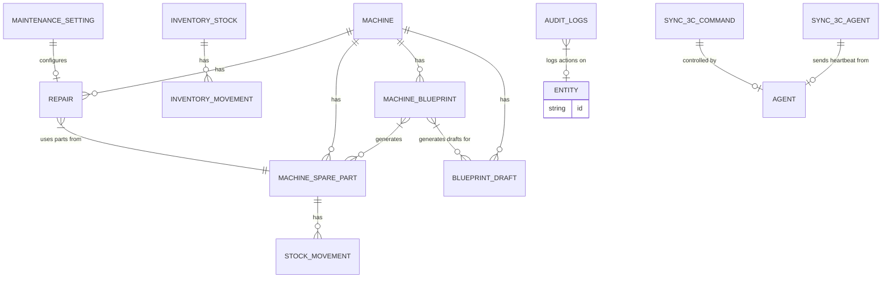

# Auditoría Completa del Proyecto Operario Control

## 1. Arquitectura Completa

El sistema Operario Control es una aplicación web (Next.js) que se integra con un sistema de gestión local (3C) a través de un agente de automatización (Node.js + AutoHotkey). Utiliza Firestore como base de datos principal y Redis para la gestión de colas de sincronización y estado del agente.

### 1.1 Componentes Principales

*   **Interfaz de Usuario (UI) / Frontend:** Aplicación Next.js desplegada en Vercel, utilizando React, Tailwind CSS y shadcn/ui. Proporciona la interfaz para la gestión de máquinas, reparaciones, inventario, alquileres y el dashboard.
*   **API Routes:** Funciones serverless de Next.js (Node.js runtime) desplegadas en Vercel. Gestionan la creación de comandos de sincronización con 3C, el estado del agente y la eliminación de archivos en Cloudinary.
*   **Agente Local (`sync-agent/agent.mjs`):** Una aplicación Node.js que se ejecuta en una máquina local con Windows. Es el puente entre la aplicación web y el sistema 3C. Escucha comandos de sincronización, ejecuta scripts AutoHotkey, procesa archivos Excel y actualiza la base de datos.
*   **Scripts AutoHotkey (AHK):** Un conjunto de scripts (`automation/*.ahk`) que automatizan la interacción con la aplicación de escritorio 3C. Realizan navegación, filtrado y exportación de datos a archivos Excel.
*   **Redis (Upstash):** Una base de datos en memoria utilizada para la cola de comandos de sincronización, el almacenamiento de estado de comandos y el heartbeat del agente. Actúa como un componente crítico para la comunicación asíncrona y la resiliencia del agente local.
*   **Firestore (Google Cloud Platform):** La base de datos NoSQL principal del sistema. Almacena todos los datos de la aplicación (máquinas, reparaciones, inventario, usuarios, logs de auditoría, etc.). Es la fuente de verdad para la mayoría de la información mostrada en la UI.
*   **Cloudinary:** Servicio de gestión de medios para almacenar planos y despieces técnicos de las máquinas (archivos PDF e imágenes).
*   **Automation Watcher (`automation-watcher/`):** Un módulo Node.js que trabaja en conjunto con el agente local para monitorear y procesar los archivos Excel exportados por 3C.

### 1.2 Diagrama de Arquitectura General

```mermaid
graph TD
     subgraph Cloud [Nube]
        UI[UI Web - Next.js/Vercel] --> |1. POST /api/sync-3c| API[API Routes - Vercel Node.js]
        UI -- |GET /api/sync-3c/status| API
        UI -- |GET /api/sync-3c/agent-status| API
        UI -- |Direct CRUD via SDK| Firestore[Firestore - Google Cloud]
        UI -- |Upload files| Cloudinary[Cloudinary]

        API --> |2. LPUSH cmd ID & HSET cmd status| Redis[Redis - Upstash]
        API --> |2. Create command & Set agent heartbeat| Firestore

        Firestore -- |Read/Write data & Audit logs| UI
        Cloudinary -- |Delete files| API
    end

    subgraph Local [Máquina Local (Windows)]
        Agent[Agente Local - Node.js] --> |3. RPOP cmd ID & HGETALL status| Redis
        Agent --> |3. Poll commands & Read agent heartbeat| Firestore
        Agent --> |4. Spawn AHK script| AHK[AutoHotkey Scripts]
        AHK --> |5. Interact with 3C & Export Excel| ThreeC[Sistema 3C - Aplicación de Escritorio]
        ThreeC --> |6. Save Excel files| LocalFS[Sistema de Archivos Local / Temp]
        LocalFS --> |7. Read Excel & Parse| Agent
        Agent --> |8. Sync data to inventory_stock & HSET result| Firestore
        Agent --> |8. Set result & cmd status| Redis
    end

    style UI fill:#bde0fe,stroke:#333,stroke-width:2px
    style API fill:#a2d2ff,stroke:#333,stroke-width:2px
    style Firestore fill:#cdb4db,stroke:#333,stroke-width:2px
    style Cloudinary fill:#ffc8dd,stroke:#333,stroke-width:2px
    style Redis fill:#ffafcc,stroke:#333,stroke-width:2px
    style Agent fill:#a2d2ff,stroke:#333,stroke-width:2px
    style AHK fill:#bde0fe,stroke:#333,stroke-width:2px
    style ThreeC fill:#cdb4db,stroke:#333,stroke-width:2px
    style LocalFS fill:#ffc8dd,stroke:#333,stroke-width:2px
```

### 1.3 Stack Tecnológico

*   **Frontend Framework:** Next.js 16 (App Router), React 19.
*   **Styling:** Tailwind CSS v4, @base-ui/react (shadcn style).
*   **Backend (API Routes):** Next.js API routes (serverless en Vercel).
*   **Base de Datos Principal:** Firestore (Google Cloud).
*   **Base de Datos Adicional (Cola/Cache):** Redis (Upstash).
*   **Autenticación:** Firebase Auth (email/password).
*   **Almacenamiento de Archivos:** Cloudinary (para planos/despieces PDF).
*   **SDKs:** `firebase-admin` (para API routes y agente), `firebase` (para el cliente web).
*   **Procesamiento de Archivos:** `xlsx` (para Excel), `pdfjs-dist` (para PDF).
*   **Notificaciones:** `sonner` (toasts).
*   **Agente Local:** Node.js + `tsx` + AutoHotkey v2.
*   **Despliegue:** Vercel (para la aplicación web y API routes).

### 1.4 Flujo de Sincronización 3C (Visión General)

La sincronización con el sistema 3C se realiza de forma asíncrona y orquestada entre la UI, las API Routes, Redis/Firestore y el agente local:

1.  **Inicio desde UI:** El usuario desencadena una sincronización desde la interfaz web.
2.  **Creación de Comando:** La UI llama a una API Route (`POST /api/sync-3c`), que crea un comando pendiente en Redis y/o Firestore.
3.  **Polling del Agente:** El agente local, que corre en un bucle continuo, consulta periódicamente Redis y/o Firestore en busca de nuevos comandos pendientes.
4.  **Ejecución AHK:** Al detectar un comando, el agente marca su estado como "running" y lanza el script AutoHotkey correspondiente.
5.  **Interacción 3C:** El script AHK interactúa con la aplicación 3C, navegando menús y exportando datos a un archivo Excel temporal.
6.  **Procesamiento de Datos:** El agente lee y parsea el archivo Excel. Luego, utiliza los datos para actualizar la colección `inventory_stock` en Firestore (o guarda el resultado en Redis si Firestore está inactivo).
7.  **Actualización de Estado:** El agente actualiza el estado del comando en Redis y/o Firestore a "completed" o "failed", junto con un resultado o mensaje de error.
8.  **Visualización en UI:** La UI, que ha estado haciendo polling para el estado del comando, muestra el resultado de la sincronización al usuario.

## 2. Flujo de Datos

### 2.1 Flujo General del Cliente (UI)

*   **Autenticación:**
    *   `UI` -> `Firebase Auth` (email/password) para login y gestión de sesión.
    *   `src/lib/AuthContext.tsx` y `src/hooks/useAuth.ts` manejan el estado de autenticación.
*   **Lectura/Escritura Directa a Firestore:**
    *   La mayoría de las operaciones CRUD para colecciones como `machines`, `repairs`, `inventory_stock`, `machine_spare_parts`, `machine_blueprints`, `blueprint_drafts`, `maintenance_settings`, `audit_logs` se realizan directamente desde el `UI` utilizando el `Firebase Client SDK`.
    *   Los `services/*.ts` (e.g., `src/services/machines.ts`, `src/services/inventoryStock.ts`) encapsulan la lógica de acceso a Firestore.
    *   Los `hooks/*.ts` (e.g., `src/hooks/useMachines.ts`, `src/hooks/useInventoryStock.ts`) proporcionan una interfaz React para consumir estos servicios y gestionar el estado local.
*   **Subida de Archivos (Cloudinary):**
    *   `UI` (`BlueprintUploader`) -> `Cloudinary auto/upload` (unsigned, preset `operario_blueprints`).
    *   Cloudinary devuelve `public_id` y `secure_url`.
    *   Estos metadatos se guardan en `Firestore` (`machine_blueprints`).
    *   Si es PDF, `pdfjs-dist` extrae texto y detecta códigos Bosch para crear borradores de repuestos (`blueprint_drafts`).
*   **Eliminación de Archivos (Cloudinary):**
    *   `UI` -> `API Route` (`POST /api/cloudinary/delete`).
    *   La `API Route` utiliza `Cloudinary SDK` con `API Key/Secret` para eliminar el archivo.
    *   Luego, el documento correspondiente se elimina de `Firestore` (`machine_blueprints` y `machine_spare_parts` relacionados).

### 2.2 Flujo de Sincronización con 3C

*   **Inicio de Sincronización:**
    *   `UI` (`Sync3CButton.tsx`) -> `API Route` (`POST /api/sync-3c`).
    *   `API Route` crea un comando en `Redis` (`LPUSH sync-3c:queue`, `HSET sync-3c:command:{id}`) y/o `Firestore` (`sync-3c-commands/{id}`).
*   **Procesamiento por el Agente Local:**
    *   `Agente Local` (`agent.mjs`) polls `Redis` (`RPOP sync-3c:queue`) o `Firestore` (`sync-3c-commands`) cada 5-30 segundos.
    *   Al detectar un comando `pending`, actualiza su estado a `running` en `Redis` y/o `Firestore`.
    *   `Agente Local` -> `AutoHotkey Scripts` (`automation/*.ahk`).
    *   `AutoHotkey` interactúa con `Sistema 3C` -> exporta Excel a `%LOCALAPPDATA%\Temp\tresc\`.
    *   `Agente Local` (vía `automation-watcher/excel-parser.js`) lee y parsea el Excel.
    *   `Agente Local` (vía `src/lib/sync-3c/engine.ts`) -> `Firestore` (`inventory_stock`) para upsert de ítems.
    *   **Fallback:** Si `Firestore` falla (e.g., por cuota), el agente genera un resultado `degraded: true` y lo guarda en `Redis` (`sync-3c:result:{id}`). Esto asegura que el agente no se detenga y que el usuario reciba un estado, aunque sea degradado.
    *   `Agente Local` actualiza el estado del comando en `Redis` y/o `Firestore` a `completed` o `failed`, incluyendo `result` o `error`.
*   **Monitoreo del Estado:**
    *   `UI` (`Sync3CButton.tsx`) -> `API Route` (`GET /api/sync-3c/status?commandId=x`) para polling del estado del comando en `Redis` y/o `Firestore`.
    *   `Agente Local` envía `heartbeat` a `Redis` (`SET sync-3c:agent:production`) y/o `Firestore` (`sync-3c-agent/production`).
    *   `UI` (`Sync3CButton.tsx`) -> `API Route` (`GET /api/sync-3c/agent-status`) para verificar el estado online/offline del agente.

### 2.3 Flujo de Movimientos de Inventario y Repuestos

*   **Máquinas:**
    *   `UI` (`useMachines().rentMachine()`) -> `src/services/machines.ts::rentMachine()`.
    *   `machines.ts::rentMachine()` -> `src/services/scaffoldRental.ts::rentScaffoldComponents()` si es categoría "scaffold".
    *   `scaffoldRental.ts::rentScaffoldComponents()` -> `src/services/inventoryStock.ts::rentStockItem()`.
    *   `inventoryStock.ts::rentStockItem()` -> Decrementa `stockAvailable`, incrementa `stockRented` en `inventory_stock`.
    *   `inventoryStock.ts::rentStockItem()` -> `src/services/inventoryMovements.ts::createInventoryMovement()` para registrar movimiento `ALQUILER`.
*   **Reparaciones y Repuestos:**
    *   `UI` (`RepairForm`) -> `src/services/repairs.ts::createRepair()`.
    *   `repairs.ts::createRepair()` itera sobre `partsUsed[]`.
    *   Por cada parte usada:
        *   `repairs.ts` -> `src/services/spareParts.ts::usePart()`.
        *   `spareParts.ts::usePart()` -> Decrementa `stockTotal` y `stockAvailable`, incrementa `stockUsed` en `machine_spare_parts`.
        *   `spareParts.ts::usePart()` -> `src/services/stockMovements.ts::createStockMovement()` para registrar movimiento `EGRESO` con `source: "REPARACION"`.

### 2.4 Flujo de Auditoría

*   Casi todas las operaciones CRUD en los `services/*.ts` (e.g., `machines`, `spareParts`, `inventoryStock`) llaman a `src/services/audit.ts::createAuditLog()`.
*   `createAuditLog()` escribe un documento en la colección `audit_logs` con `action` (`create`/`update`/`delete`), `entity` (`EntityType`), `entityId`, `before` y `after` estados, y `timestamp`. El `userId` no se popula.

## 3. Flujo de Sincronización con 3C

La sincronización con el sistema 3C es un proceso crítico que involucra varios componentes, orquestado para extraer datos del sistema de escritorio y actualizarlos en Firestore.

#### 3.1 Componentes Involucrados

*   **UI (`src/components/sync/Sync3CButton.tsx`):** Inicia la solicitud de sincronización y muestra el estado.
*   **API Route (`src/app/api/sync-3c/route.ts`):** Recibe la solicitud de la UI y crea el comando de sincronización.
*   **Redis (Upstash):** Actúa como cola de comandos (`sync-3c:queue`) y almacén de estado (`sync-3c:command:{id}`, `sync-3c:result:{id}`). También guarda el heartbeat del agente (`sync-3c:agent:production`).
*   **Firestore:** Históricamente, también se usaba para la cola de comandos (`sync-3c-commands`) y el heartbeat (`sync-3c-agent`). Actualmente, Redis es el primario, pero el código aún soporta Firestore. Es el destino final de los datos sincronizados (`inventory_stock`).
*   **Agente Local (`sync-agent/agent.mjs`):** El orquestador principal del lado local. Escucha la cola de comandos, ejecuta AHK, procesa el Excel y sincroniza los datos.
*   **Scripts AutoHotkey (`automation/sync_3c.ahk`, `automation/sync_reparaciones.ahk`, etc.):** Automatizan la navegación y exportación en el sistema 3C.
*   **Sistema 3C:** La aplicación de escritorio de la cual se extraen los datos.
*   **Módulo Excel Parser (`automation-watcher/excel-parser.js`, `src/lib/sync-3c/parser.ts`):** Lee y transforma el contenido de los archivos Excel exportados a un formato estructurado.
*   **Módulo Sync Engine (`src/lib/sync-3c/engine.ts`):** Realiza la lógica de upsert de los datos parseados en la colección `inventory_stock` de Firestore.

#### 3.2 Flujo Detallado

1.  **Inicio (UI):** El usuario hace clic en el botón de sincronización (`Sync3CButton.tsx`) en el Dashboard.
2.  **Creación de Comando (API Route):**
    *   La UI realiza un `POST` a `/api/sync-3c`.
    *   Esta API crea un nuevo comando con un `commandId` único.
    *   El comando se encola en `sync-3c:queue` (Redis `LPUSH`) y su estado inicial (`pending`) se guarda en `sync-3c:command:{id}` (Redis `HSET`). Opcionalmente, también se crea/actualiza un documento en `sync-3c-commands/{id}` en Firestore.
    *   La API responde a la UI con el `commandId`.
3.  **Polling del Agente Local:**
    *   El `agent.mjs` (ejecutándose en un bucle cada 30 segundos) realiza un `RPOP` en `sync-3c:queue` de Redis.
    *   Si encuentra un `commandId`, lo marca como `running` en `sync-3c:command:{id}` (Redis `HSET`) y/o `sync-3c-commands/{id}` (Firestore).
    *   El agente también envía un heartbeat a `sync-3c:agent:production` (Redis `SET`) cada 30 segundos, indicando su estado (`idle` o `running`) y la hora del último latido.
4.  **Ejecución de AutoHotkey:**
    *   El agente ejecuta el script AHK correspondiente (ej. `automation/sync_3c.ahk`) utilizando `child_process.spawn()`.
    *   El script AHK realiza los siguientes pasos (ejemplo para Stock - `sync_3c.ahk`):
        *   Minimiza navegadores (Chrome/Edge).
        *   Activa la ventana de 3C (`WinActivate("3C")`).
        *   Envía `Ctrl+Home` para asegurar que 3C está en el menú principal.
        *   Simula clics y entradas de teclado para navegar a la sección de existencias: "Almacenes" -> "Informes" -> "Existencias" -> "Depósitos" -> "Seleccionar Todos" -> "Consulta" -> "Aceptar" -> "Excel".
        *   Después de hacer clic en "Excel", 3C genera el reporte y abre el archivo en Excel.
        *   El script AHK espera a que la ventana de Excel (`ahk_class XLMAIN`) aparezca y luego el `WatchAndCopy()` (parte de `sync_common.ahk`) monitorea el directorio `%LOCALAPPDATA%\Temp\tresc\` para el archivo `tresc*.xls` recién creado.
        *   Una vez que el archivo es detectado, lo copia a `automation-watcher/3c_exports/` y luego cierra la ventana de Excel (`WinClose("ahk_class XLMAIN")`).
        *   El script AHK termina (`ExitApp`). **Importante:** 3C queda en la pantalla del reporte (no vuelve al menú principal), lo que podría causar problemas en ejecuciones consecutivas sin un reinicio o navegación adecuada.
5.  **Procesamiento y Sincronización de Datos:**
    *   El agente local (`agent.mjs`) utiliza `src/lib/sync-3c/parser.ts` y `automation-watcher/excel-parser.js` para leer el archivo Excel exportado y transformarlo en objetos `Sync3CItem[]`.
    *   Luego, llama a `src/lib/sync-3c/engine.ts::syncItems()` para procesar estos ítems.
    *   `syncItems()` intenta realizar un `upsert` (crear o actualizar) de los ítems en la colección `inventory_stock` de Firestore.
    *   **Manejo de Fallos de Firestore:** Si la operación de `syncItems()` a Firestore falla (ej. por exceder la cuota del plan Spark), el agente lo atrapa. En lugar de fallar, genera un resultado `degraded: true` y lo guarda en `Redis` (`sync-3c:result:{id}`). Esto asegura que el agente no se detenga y que el usuario reciba un estado, aunque sea degradado.
6.  **Actualización Final del Comando:**
    *   Una vez completado el procesamiento (exitoso o degradado), el agente actualiza el estado del comando en `sync-3c:command:{id}` (Redis `HSET`) y/o `sync-3c-commands/{id}` (Firestore) a `completed` o `failed`, incluyendo los detalles del resultado o el mensaje de error.
7.  **Actualización de la UI:**
    *   La UI (`Sync3CButton.tsx`) realiza polling constante a `/api/sync-3c/status?commandId=x`.
    *   Al detectar el estado `completed` o `failed`, la UI muestra el resultado al usuario (ej. con `sonner` toasts) y actualiza los datos en pantalla si es necesario.

#### 3.3 Módulos de Sincronización AHK (Ejemplos)

*   **Stock (`sync_3c.ahk`):** Navega para exportar existencias de depósitos.
    *   Pasos: Almacenes -> Informes -> Existencias -> Depósitos -> Seleccionar todos -> Consulta -> Aceptar -> Excel.
*   **Reparaciones (`sync_reparaciones.ahk`):** Navega para exportar informes de reparaciones.
    *   Pasos: Ventas -> Reparaciones -> ExcelItems -> PrintAll -> Imprimir -> ExcelFormat.
    *   Este script tiene una lógica adicional para `WaitForExcel`, `WatchAndCopy`, cerrar Excel y volver a 3C a la opción "SalirRep".
*   **`sync_common.ahk`:** Contiene funciones compartidas como `ClickAt`, `WaitForExcel`, `WatchAndCopy`, `ValidarFoco`, `FocusFix` y la carga de coordenadas desde `config.ini`.

#### 3.4 Configuración de Coordenadas

*   Las coordenadas de clic para AutoHotkey se almacenan en `automation/config.ini`.
*   `sync_common.ahk` carga estas coordenadas en un mapa para su uso dinámico por `ClickAt(name)`.
*   Un problema detectado previamente fue que `sync_common.ahk` no cargaba la coordenada "Ventas" para `sync_reparaciones.ahk`.

## 4. Flujo del Agente Local (`sync-agent/agent.mjs`)

El agente local es un componente crítico que orquesta la comunicación entre la nube y el sistema de escritorio 3C. Se ejecuta como un proceso de Node.js en una máquina Windows.

#### 4.1 Ciclo de Operación

El agente opera en un bucle de polling continuo, realizando varias tareas en intervalos definidos:

1.  **Polling de Comandos (cada 30s):**
    *   Realiza un `RPOP` en la lista `sync-3c:queue` de Redis para obtener un `commandId` pendiente.
    *   Si hay un comando, cambia su estado a `running` en `sync-3c:command:{id}` (Redis `HSET`) y/o `sync-3c-commands/{id}` (Firestore).
    *   **Recuperación de Comandos Stale:** El agente también escanea periódicamente (`SCAN`) en Redis para identificar comandos que tienen el estado `running` por más de 10 minutos. Estos comandos se consideran "stale" (colgados) y se re-encolan para su reprocesamiento, lo que proporciona resiliencia ante fallos inesperados del agente o de AHK.
2.  **Heartbeat (cada 30s):**
    *   Envía un `SET` a `sync-3c:agent:production` en Redis, actualizando un JSON con `lastHeartbeat` (timestamp), `status` (`idle` o `running`) y `machineName`.
    *   Este heartbeat permite que la UI monitoree si el agente está online y activo.
3.  **Ejecución de AHK:**
    *   Al recibir un comando, el agente determina el script AHK a ejecutar basado en el módulo de sincronización solicitado (ej. `stock` -> `sync_3c.ahk`, `reparaciones` -> `sync_reparaciones.ahk`).
    *   Lanza el script AHK utilizando `child_process.spawn()` con el directorio `automation/` como `cwd` y `windowsHide: true`.
    *   Espera la finalización del script AHK por un tiempo límite (configurable, por ejemplo, 120 segundos). Si AHK falla (código de salida distinto de 0) o excede el timeout, el agente marca el comando como `failed`.
    *   Los scripts AHK no reciben argumentos; su comportamiento se basa en coordenadas predefinidas en `config.ini`.
4.  **Procesamiento de Excel:**
    *   Una vez que el script AHK ha exportado un archivo Excel al directorio temporal (`%LOCALAPPDATA%\Temp\tresc\`) y el `WatchAndCopy()` lo ha movido a `automation-watcher/3c_exports/`, el agente lee y parsea este archivo.
    *   Utiliza `automation-watcher/excel-parser.js` y `src/lib/sync-3c/parser.ts` para extraer los datos relevantes.
5.  **Sincronización de Datos:**
    *   El agente invoca `src/lib/sync-3c/engine.ts::syncItems()` para realizar operaciones `upsert` en la colección `inventory_stock` de Firestore.
    *   **Manejo de Errores de Firestore:** En caso de que `syncItems()` falle (ej. por problemas de conexión, credenciales o cuota de Firestore), el agente tiene un bloque `try/catch` interno. Si falla, el resultado se marca como `{ degraded: true, skipped: items.length }` y se guarda en Redis (`sync-3c:result:{id}`). Esto evita que el agente se caiga y permite que la UI muestre un estado "degradado" en lugar de un fallo total.
6.  **Actualización Final del Comando:**
    *   Después de la sincronización (exitosa o degradada), el agente actualiza el estado del comando en Redis (`sync-3c:command:{id}`) y/o Firestore (`sync-3c-commands/{id}`) a `completed` o `failed`, incluyendo un hash `result` con la información detallada de la operación o un `error` si hubo problemas.

#### 4.2 Configuración y Dependencias

*   **Lanzamiento:** El agente se inicia oculto en Windows mediante `start-agent.vbs`.
*   **Credenciales Firebase:** Utiliza `sync-agent/service-account.json` para autenticarse con `firebase-admin` al interactuar con Firestore.
*   **Timeout AHK:** Tiene un timeout de 120s para la ejecución de los scripts AHK.
*   **Module Mapping:** El agente tiene una lógica para mapear módulos como `stock` a `sync_3c.ahk` y `reparaciones` a `sync_reparaciones.ahk`.

#### 4.3 Registros (Logs)

*   El agente genera un archivo de log (`sync-agent/agent.log`) que registra sus operaciones, polling, ejecuciones de AHK, estados de comandos y errores.

## 5. Firestore: Uso, Modelos de Datos y Colecciones

Firestore es la base de datos principal de Operario Control, utilizada para almacenar la mayoría de los datos de la aplicación.

#### 5.1 Colecciones Firestore y sus Esquemas

A continuación, se detallan las colecciones de Firestore, sus campos principales y su propósito. Estas colecciones forman la columna vertebral del modelo de datos de la aplicación.

##### 5.1.1 `machines` — Máquinas/Equipos

*   **Propósito:** Almacena información sobre cada unidad física de máquina o equipo. (1 documento = 1 unidad física, no stock agregado).
*   **Campos Clave:**
    *   `id`: `string` (Firestore auto-ID)
    *   `name`: `string`
    *   `model`: `string`
    *   `category`: `"machine" | "tool" | "scaffold" | null`
    *   `status`: `"available" | "rented" | "maintenance"`
    *   `locationType`: `"deposito" | "obra" | "taller"`
    *   `location`: `{ client: { name, address }, project: { name, address } } | null`
    *   `rental`: `{ clientName, clientAddress, projectName, projectAddress, startDate, expectedEndDate, isOpenEnded } | null`
    *   `createdAt`: `Timestamp`
    *   `updatedAt`: `Timestamp`
*   **Reglas de Dominio:** 1 documento representa 1 unidad física.

##### 5.1.2 `repairs` — Órdenes de Reparación

*   **Propósito:** Registra el historial y estado de las órdenes de reparación para las máquinas.
*   **Campos Clave:**
    *   `id`: `string` (Firestore auto-ID)
    *   `machineId`: `string` (FK -> machines.id)
    *   `machineName`: `string` (Desnormalizado)
    *   `machineModel`: `string | undefined` (Desnormalizado)
    *   `internalNumber`: `string | undefined` (Nº interno)
    *   `clientName`: `string` (Desnormalizado)
    *   `reportedIssue`: `string`
    *   `diagnosis`: `string | undefined`
    *   `repairPerformed`: `string`
    *   `technician`: `string`
    *   `entryDate`: `Timestamp`
    *   `exitDate`: `Timestamp`
    *   `status`: `"EN_TALLER" | "FINALIZADO"`
    *   `partsUsed`: `PartUsage[]` (objetos con `partId`, `code`, `description`, `quantity`)
    *   Fechas de mantenimiento auto-calculadas: `warrantyUntil`, `oilChangeDueDate`, `bearingChangeDueDate`, `maintenanceDueDate`.

##### 5.1.3 `machine_spare_parts` — Repuestos por Máquina

*   **Propósito:** Catálogo de repuestos específicos asociados a modelos de máquina.
*   **Campos Clave:**
    *   `id`: `string` (Firestore auto-ID)
    *   `machineId`: `string` (FK -> machines.id)
    *   `partName`: `string`
    *   `partCode`: `string`
    *   `category`: `SparePartCategory`
    *   `stockTotal`: `number`
    *   `stockAvailable`: `number`
    *   `stockUsed`: `number`
    *   `source`: `"manual" | "imported" | "blueprint"`
    *   `blueprintId`: `string | undefined` (FK -> machine_blueprints.id)

##### 5.1.4 `inventory_stock` — Stock de Materiales (Andamios, Consumibles)

*   **Propósito:** Almacena el stock agregado de materiales (andamios, consumibles). (1 documento = stock agregado, no unidades individuales).
*   **Campos Clave:**
    *   `id`: `string` (Firestore auto-ID)
    *   `name`: `string`
    *   `codigo`: `string | undefined` (Código externo 3C)
    *   `category`: `StockCategory`
    *   `unit`: `StockUnit`
    *   `stockTotal`: `number`
    *   `stockAvailable`: `number`
    *   `stockRented`: `number`
    *   `locationType`: `"deposito"` (Siempre "deposito")
    *   `deposito`: `number | undefined` (Depósito 3C)
    *   `source`: `"manual" | "3c" | undefined`

##### 5.1.5 `inventory_movements` — Movimientos de Materiales

*   **Propósito:** Registra la trazabilidad de los movimientos de materiales (alquiler, devolución, ajuste).
*   **Campos Clave:**
    *   `id`: `string` (Firestore auto-ID)
    *   `materialId`: `string` (FK -> inventory_stock.id)
    *   `date`: `Timestamp`
    *   `type`: `"ALQUILER" | "DEVOLUCION" | "AJUSTE"`
    *   `quantity`: `number`
    *   `clientName`: `string | undefined`
    *   `projectName`: `string | undefined`

##### 5.1.6 `stock_movements` — Movimientos de Repuestos

*   **Propósito:** Registra la trazabilidad de los movimientos de repuestos (ingreso, egreso).
*   **Campos Clave:**
    *   `id`: `string` (Firestore auto-ID)
    *   `partId`: `string` (FK -> machine_spare_parts.id)
    *   `date`: `Timestamp`
    *   `type`: `"INGRESO" | "EGRESO"`
    *   `source`: `"REPARACION" | "REPOSICION"`
    *   `quantity`: `number`

##### 5.1.7 `machine_blueprints` — Planos/Despieces

*   **Propósito:** Almacena metadatos de planos técnicos (PDFs o imágenes) subidos a Cloudinary y asociados a máquinas.
*   **Campos Clave:**
    *   `id`: `string` (Firestore auto-ID)
    *   `machineId`: `string` (FK -> machines.id)
    *   `fileUrl`: `string` (URL Cloudinary)
    *   `publicId`: `string` (Public ID Cloudinary)
    *   `fileName`: `string`
    *   `fileType`: `"pdf" | "image"`

##### 5.1.8 `blueprint_drafts` — Borradores de Importación de Repuestos

*   **Propósito:** Almacena repuestos extraídos automáticamente de PDFs o ingresados manualmente, antes de ser confirmados y movidos a `machine_spare_parts`.
*   **Campos Clave:**
    *   `id`: `string` (Firestore auto-ID)
    *   `machineId`: `string` (FK -> machines.id)
    *   `blueprintId`: `string` (FK -> machine_blueprints.id)
    *   `partName`: `string`
    *   `partCode`: `string`
    *   `status`: `"draft" | "confirmed"`

##### 5.1.9 `maintenance_settings` — Configuración de Mantenimiento (Singleton)

*   **Propósito:** Documento único (`maintenance_settings/config`) que almacena configuraciones globales para el cálculo de fechas de mantenimiento y garantía.
*   **Campos Clave:**
    *   `oilChangeDays`: `number` (Default: 90)
    *   `bearingChangeDays`: `number` (Default: 180)
    *   `maintenanceDays`: `number` (Default: 365)
    *   `warrantyDays`: `number` (Default: 90)

##### 5.1.10 `audit_logs` — Log de Auditoría

*   **Propósito:** Registra todas las acciones CRUD realizadas en entidades clave del sistema para trazabilidad.
*   **Campos Clave:**
    *   `id`: `string` (Firestore auto-ID)
    *   `action`: `"create" | "update" | "delete"`
    *   `entity`: `EntityType` (ej. "machine", "repair")
    *   `entityId`: `string` (ID del documento afectado)
    *   `before`: `object | null` (Estado previo del documento)
    *   `after`: `object | null` (Estado posterior del documento)
    *   `timestamp`: `Timestamp`
    *   `userId`: `string` (**Nota:** Actualmente no se popula, un riesgo de seguridad/trazabilidad)

##### 5.1.11 `sync-3c-commands` — Cola de Comandos de Sincronización (Firestore)

*   **Propósito:** (Histórico/Secundario) Almacena el estado de los comandos de sincronización enviados al agente local. Redis es ahora la cola principal.
*   **Campos Clave:**
    *   `id`: `string` (Firestore auto-ID)
    *   `status`: `"pending" | "running" | "completed" | "failed"`
    *   `createdAt`: `Timestamp`
    *   `result`: `object | null`
    *   `error`: `string | null`

##### 5.1.12 `sync-3c-agent` — Heartbeat del Agente (Firestore)

*   **Propósito:** (Histórico/Secundario) Documento único (`sync-3c-agent/production`) para que el agente local reporte su estado y "latido" a la nube. Redis es ahora el primario.
*   **Campos Clave:**
    *   `lastHeartbeat`: `Timestamp`
    *   `status`: `"idle" | "running"`
    *   `machineName`: `string | null`

##### 5.1.13 Colecciones Legacy

*   `rentals`: Mencionada en `docs/auditoria-sistema.md` como "legacy" y en `docs/arquitectura.md` se indica que `rentals.ts` solo re-exporta funciones de `machines.ts` y no existe como colección. El tipo `LegacyRental` existe en `src/types/rental.ts`. Esto sugiere una colección que existió y ya no se usa o fue reemplazada por el campo `rental` embebido en `machines`.
*   `repairs`: Mencionada en `docs/auditoria-sistema.md` como "legacy". Sin embargo, `src/services/repairs.ts` y `src/app/(protected)/repairs/page.tsx` están activos y usan esta colección. Parece que la etiqueta "legacy" podría referirse a una implementación anterior o a ciertos aspectos de su manejo.

#### 5.2 Relaciones entre Colecciones



#### 5.3 Modelos de Datos (Interfaces TypeScript)

Los tipos TypeScript (`src/types/`) definen la estructura de los datos utilizados en la aplicación, asegurando la consistencia y facilitando el desarrollo.

*   [`src/types/machine.ts`](src/types/machine.ts): `Machine`, `MachineStatus`, `MachineLocation`, `MachineCategory`, `MachineRental`, etc.
*   [`src/types/repair.ts`](src/types/repair.ts): `MachineRepair`, `CreateRepairInput`, `PartUsage`, `RepairStatus`, `RepairSource`, etc.
*   [`src/types/sparePart.ts`](src/types/sparePart.ts): `SparePart`, `CreateSparePartInput`, `SparePartCategory`, `SparePartSource`, etc.
*   [`src/types/inventoryStock.ts`](src/types/inventoryStock.ts): `InventoryStock`, `CreateStockInput`, `StockCategory`, `StockUnit`, `StockSubtype`, `StockSize`, etc.
*   [`src/types/inventoryMovement.ts`](src/types/inventoryMovement.ts): `InventoryMovement`, `CreateInventoryMovementInput`, `InventoryMovementType`, etc.
*   [`src/types/stockMovement.ts`](src/types/stockMovement.ts): `StockMovement`, `StockMovementType`, `StockMovementSource`, etc.
*   [`src/types/machineBlueprint.ts`](src/types/machineBlueprint.ts) (implícito via `docs/auditoria-sistema.md`): `MachineBlueprint`.
*   [`src/types/blueprintDraft.ts`](src/types/blueprintDraft.ts) (implícito via `docs/auditoria-sistema.md`): `BlueprintDraft`.
*   [`src/types/audit.ts`](src/types/audit.ts): `AuditLog`, `AuditAction`, `AuditEntity`, etc.
*   [`src/types/errors.ts`](src/types/errors.ts): `AppError`.
*   [`src/types/rental.ts`](src/types/rental.ts): `LegacyRental` (tipo para colección legacy/campo embebido).
*   [`src/types/stockAlert.ts`](src/types/stockAlert.ts): `StockAlert`, `StockAlertType`, `StockHealthScore`, `ConsumptionTrend`, `StockIntelligence`, etc. (para el motor de recomendación).

#### 5.4 Índices Firestore

Los documentos mencionan la necesidad de varios índices compuestos para optimizar las consultas. Es crucial verificar que estos índices existan en Firestore para evitar problemas de rendimiento y errores de consulta.

*   `repairs`: `machineId` (ASC) + `entryDate` (DESC)
*   `machine_spare_parts`: `machineId` (ASC) + `partCode` (ASC)
*   `machine_spare_parts`: `machineId` (ASC) + `source` (ASC)
*   `inventory_movements`: `materialId` (ASC) + `date` (DESC)
*   `inventory_movements`: `date` (ASC) (range) + `date` (DESC) (order)
*   `stock_movements`: `partId` (ASC) + `date` (DESC)
*   `machine_blueprints`: `machineId` (ASC) + `createdAt` (DESC)
*   `blueprint_drafts`: `machineId` + `partCode` + `status`
*   `inventory_stock`: `name` (ASC) + `size` (ASC)

**Nota Importante:** `docs/auditoria-sistema.md` indica "Reglas versionadas: ❌ No (solo en consola Firebase)" y "No existe `firestore.indexes.json`". Esto representa un riesgo significativo de gestión de la infraestructura, ya que los índices y las reglas no están versionados con el código, lo que puede llevar a inconsistencias y dificultades en el despliegue.

## 6. Redis: Uso y Estructuras de Datos

Redis (Upstash) se ha integrado recientemente para mejorar la resiliencia y escalabilidad del sistema, especialmente en la gestión de comandos de sincronización y el estado del agente, sirviendo como un fallback cuando Firestore excede sus cuotas.

#### 6.1 Componentes que Interactúan con Redis

*   **API Routes (Vercel Node.js runtime):** Utilizan Redis para encolar comandos y establecer el estado.
*   **Agente Local (`sync-agent/agent.mjs`):** Es el principal consumidor de la cola de Redis, procesando comandos y actualizando estados/resultados. También utiliza Redis para su heartbeat.
*   **UI (Dashboard):** Pollea las API Routes que, a su vez, consultan Redis para el estado de los comandos y del agente.

#### 6.2 Claves y Tipos de Datos en Redis

Redis almacena información crucial para la operación asíncrona y la resiliencia.

| Key | Tipo Redis | Propósito | Operaciones |
|---|---|---|---|
| `sync-3c:queue` | `List` | Cola FIFO de IDs de comandos de sincronización pendientes para el agente local. | `LPUSH` (API Route para encolar), `RPOP` (Agente para consumir). |
| `sync-3c:command:{id}` | `Hash` | Almacena el estado detallado de un comando de sincronización específico. `{id}` es el `commandId` único. | `HSET` (API Route y Agente para actualizar el estado, ej. `pending`, `running`, `completed`, `failed`), `HGETALL` (API Route para leer el estado y enviarlo a la UI). |
| `sync-3c:result:{id}` | `Hash` (v2) | Almacena el resultado completo de una operación de sincronización. Este hash se agregó como parte de la solución temporal ante fallos de Firestore, permitiendo guardar resultados degradados. | `HSET` (Agente para guardar el resultado de la sincronización, especialmente cuando Firestore falla). |
| `sync-3c:agent:production` | `String` | Contiene un JSON con el heartbeat del agente local. | `SET` (Agente para enviar el heartbeat periódicamente), `GET` (API Route para leer el heartbeat y enviarlo a la UI). |

#### 6.3 Flujo con Redis

1.  **Inicio de Sync (UI -> API):** Cuando el usuario inicia una sincronización, la `API Route` (`POST /api/sync-3c`) genera un `commandId`.
2.  **Encuesta de Comando (API -> Redis):** La API utiliza `LPUSH sync-3c:queue` para añadir el `commandId` a la cola y `HSET sync-3c:command:{id}` para inicializar su estado.
3.  **Polling del Agente (Agente -> Redis):** El `Agente Local` (`sync-agent/agent.mjs`) realiza `RPOP` en `sync-3c:queue` en busca de nuevos comandos.
4.  **Actualización de Estado (Agente -> Redis):** Al tomar un comando, el agente actualiza su estado a `running` usando `HSET sync-3c:command:{id}`.
5.  **Heartbeat (Agente -> Redis):** Periódicamente, el agente usa `SET sync-3c:agent:production` para actualizar su estado de actividad.
6.  **Guardado de Resultados (Agente -> Redis):** Una vez que la sincronización con 3C y el procesamiento del Excel terminan, el agente guarda el resultado completo (incluyendo si fue degradado o no) usando `HSET sync-3c:result:{id}` y el estado final del comando con `HSET sync-3c:command:{id}`.
7.  **Consulta de Estado (UI -> API -> Redis):** La UI pollea la `API Route` (`GET /api/sync-3c/status?commandId=x`), la cual realiza un `HGETALL` en `sync-3c:command:{id}` para obtener el estado actual y un `GET` en `sync-3c:result:{id}` para obtener los resultados.
8.  **Consulta de Heartbeat (UI -> API -> Redis):** La UI pollea la `API Route` (`GET /api/sync-3c/agent-status`), la cual realiza un `GET` en `sync-3c:agent:production` para verificar si el agente está online.

#### 6.4 Resiliencia y Fallback de Firestore

La integración de Redis es un punto clave para la resiliencia del sistema:

*   **Firestore Fallback:** Si Firestore falla o excede su cuota (como se menciona en `auditoria-migracion-redis`), el `syncItems()` en el agente local tiene un bloque `try/catch`. En este escenario, el agente no se detiene, sino que genera un resultado `degraded: true` y lo guarda en `sync-3c:result:{id}` en Redis. Esto asegura que la UI siga recibiendo actualizaciones de estado y resultados, aunque los datos no se persistan completamente en Firestore.
*   **Recuperación de Comandos Stale:** La capacidad del agente para escanear y re-encolar comandos `running` por mucho tiempo en Redis (`SCAN`) contribuye a la robustez, asegurando que los comandos no se queden atascados indefinidamente.

## 7. Dashboard: Funcionalidad y Dependencias

El Dashboard es la página principal de la aplicación (`/dashboard`), diseñada para proporcionar una visión general rápida del estado operativo, métricas clave y alertas.

#### 7.1 Métricas y Secciones Principales

El Dashboard consolida información de varias colecciones de Firestore para presentar un resumen ejecutivo:

*   **Cards de Resumen:**
    *   Muestra el total de equipos, equipos disponibles, alquilados y en mantenimiento.
    *   **Fuente de Datos:** Colección `machines` (filtrado por `status`).
*   **Cards por Categoría:**
    *   Desglosa el total de máquinas por categorías como "Maquinaria", "Andamios" y "Herramientas".
    *   **Fuente de Datos:** Colección `machines` (filtrado por `category`).
*   **Alertas de Alquiler:**
    *   Destaca máquinas con alquileres próximos a vencer o sin fecha de devolución definida.
    *   **Fuente de Datos:** Colección `machines` (con `rental` activo).
*   **Workshop Summary:**
    *   Resume el estado del taller: máquinas "En taller", reparaciones "Finalizadas hoy", mantenimientos "Vencidos" y "Próximos 7 días".
    *   **Fuente de Datos:** Colección `repairs` (con cálculos en memoria para las estadísticas).
*   **Smart Alerts Panel:**
    *   Genera alertas inteligentes sobre fallas repetitivas, máquinas sobrecargadas y mantenimiento ignorado.
    *   **Fuente de Datos:** Colecciones `repairs` y el servicio `stockIntelligenceService`.
*   **Stock Materials:**
    *   Muestra cards de materiales con su stock actual.
    *   **Fuente de Datos:** Colección `inventory_stock`.
*   **Stock Intelligence:**
    *   Ofrece un "health score" del stock, identifica ítems críticos, los más consumidos y tendencias.
    *   **Fuente de Datos:** Principalmente el servicio `stockIntelligenceService`, que a su vez combina datos de hasta cinco colecciones (posiblemente `inventory_stock`, `machine_spare_parts`, `stock_movements`, `inventory_movements`, `machines`).

#### 7.2 Componentes UI Utilizados

El Dashboard se construye utilizando una combinación de componentes genéricos (shadcn/ui) y componentes específicos del dominio:

*   **Componentes de Dominio:**
    *   `src/components/dashboard/GlobalSearchResults.tsx`: Probablemente para una funcionalidad de búsqueda global en el dashboard.
    *   `src/components/dashboard/SmartAlertsPanel.tsx`: Muestra las alertas inteligentes de mantenimiento y stock.
    *   `src/components/dashboard/WorkshopSummary.tsx`: Presenta el resumen del estado del taller.
    *   `src/components/sync/Sync3CButton.tsx`: Permite iniciar y monitorear la sincronización con 3C.
*   **Componentes Shadcn/ui (Genéricos):**
    *   `Card`, `CardHeader`, `CardTitle`, `CardContent`: Para la organización visual de las métricas y paneles.
    *   `Table`, `TableHeader`, `TableBody`, `TableRow`, `TableCell`: Para mostrar listados de datos.
    *   `Input`, `Select`, `Button`, `Badge`, `Separator`: Elementos de interacción y visualización.
    *   `Toaster` (`sonner`): Para notificaciones al usuario.

#### 7.3 Dependencias Clave

*   **Servicios:** Depende fuertemente de los `services/*.ts` para acceder y manipular datos de Firestore (ej. `machines.ts`, `repairs.ts`, `inventoryStock.ts`, `stockIntelligence.ts`).
*   **Hooks:** Utiliza varios `hooks/*.ts` para gestionar el estado y los datos de forma reactiva (ej. `useMachines()`, `useRepairs()`, `useInventoryStock()`, `useStockIntelligence()`).
*   **API Routes:** Indirectamente, para el estado del agente y los comandos de sincronización con 3C (`/api/sync-3c/status`, `/api/sync-3c/agent-status`).
*   **Firebase Client SDK:** Para la lectura y escucha en tiempo real de los datos de Firestore.

#### 7.4 Observaciones

*   La página del Dashboard es 100% "use client", lo que significa que la renderización inicial y la lógica de fetching de datos ocurren en el lado del cliente. Esto podría tener implicaciones en el rendimiento de carga inicial y SEO.
*   La lógica de `stockIntelligenceService` es un componente central para las alertas y recomendaciones, lo que sugiere una complejidad considerable en la agregación y análisis de datos de múltiples fuentes.
